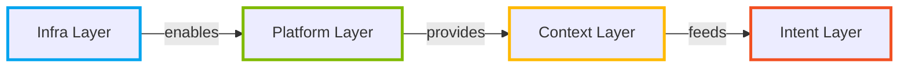

# Diagrams Format Reference

## Mermaid Diagrams

### Supported Types

- `flowchart LR` / `graph LR`, primary choice for architecture and process flows
- `sequenceDiagram`, agent interactions, API flows, handoff sequences
- `stateDiagram-v2`, state machines, lifecycle diagrams
- `gantt`, roadmaps, timelines

Not supported in FigJam: classDiagram, erDiagram, pie, journey. Use only supported types.

### Layer Color Classes (Mermaid)

```mermaid
%%{ init: { 'theme': 'base', 'themeVariables': { 'primaryColor': '#E5F6FD' } } }%%
flowchart LR
  classDef blue   fill:#E5F6FD,stroke:#00A4EF,stroke-width:2px,color:#0076AC
  classDef green  fill:#F1F8E3,stroke:#7FBA00,stroke-width:2px,color:#5A8500
  classDef yellow fill:#FFF7E0,stroke:#FFB900,stroke-width:2px,color:#B88500
  classDef red    fill:#FFF0EB,stroke:#F25022,stroke-width:2px,color:#B33816
  classDef neutral fill:#F7F7F5,stroke:#CECEC7,stroke-width:2px,color:#3A3A3A
```

### FigJam-specific rules

FigJam's Mermaid renderer has quirks:

1. Node IDs must be ASCII-safe: `InfraLayer` not `Infra Layer`, no accents, no hyphens
2. No `classDef` with `fill` for FigJam, use border-only styling: `stroke:#00A4EF,stroke-width:3px`
3. Edge labels must be in quotes: `-->|"deploys to"|`
4. Keep node labels in quotes: `A["Infra Layer"]`
5. Max 20 nodes for readable rendering in FigJam
6. Test with `flowchart LR` direction first

### FigJam-safe pattern



## SVG Diagrams (hand-crafted)

When Mermaid is insufficient (complex layouts, custom illustrations, architecture art), use hand-crafted SVG.

### SVG Canvas Setup

```svg
<svg viewBox="0 0 900 500" xmlns="http://www.w3.org/2000/svg"
     font-family="Inter, -apple-system, sans-serif">
  <defs>
    <!-- DS color palette as SVG variables via use of inline style -->
  </defs>
</svg>
```

Standard canvas sizes:

| Use | ViewBox |
|-----|---------|
| Landscape diagram | `0 0 900 500` |
| Square diagram | `0 0 600 600` |
| Hero illustration | `0 0 480 480` |
| Wide architecture | `0 0 1200 600` |

### Node Styles

```svg
<!-- Filled node with layer color -->
<rect x="20" y="20" width="160" height="48" rx="6" fill="#E5F6FD" stroke="#00A4EF" stroke-width="1.5"/>
<text x="100" y="49" text-anchor="middle" font-size="14" font-weight="500" fill="#0076AC">Infra Layer</text>

<!-- Layer badge -->
<rect x="20" y="20" width="28" height="28" rx="4" fill="#00A4EF"/>
<text x="34" y="38" text-anchor="middle" font-size="11" font-weight="600" fill="#fff" font-family="JetBrains Mono, monospace">01</text>
```

### Connector Rules

- Use `<path>` with `stroke` matching the source node's layer color
- Arrowhead: `marker-end="url(#arrow-blue)"` (define marker per color in `<defs>`)
- Avoid diagonal connectors unless absolutely necessary. Use L-shaped routes.
- Connector stroke-width: `1.5px` for thin lines, `2px` for primary connections

### Animation (optional)

Subtle entrance animations using CSS `@keyframes`:

```css
@keyframes fadeUp {
  from { opacity: 0; transform: translateY(8px); }
  to   { opacity: 1; transform: translateY(0); }
}
.node { animation: fadeUp 0.4s ease forwards; }
.node:nth-child(2) { animation-delay: 0.1s; }
.node:nth-child(3) { animation-delay: 0.2s; }
```

## Icon Standards

- Use inline SVG only. No icon library imports.
- Style: `stroke: currentColor; stroke-width: 2; fill: none; stroke-linecap: round; stroke-linejoin: round`
- Standard sizes: `16x16` inline, `20x20` standalone, `24x24` feature icons
- Feather Icons or Lucide React patterns are acceptable references for icon shapes
