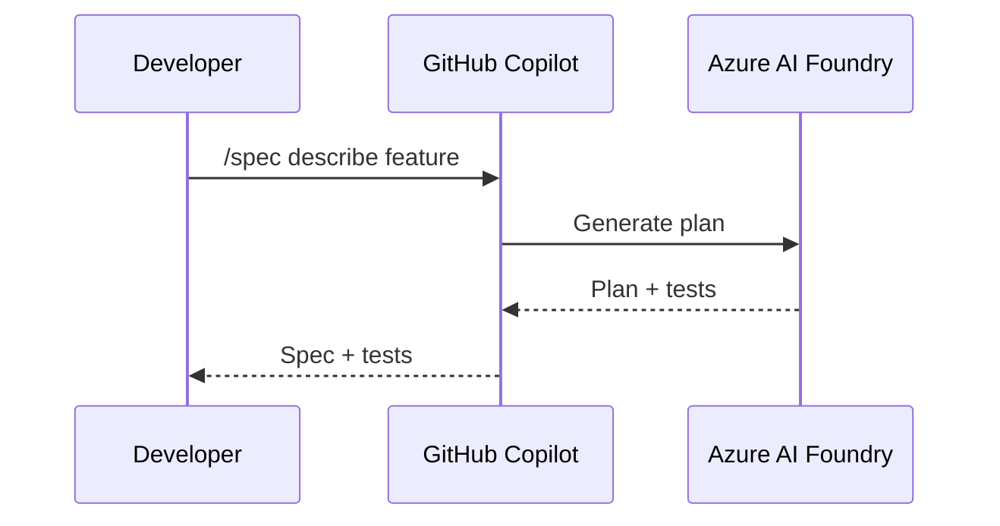

# Markdown Guide / Long-form `.md` Reference (paulasilva-ms)

For raw-markdown long-form documents under MS identity: workshop guides, framework explanations, enablement bridges, customer field guides, technical articles. Source files that may be rendered to HTML or PDF later, but stand on their own as reading material.

Examples in this workspace:
- `doc-presentations/sdd-tdd-spec-kit-specky/SDD_TDD_Spec_Kit_Specky_Complete_Guide_v3.0.0_2026-04-27.md`
- `doc-presentations/agentic-devops-platform/Agentic_DevOps_Platform_Bridge_v1.0_2026-04-22_en.md`
- `doc-presentations/guia-agentes-microsoft/Guia_Agentes_Microsoft_v1.0.0-ptbr_2026-04-16.md`

## When to use markdown guide vs HTML playbook

| Use markdown guide | Use HTML playbook |
|---|---|
| Living document, edited frequently | Stable, render-once-and-publish |
| Read on GitHub or in editor | Read in browser as the primary surface |
| Source for downstream HTML/PDF/PPTX | Final delivered artifact |
| Code-heavy, reviewed in PRs | Prose-heavy, reviewed by skim |
| Internal review with engineers / DevRel | Customer leave-behind |
| Output of doc co-authoring | Output of workshop or deck pipeline |

## Mandatory frontmatter (MS-identity)

```yaml
---
title: "Workshop Guide: Agentic DevOps Foundations"
description: "Hands-on workshop guide covering the four-layer agentic stack with Microsoft platform tooling"
author: "Paula Silva"
role: "Software Global Black Belt"
contact: "paulasilva@microsoft.com"
date: "2026-04-27"
version: "1.0.0"
status: "approved"
locale: "en"
tags: ["agentic", "devops", "platform-engineering", "microsoft", "github-copilot", "azure-ai-foundry"]
---
```

Field rules (MS-specific differences from `paulasilvatech-ds/markdown-guide.md`):

| Field | Required | MS Format |
|---|---|---|
| `title` | yes | Sentence case |
| `description` | yes | One sentence |
| `author` | yes | `Paula Silva` (not `Paula Silva, AI-Native Software Engineer`) |
| `role` | yes | `Software Global Black Belt` (always English, never abbreviated) |
| `contact` | yes | `paulasilva@microsoft.com` (single channel) |
| `date` | yes | ISO `YYYY-MM-DD` |
| `version` | yes | Semver `M.M.M` |
| `status` | yes | `draft` \| `approved` \| `archived` |
| `locale` | yes | `en` \| `pt-br` \| `es` \| `multi` |
| `tags` | yes | Lowercase, hyphenated, ordered most-specific first |

**Forbidden in frontmatter** (will fail the identity audit):
- `github`, `linkedin`, `site` keys (no personal socials in MS material)
- `AI-Native Software Engineer` as `role` or anywhere in `author`
- `agenticdevopsplatform.com` in any field
- Translated forms of role/tagline (always English)

## Document structure (canonical)

```markdown
---
[frontmatter]
---

# Document Title

> One-paragraph italicized lead.

## Change Log

| Version | Date       | Author      | Changes |
|---------|------------|-------------|---------|
| 1.0.0   | 2026-04-27 | Paula Silva | Initial workshop guide |

## Table of Contents

- [1. Section title](#1-section-title)
  - [1.1 Subsection](#11-subsection)
- [2. Next section](#2-next-section)

---

## 1. Section Title

[chapter lead, 1 to 3 sentences]

### 1.1 Subsection

[prose, code, tables]

---

## Closing section

[Monday morning / What to do next / References]

---

Paula Silva, Software Global Black Belt
*Building the future of software development with AI and Agentic DevOps*

paulasilva@microsoft.com
```

## Heading rules

- **H1 once**, immediately after frontmatter.
- **H2 per major section**, numbered (`## 1. Section`).
- **H3 for subsections**, numbered with parent (`### 1.1 ...`).
- **H4 only for** numbered sub-subsections in long sections.
- **Sentence case**, not Title Case.

## Mandatory sections

Same as `paulasilvatech-ds/markdown-guide.md`:

1. **H1 title** + italicized one-paragraph lead.
2. **Change Log**: table with version / date / author / changes.
3. **Table of Contents**: bulleted, anchor-linked, two levels deep.
4. **Body sections**: numbered H2/H3.
5. **Closing section**: "Monday morning" or "What to do next" + "References".
6. **MS signature block**: exactly as in the structure above. No socials, email only.

## MS signature block (mandatory at end of file)

```markdown
---

Paula Silva, Software Global Black Belt
*Building the future of software development with AI and Agentic DevOps*

paulasilva@microsoft.com
```

The italicized line is the EN tagline, never translated even in PT-BR or ES guides.

## Code blocks

Always include a language tag:

````markdown
```bash
az login
az ai foundry workspace create --name agent-workspace
```
````

Keep blocks under ~30 lines. Long listings → side files referenced by hyperlink.

**Microsoft-specific code patterns** (when the guide is Microsoft-platform-focused):
- Azure CLI commands: prefer `az ai foundry`, `azd up`, `gh` (GitHub CLI) over imperative scripts.
- C# / .NET examples: use modern style (records, file-scoped namespaces, primary constructors).
- TypeScript / Node: prefer `node:` import prefix and ES modules.

## Diagrams

**Mermaid preferred** for sequence, flowchart, state, renders natively on GitHub:

````markdown

````

SVG referenced as image for architecture diagrams. See `references/architecture-diagrams.md`.

## Citations (MS-preferred sources)

For Microsoft-platform claims, prefer official sources in this order:

1. **Microsoft Learn** (`learn.microsoft.com`), primary canonical reference for Azure / GitHub / .NET / Power Platform.
2. **Microsoft official blogs**: Azure blog, GitHub blog, .NET blog, Power Platform blog.
3. **GitHub repositories owned by `microsoft/` or `Azure/`**: canonical for SDKs and tooling.
4. **Vendor-neutral research**: KPMG, Gartner, Forrester, IDC, McKinsey, when claim is about the market, not the platform.
5. **OpenAI, Microsoft Research, Google Research, peer-reviewed papers**: when claim is about model behavior or AI research generally.

Avoid as primary citations:
- Personal blogs (yours included, link to Microsoft sources first).
- Stack Overflow / Reddit threads (use only as code-pattern references, never as authority).
- Marketing pages without dated content.

## Editorial mechanics (MS calibration)

All hard rules from `references/voice.md` apply, plus:

- **No em dashes (`-`)**: use comma, period, colon, semicolon.
- **Sentence case headings.**
- **Full product names**: `GitHub Copilot` (not `Copilot`), `Azure AI Foundry` (not `Foundry` or `AI Foundry`), `Microsoft 365 Copilot` (not `M365 Copilot`).
- **ISO dates** in metadata.
- **Slightly more formal calibration** than personal material, see `references/voice.md` "Microsoft-identity tone calibration" table.
- **Preserve directness**: do not soften to corporate-speak. The voice should still be recognizably Paula's.

## File naming (MS material)

Same convention as `references/SKILL.md` Step 6:

```
{Title}_v{M_M_M}_{YYYY-MM-DD}_{locale}.md
```

Examples:
```
SDD_TDD_Spec_Kit_Specky_Complete_Guide_v3.0.0_2026-04-27.md
Workshop_Guide_AgenticDevOps_v1_0_0_2026-05-01_en.md
Guia_Agentes_Microsoft_v1.0.0-ptbr_2026-04-16.md
```

## Pre-publish checklist (MS markdown guide)

- [ ] Frontmatter has `author`, `role` (`Software Global Black Belt`), `contact` (`paulasilva@microsoft.com`)
- [ ] No `github`, `linkedin`, `site` fields in frontmatter
- [ ] No `AI-Native Software Engineer` anywhere in the file
- [ ] No `@paulasilvatech`, `paulanunes`, `agenticdevopsplatform` anywhere
- [ ] H1 matches frontmatter `title`
- [ ] Change Log includes the current version row
- [ ] TOC anchors match section IDs
- [ ] No em dashes
- [ ] No banned vocabulary (see `references/voice.md`)
- [ ] All stats have source statements; Microsoft sources cited where applicable
- [ ] All external references are hyperlinks, not bare URLs
- [ ] Code blocks have language tags
- [ ] Closing signature block matches the MS-identity template exactly
- [ ] Tagline is in English regardless of locale
- [ ] Run forbidden-strings audit from `references/identity.md`
