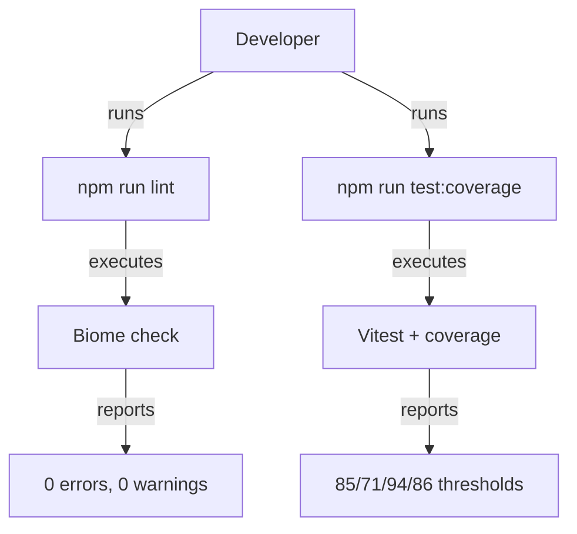

# Specky — Design

> Complete system design covering architecture, data, APIs, security, infrastructure, and decisions.

---

## 1. System Context (C4 Level 1)

The Specky CLI toolkit is a Node.js/TypeScript project that provides spec-driven development capabilities through MCP tools, agents, and hooks. This design covers the integration of Biome as the linting/formatting toolchain.

**External systems:**
- Biome (linting/formatting engine)
- Vitest (test runner with coverage)
- npm (package management and script execution)

---

## 2. Container Architecture (C4 Level 2)

**Single container:** Node.js CLI application.

- `src/` — TypeScript source code
- `tests/` — Vitest unit and integration tests
- `dist/` — Compiled JavaScript output
- `.specs/` — SDD spec packages (this feature adds the first one)

---

## 3. Component Design (C4 Level 3)

**Lint integration:**
- `biome.json` — Biome configuration (formatter + linter)
- `package.json` — npm scripts: `lint`, `lint:fix`, `format`

**Test coverage:**
- `tests/unit/slug.test.ts` — slugification tests
- `tests/unit/routing-helper.test.ts` — model routing hint tests
- `tests/unit/audit-tools.test.ts` — audit tool registration tests
- `tests/unit/transcript-tools.test.ts` — transcript MCP tool tests
- `tests/unit/cli-commands.test.ts` — CLI command tests
- `tests/unit/vscode-settings-writer.test.ts` — VS Code settings writer tests
- `tests/unit/agent-skills.test.ts` — agent-skills compiler tests

**Dogfooding:**
- `.specs/001-biome-lint-integration/` — This spec package

---

## 4. Code-Level Design (C4 Level 4)

**Biome configuration** (`biome.json`):
- Formatter: 2-space indent, LF line endings, 100 char line width
- Linter: recommended rules with `noExplicitAny` off (project uses `any` in MCP SDK types)
- Files: ignore `dist`, `node_modules`, `coverage`, `site`, `.svg`

**Coverage thresholds** (`vitest.config.ts`):
- Statements: 85
- Branches: 71
- Functions: 94
- Lines: 86

---

## 5. System Diagrams

---

## 6. Data Model

No persistent data model changes. The `.specs/` directory structure follows the standard SDD artifact layout:
- `CONSTITUTION.md` — project charter
- `SPECIFICATION.md` — requirements
- `DESIGN.md` — this document
- `TASKS.md` — implementation tasks
- `ANALYSIS.md` — consistency analysis
- `CHECKLIST.md` — verification checklist

---

## 7. API Contracts

No network API changes. The npm scripts added:
- `npm run lint` — executes `biome check .`
- `npm run lint:fix` — executes `biome check --write .`
- `npm run format` — executes `biome format --write .`

---

## 8. Infrastructure & Deployment

No infrastructure changes. The feature is local development tooling only.

---

## 9. Security Architecture

No security changes. Biome is a devDependency; it does not ship with the runtime package.

---

## 10. Architecture Decision Records

### ADR-001: Biome over ESLint+Prettier

**Decision:** Use Biome as the single linting/formatting toolchain.

**Rationale:** Biome is faster (Rust-based), has unified config, and requires less setup than ESLint+Prettier.

**Consequences:** Slight learning curve for contributors familiar with ESLint; Biome's rule set differs from ESLint.

### ADR-002: Manual test creation over generated tests

**Decision:** Write tests manually for uncovered modules rather than generating them.

**Rationale:** Manual tests are more maintainable and cover edge cases that generators miss.

**Consequences:** More effort upfront, but higher quality test coverage.

### ADR-003: Static-only classes kept with biome-ignore

**Decision:** Keep `DependencyGraph` and `MethodologyGuide` as static-only classes with biome-ignore comments.

**Rationale:** Converting to functions would break the public API and require changes across all consumers.

**Consequences:** Biome warning suppressed; code remains compatible.

---

## 11. Error Handling Strategy

- Biome config errors: fail fast with clear error message
- Test failures: standard Vitest error output
- Coverage threshold failures: exit code 1 with detailed report

---

## 12. Cross-Cutting Concerns

- **Logging:** Biome outputs to stdout/stderr
- **Monitoring:** CI pipeline captures test and lint results
- **Configuration:** `biome.json` is the single source of truth
