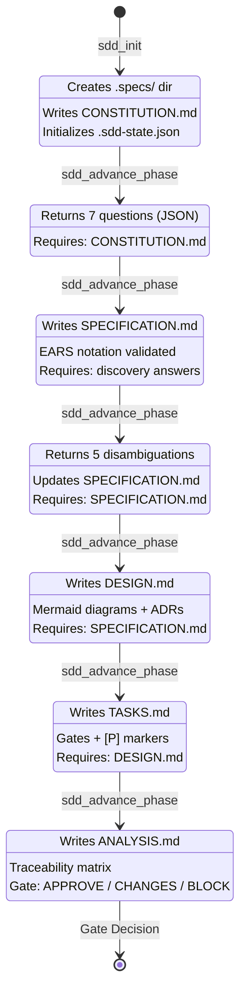
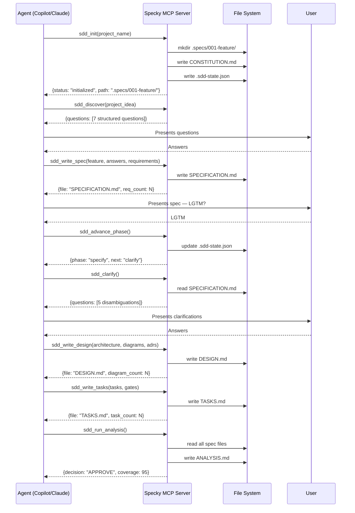
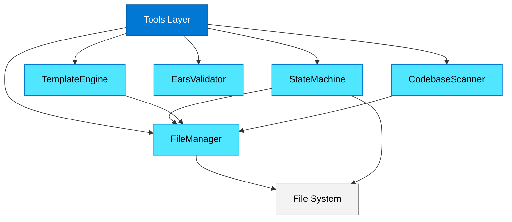
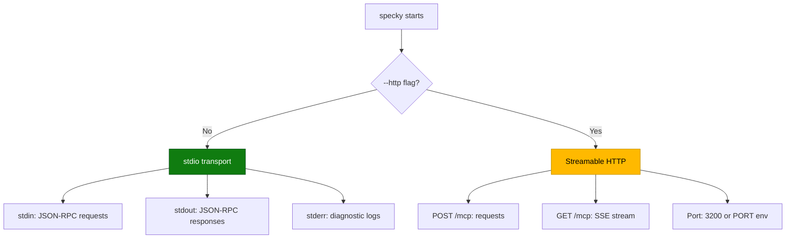
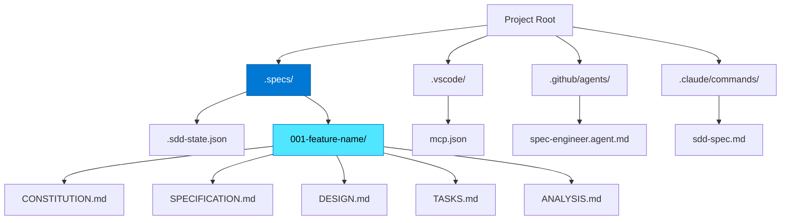
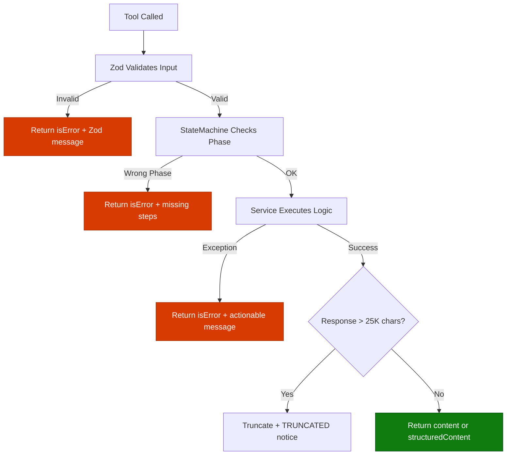

# Specky — Design

> Architecture, Mermaid diagrams, ADRs, and API contracts for the Specky MCP server.

---

## Table of Contents

- [1. Architecture Overview](#1-architecture-overview)
- [2. System Diagrams](#2-system-diagrams)
- [3. Project Structure](#3-project-structure)
- [4. Services Architecture](#4-services-architecture)
- [5. Tool Registration Pattern](#5-tool-registration-pattern)
- [6. Architecture Decision Records](#6-architecture-decision-records)
- [7. Data Models](#7-data-models)
- [8. Error Handling Strategy](#8-error-handling-strategy)

---

## 1. Architecture Overview

Specky follows a **layered architecture** with clear separation between transport, tools, and services. The MCP SDK handles protocol serialization; tools validate input and format output; services contain all business logic.

**Key design principle:** Tools are thin. Services are fat. The `FileManager` owns all disk I/O. The `StateMachine` owns all phase logic. No tool reads or writes files directly — they delegate to services.

```
┌─────────────────────────────────────────────────────────┐
│                    MCP Clients                           │
│  VS Code (Copilot)  │  Claude Code  │  Claude Desktop   │
└──────────┬──────────┴──────┬────────┴──────┬────────────┘
           │ stdio           │ stdio         │ stdio
           └──────────┬──────┘               │
                      │                      │
┌─────────────────────▼──────────────────────▼────────────┐
│                  Specky MCP Server                        │
│                                                          │
│  ┌─── Transport Layer ────────────────────────────────┐  │
│  │  stdio (default)  │  Streamable HTTP (--http flag) │  │
│  └────────────────────────────────────────────────────┘  │
│                          │                               │
│  ┌─── Tool Layer ─────────────────────────────────────┐  │
│  │  pipeline.ts (8 tools)                             │  │
│  │  analysis.ts (2 tools: run_analysis, check_sync)   │  │
│  │  utility.ts  (4 tools: status, template, scan, amend)│ │
│  └────────────────────────────────────────────────────┘  │
│                          │                               │
│  ┌─── Schema Layer ───────────────────────────────────┐  │
│  │  common.ts  │  pipeline.ts  │  utility.ts          │  │
│  │  (Zod .strict() schemas for all tool inputs)       │  │
│  └────────────────────────────────────────────────────┘  │
│                          │                               │
│  ┌─── Service Layer ──────────────────────────────────┐  │
│  │  FileManager  │  StateMachine  │  TemplateEngine    │  │
│  │  EarsValidator │  CodebaseScanner                   │  │
│  └────────────────────────────────────────────────────┘  │
│                          │                               │
│  ┌─── Template Layer ─────────────────────────────────┐  │
│  │  templates/*.md (7 embedded Markdown templates)     │  │
│  └────────────────────────────────────────────────────┘  │
│                          │                               │
│  ┌─── File System ────────────────────────────────────┐  │
│  │  .specs/NNN-feature/  │  .specs/.sdd-state.json    │  │
│  └────────────────────────────────────────────────────┘  │
└──────────────────────────────────────────────────────────┘
```

**Covers:** REQ-CORE-001, REQ-CORE-002, REQ-CORE-003, REQ-SVC-001 through REQ-SVC-010

---

## 2. System Diagrams

### Diagram 1: SDD Pipeline State Machine

This diagram shows the 7-phase pipeline with transitions and required artifacts.



**Covers:** REQ-PIPE-001 through REQ-PIPE-008, REQ-SVC-003, REQ-SVC-004

---

### Diagram 2: Tool Call Sequence (Full Pipeline)

This diagram shows a complete pipeline execution from the agent's perspective.



**Covers:** REQ-PIPE-001 through REQ-PIPE-008, REQ-INT-001, REQ-INT-003

---

### Diagram 3: Service Dependency Graph

Shows how services depend on each other. No circular dependencies.



**Key insight:** `FileManager` is the foundation — all other services that need disk access go through it. `EarsValidator` is the only pure service (no disk dependency).

**Covers:** REQ-SVC-001 through REQ-SVC-010

---

### Diagram 4: Transport Selection



**Covers:** REQ-CORE-002, REQ-CORE-003

---

### Diagram 5: File Structure on Disk

After a full pipeline run, this is what exists in the user's project:



**Covers:** REQ-PIPE-001, REQ-INT-004, Constitution Art. 2

---

### Diagram 6: Error Handling Flow



**Covers:** REQ-CORE-006, REQ-QUAL-003, REQ-SVC-003

---

## 3. Project Structure

```
specky/                                 # Project root
├── package.json                        # npm package, bin: "specky"
├── tsconfig.json                       # Strict TypeScript
├── Dockerfile                          # Multi-stage build
├── docker-compose.yml                  # HTTP mode
├── README.md                           # Full documentation
├── LICENSE                             # MIT
├── .specs/                             # Specky's own specs (dogfooding)
│   └── 001-specky-mcp-server/
│       ├── CONSTITUTION.md
│       ├── SPECIFICATION.md
│       ├── DESIGN.md                   # This file
│       ├── TASKS.md
│       └── ANALYSIS.md
├── .vscode/
│   └── mcp.json.example               # VS Code config example
├── .github/
│   └── agents/                         # GitHub Copilot agents
│       ├── spec-engineer.agent.md
│       ├── design-architect.agent.md
│       ├── task-planner.agent.md
│       └── spec-reviewer.agent.md
├── .claude/
│   └── commands/                       # Claude Code commands
│       ├── sdd-spec.md
│       ├── sdd-design.md
│       ├── sdd-tasks.md
│       ├── sdd-analyze.md
│       └── sdd-bugfix.md
├── src/
│   ├── index.ts                        # Entry: McpServer + transport
│   ├── constants.ts                    # VERSION, CHARACTER_LIMIT, etc.
│   ├── types.ts                        # All TypeScript interfaces
│   ├── schemas/
│   │   ├── common.ts                   # Shared Zod schemas
│   │   ├── pipeline.ts                 # Pipeline tool schemas
│   │   └── utility.ts                  # Utility tool schemas
│   ├── services/
│   │   ├── file-manager.ts             # Disk I/O with path sanitization
│   │   ├── state-machine.ts            # Phase tracking + transitions
│   │   ├── template-engine.ts          # Template rendering
│   │   ├── ears-validator.ts           # EARS pattern validation
│   │   └── codebase-scanner.ts         # Project structure detection
│   └── tools/
│       ├── pipeline.ts                 # 8 pipeline tools
│       ├── analysis.ts                 # 2 analysis tools
│       └── utility.ts                  # 4 utility tools
└── templates/
    ├── constitution.md                 # CONSTITUTION template
    ├── specification.md                # SPECIFICATION template
    ├── design.md                       # DESIGN template
    ├── tasks.md                        # TASKS template
    ├── analysis.md                     # ANALYSIS template
    ├── bugfix.md                       # BUGFIX_SPEC template
    └── sync-report.md                  # SYNC_REPORT template
```

**Total: 38 files** (17 TypeScript, 7 templates, 4 agents, 5 commands, 5 spec docs, 6 config/docs)

---

## 4. Services Architecture

### 4.1 FileManager

**Responsibility:** All disk I/O. No other service or tool reads/writes files directly.

```typescript
export class FileManager {
  constructor(private workspaceRoot: string) {}

  // Directory operations
  async ensureSpecDir(specDir: string): Promise<string>
  async listFeatures(): Promise<FeatureInfo[]>

  // File operations (all paths relative to workspaceRoot)
  async writeSpecFile(featureDir: string, fileName: string, content: string, force?: boolean): Promise<string>
  async readSpecFile(featureDir: string, fileName: string): Promise<string>
  async fileExists(relativePath: string): Promise<boolean>
  async listSpecFiles(featureDir: string): Promise<string[]>

  // Project scanning
  async readProjectFile(relativePath: string): Promise<string>
  async scanDirectory(dir: string, depth: number, exclude: string[]): Promise<DirectoryTree>

  // Safety
  private sanitizePath(path: string): string  // Rejects "..", absolute paths
}
```

**Design choices:**
- Atomic writes via temp file + rename (REQ-SVC-002)
- Path sanitization rejects `..` traversal (REQ-SVC-001)
- `force` parameter required to overwrite existing files
- Returns absolute path of written file for agent display

**Covers:** REQ-SVC-001, REQ-SVC-002

---

### 4.2 StateMachine

**Responsibility:** Phase tracking, transition validation, state persistence.

```typescript
export class StateMachine {
  constructor(private fileManager: FileManager) {}

  async loadState(specDir: string): Promise<SddState>
  async saveState(specDir: string, state: SddState): Promise<void>
  async getCurrentPhase(specDir: string): Promise<Phase>
  async canTransition(specDir: string, targetPhase: Phase): Promise<TransitionResult>
  async advancePhase(specDir: string, featureNumber: string): Promise<SddState>
  async recordPhaseStart(specDir: string, phase: Phase): Promise<void>
  async recordPhaseComplete(specDir: string, phase: Phase): Promise<void>

  // Validation
  getRequiredFiles(phase: Phase): string[]
  getPhaseOrder(): Phase[]
}
```

**Phase transition rules:**

| From | To | Required Files |
|------|----|---------------|
| (none) | init | — |
| init | discover | CONSTITUTION.md |
| discover | specify | CONSTITUTION.md + discovery completed |
| specify | clarify | SPECIFICATION.md |
| clarify | design | SPECIFICATION.md (clarified) |
| design | tasks | DESIGN.md |
| tasks | analyze | TASKS.md |

**Covers:** REQ-SVC-003, REQ-SVC-004, REQ-PIPE-008

---

### 4.3 TemplateEngine

**Responsibility:** Load templates, replace variables, add frontmatter.

```typescript
export class TemplateEngine {
  constructor(private fileManager: FileManager) {}

  async render(templateName: TemplateName, context: Record<string, string | string[]>): Promise<string>
  async renderWithFrontmatter(templateName: TemplateName, context: TemplateContext): Promise<string>

  // Internal
  private loadTemplate(name: TemplateName): Promise<string>
  private replaceVariables(template: string, context: Record<string, string>): string
  private generateFrontmatter(context: TemplateContext): string
}
```

**Variable replacement rules:**
- `{{variable}}` → replaced with context value
- `{{variable}}` not in context → `[TODO: variable]`
- `{{#each items}}...{{/each}}` → iterated (simple loop support)
- No double-encoding of `<`, `>`, `&` in replaced values

**Covers:** REQ-SVC-005, REQ-SVC-006

---

### 4.4 EarsValidator

**Responsibility:** Validate EARS notation, detect patterns, suggest improvements.

```typescript
export class EarsValidator {
  validate(requirement: string): ValidationResult
  detectPattern(requirement: string): EarsPattern
  suggestImprovement(requirement: string): EarsImprovement
  validateAll(requirements: EarsRequirement[]): BatchValidationResult
}
```

**Pattern detection rules:**

| Pattern | Regex Trigger | Priority |
|---------|--------------|----------|
| Ubiquitous | `^The (system\|server\|tool) shall` | 6 (lowest) |
| Event-driven | `^When .+, the (system\|server\|tool) shall` | 1 (highest) |
| State-driven | `^While .+, the (system\|server\|tool) shall` | 2 |
| Optional | `^Where .+, the (system\|server\|tool) shall` | 3 |
| Unwanted | `^If .+, then the (system\|server\|tool) shall` | 4 |
| Complex | Multiple patterns combined | 5 |

**Covers:** REQ-SVC-007, REQ-SVC-008

---

### 4.5 CodebaseScanner

**Responsibility:** Read project structure for auto-steering context.

```typescript
export class CodebaseScanner {
  constructor(private fileManager: FileManager) {}

  async scan(depth: number, exclude: string[]): Promise<CodebaseSummary>
  async detectTechStack(): Promise<TechStack>

  // Internal
  private detectFromPackageJson(content: string): Partial<TechStack>
  private detectFromRequirementsTxt(content: string): Partial<TechStack>
  private detectFromGoMod(content: string): Partial<TechStack>
}
```

**Manifest detection order:** `package.json` → `requirements.txt` → `pyproject.toml` → `go.mod` → `Cargo.toml` → `pom.xml` → `build.gradle`

**Covers:** REQ-SVC-009, REQ-SVC-010

---

## 5. Tool Registration Pattern

All tools follow the same registration pattern using `server.registerTool()`:

```typescript
// Pattern: one function per tool domain
export function registerPipelineTools(
  server: McpServer,
  fileManager: FileManager,
  stateMachine: StateMachine,
  templateEngine: TemplateEngine,
  earsValidator: EarsValidator
): void {

  server.registerTool(
    "sdd_init",
    {
      title: "Initialize SDD Pipeline",
      description: "Creates .specs/ directory, writes CONSTITUTION.md skeleton, and initializes the state machine. Call this first before any other SDD tool.",
      inputSchema: initInputSchema,       // Zod .strict() schema
      annotations: {
        readOnlyHint: false,
        destructiveHint: false,
        idempotentHint: false,
        openWorldHint: false
      }
    },
    async (input) => {
      try {
        // 1. Validate phase (StateMachine)
        // 2. Execute logic (FileManager + TemplateEngine)
        // 3. Update state (StateMachine)
        // 4. Return result
        return {
          content: [{ type: "text", text: JSON.stringify(result) }],
          structuredContent: { ... }
        };
      } catch (error) {
        return {
          content: [{ type: "text", text: `Error: ${error.message}` }],
          isError: true
        };
      }
    }
  );

  // ... register remaining 7 pipeline tools
}
```

**Covers:** REQ-INT-006, REQ-QUAL-003, REQ-QUAL-006

---

## 6. Architecture Decision Records

### ADR-001: Standalone Project over Module

**Decision:** Build Specky as an independent npm package, not a module inside an existing MCP server.

**Rationale:** A standalone project can be distributed via npm (`npx specky`), versioned independently, tested independently, and adopted by any developer without coupling to specific infrastructure.

**Consequences:** Requires its own `package.json`, `tsconfig.json`, and build step. This is standard for professional MCP servers and follows the pattern of other community MCP servers.

**Covers:** REQ-CORE-005, Constitution Art. 3.1

---

### ADR-002: stdio as Primary Transport

**Decision:** Default transport is stdio. HTTP is opt-in via `--http` flag.

**Rationale:** VS Code spawns MCP servers as subprocesses via stdio. Claude Code and Claude Desktop also use stdio for local servers. MCP best practices recommend stdio for local integrations.

**Consequences:** All logging must go to stderr (stdout is reserved for JSON-RPC). HTTP mode requires explicit flag, which makes it clear this is a secondary deployment option.

**Covers:** REQ-CORE-002, REQ-CORE-003, Constitution Art. 3.7

---

### ADR-003: Tools Write Files Directly

**Decision:** `sdd_write_*` tools create real files on disk instead of returning content for the agent to save.

**Rationale:** This is the whole point of the MCP server — the agent orchestrates the conversation while Specky handles file I/O and state management. This matches how MCP-native servers work and avoids the "documentation-only" trap of the previous implementation.

**Consequences:** The server needs `SDD_WORKSPACE` to know where to write. File operations must be safe (atomic writes, path sanitization). The `force` parameter prevents accidental overwrites.

**Covers:** REQ-SVC-001, REQ-SVC-002, Constitution Art. 3.2

---

### ADR-004: Thin Tools, Fat Services

**Decision:** Tools are thin wrappers (validate input, call service, format output). All business logic lives in services.

**Rationale:** This makes services independently testable, avoids code duplication between tools that share logic (e.g., multiple tools use FileManager), and keeps the tool registration code clean and readable.

**Consequences:** The service layer has 5 classes that must be initialized at startup and injected into tool registration functions.

**Covers:** Constitution Art. 3.4

---

### ADR-005: Embedded Templates over External Dependencies

**Decision:** Markdown templates are embedded in the `templates/` directory and shipped with the npm package.

**Rationale:** Zero external dependencies for templates. Templates work offline. Users can inspect and customize templates by forking the repo. No API calls needed for template rendering.

**Consequences:** Template updates require a new npm release. Users who want custom templates must fork or override. This trade-off is acceptable because templates rarely change and stability is more valuable than hot-reloading.

**Covers:** REQ-UTIL-002, REQ-SVC-005, Constitution Art. 3.6

---

## 7. Data Models

### SddState (`.sdd-state.json`)

```typescript
interface SddState {
  version: string;                    // "3.0.0"
  project_name: string;               // "my-cool-project"
  current_phase: Phase;               // "specify"
  phases: Record<Phase, PhaseStatus>;
  features: string[];                 // ["001-my-cool-project"]
  amendments: Amendment[];
  gate_decision: GateDecision | null;
}

interface PhaseStatus {
  status: "pending" | "in_progress" | "completed";
  started_at?: string;                // ISO 8601
  completed_at?: string;              // ISO 8601
}

type Phase = "init" | "discover" | "specify" | "clarify" | "design" | "tasks" | "analyze";

interface GateDecision {
  decision: "APPROVE" | "CHANGES_NEEDED" | "BLOCK";
  reasons: string[];
  coverage_percent: number;
  gaps: string[];
  decided_at: string;
}
```

### FeatureInfo

```typescript
interface FeatureInfo {
  number: string;      // "001"
  name: string;        // "my-cool-project"
  directory: string;   // ".specs/001-my-cool-project"
  files: string[];     // ["CONSTITUTION.md", "SPECIFICATION.md"]
}
```

### EarsRequirement

```typescript
interface EarsRequirement {
  id: string;                        // "REQ-CORE-001"
  pattern: EarsPattern;              // "ubiquitous"
  text: string;                      // "The server shall..."
  acceptance_criteria: string[];
  traces_to: string[];               // ["SC-001", "Art. 4.3"]
}

type EarsPattern = "ubiquitous" | "event_driven" | "state_driven" | "optional" | "unwanted" | "complex" | "unknown";
```

### DirectoryTree

```typescript
interface DirectoryTree {
  name: string;
  type: "file" | "directory";
  children?: DirectoryTree[];
}

interface CodebaseSummary {
  tree: DirectoryTree;
  tech_stack: TechStack;
  total_files: number;
  total_dirs: number;
}

interface TechStack {
  language: string;           // "TypeScript"
  framework?: string;         // "Express"
  package_manager: string;    // "npm"
  runtime: string;            // "Node.js 18"
}
```

**Covers:** REQ-SVC-004, REQ-SVC-009, REQ-SVC-010

---

## 8. Error Handling Strategy

### Error Categories

| Category | HTTP Analog | MCP Response | Example |
|----------|-------------|-------------|---------|
| **Validation Error** | 400 | `isError: true` + Zod message | Invalid `project_name` format |
| **Phase Error** | 409 | `isError: true` + missing steps | Called `sdd_write_design` before `sdd_write_spec` |
| **Not Found** | 404 | `isError: true` + expected path | SPECIFICATION.md not found |
| **Already Exists** | 409 | `isError: true` + use `force: true` | CONSTITUTION.md already exists |
| **Internal Error** | 500 | `isError: true` + generic message | Unexpected filesystem error |

### Error Message Format

All error messages follow this pattern:

```
[TOOL_NAME] Error: {what happened}
→ Expected: {what should exist or be true}
→ Found: {what actually exists or is true}
→ Fix: {exactly what the user/agent should do next}
```

**Example:**

```
[sdd_write_design] Error: Cannot write DESIGN.md — prerequisite phase not complete.
→ Expected: Phase "specify" completed with SPECIFICATION.md on disk
→ Found: Current phase is "init", SPECIFICATION.md does not exist
→ Fix: Run sdd_discover, then sdd_write_spec, then sdd_advance_phase to reach "design" phase
```

**Covers:** REQ-QUAL-003, Constitution Art. 4.4
