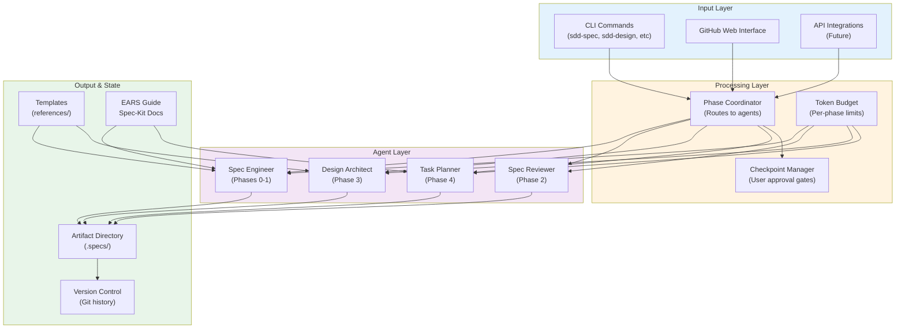
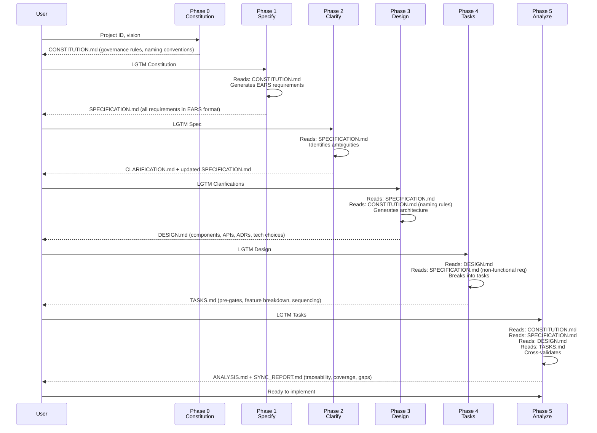
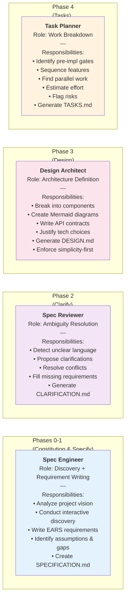
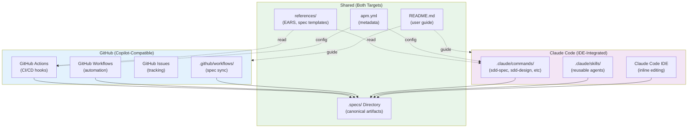
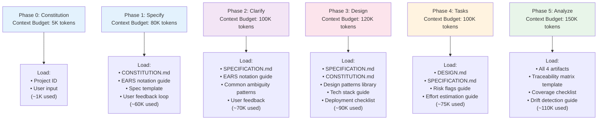
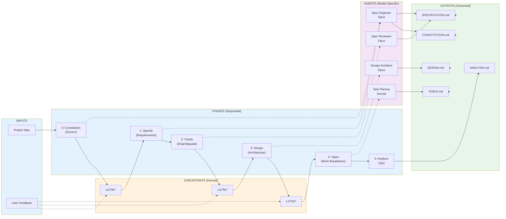

# SDD Spec Engineer v3.0 - System Architecture

## Executive Summary

**SDD Spec Engineer** is a specification-driven design system that orchestrates the creation of complete, traceable software specifications from initial idea through implementation planning. It solves a critical problem in software engineering: the gap between ambiguous product ideas and executable task lists.

The system combines **seven sequential phases** (Constitution → Specify → Clarify → Design → Tasks → Analyze → Handoff), **four specialized agents**, **six automation hooks**, and **structured templates** to transform rough ideas into production-ready specifications suitable for both GitHub Copilot and Claude Code environments.

### The Problem It Solves

Modern software projects fail not because developers can't build, but because **requirements are ambiguous, incomplete, or contradict design decisions**. Engineers spend 40% of time rework due to misunderstood requirements. SDD Spec Engineer reduces this friction by:

1. **Externalizing governance** (Constitution phase) so all parties agree on how specs evolve
2. **Formalizing requirements** (Specify phase) using EARS notation, eliminating ambiguity
3. **Validating completeness** (Clarify → Analyze phases) before design work begins
4. **Linking design to requirements** (Design → Tasks phases) creating an auditable chain of custody
5. **Detecting drift** (Analyze phase) between specification, design, and implementation plan

### Design Constraints

The system operates under three immutable constraints:

- **Dual-tool compatibility:** Must work seamlessly with GitHub Copilot AND Claude Code (not just Claude)
- **File-based state:** No runtime database or persistent service; all state lives in Markdown files
- **AI-model agnostic:** Orchestration works with any frontier model (Claude Opus, Sonnet, Haiku, GPT-4, etc.)

### Quality Attributes

| Attribute | Why It Matters | How Achieved |
|-----------|----------------|-------------|
| **Traceability** | Auditors and regulators demand proof that every requirement → design → task | Traceback links in every artifact |
| **Simplicity-first** | Prevent over-engineering and gold-plating | Explicit rejection of "nice-to-have" complexity in Design phase |
| **Progressive disclosure** | Don't overwhelm users with 500-page specs; reveal detail only when needed | Context loading increases with each phase |
| **Human-readable** | Specs must survive 6-month hibernation and still make sense | Markdown + tables + Mermaid diagrams |
| **Extensible** | Teams have unique needs (compliance, architecture styles, tech stacks) | Templates + hooks + customizable agents |

---

## System Architecture (High-Level)

The SDD Spec Engineer orchestrates a **pipeline of 7 sequential phases**, each with a dedicated agent, producing a **versioned artifact directory** with full traceability.

```mermaid
graph LR
    A["User Idea<br/>Bug Report<br/>Feature Request"] -->|Project ID + Scope| Constitution["📋 Phase 0: Constitution<br/>(Governance Establishment)"]
    
    Constitution -->|Charter + Rules| Specify["📝 Phase 1: Specify<br/>(Requirement Extraction)"]
    
    Specify -->|Requirements| Clarify["🔍 Phase 2: Clarify<br/>(Ambiguity Resolution)"]
    
    Clarify -->|Validated Spec| Design["🏗️ Phase 3: Design<br/>(Architecture Definition)"]
    
    Design -->|Components + APIs| Tasks["✅ Phase 4: Tasks<br/>(Work Breakdown)"]
    
    Tasks -->|Task List| Analyze["📊 Phase 5: Analyze<br/>(Quality Assurance)"]
    
    Analyze -->|Traceability Report| Handoff["🚀 Phase 6: Handoff<br/>(Ready to Implement)"]
    
    Handoff -->|.specs/ Directory| Output["Complete Spec Package<br/>(CONSTITUTION.md<br/>SPECIFICATION.md<br/>DESIGN.md<br/>TASKS.md<br/>ANALYSIS.md<br/>SYNC_REPORT.md)"]
    
    style Constitution fill:#e3f2fd
    style Specify fill:#e3f2fd
    style Clarify fill:#f3e5f5
    style Design fill:#fce4ec
    style Tasks fill:#fff3e0
    style Analyze fill:#e8f5e9
    style Handoff fill:#eceff1
    style Output fill:#f5f5f5
```



**Data Flow Through Phases:**
Each phase reads artifacts from previous phases and writes new artifacts with additive information (never destructive updates).

| Phase | Input | Output | Agent | Model |
|-------|-------|--------|-------|-------|
| Constitution | Project ID, vision | CONSTITUTION.md (governance rules) | None (scaffold only) | N/A |
| Specify | Idea + Constitution | SPECIFICATION.md (EARS requirements) | spec-engineer | Opus 4 |
| Clarify | Spec + feedback | SPECIFICATION.md v2 + CLARIFICATION.md | spec-reviewer | Opus 4 |
| Design | Spec + Constitution | DESIGN.md (components, APIs, ADRs) | design-architect | Opus 4 |
| Tasks | Design + Spec | TASKS.md (work breakdown, gates) | task-planner | Sonnet 4 |
| Analyze | All artifacts | ANALYSIS.md + SYNC_REPORT.md | (analysis module) | Opus 4 |
| Handoff | Analysis | All artifacts ready for dev | (coordinator) | None |

**Key principle:** All agents communicate through files, not direct API calls. This allows:
- Any AI tool to participate (GitHub Copilot, Claude Code, custom scripts)
- Human review and editing at every checkpoint
- Version control and audit trails
- Offline operation (no cloud dependency)

---

## System Architecture (Component View)

The system comprises **four core subsystems**, each with distinct responsibility:



---

## Data Flow Between Phases

This diagram shows what data each phase reads and writes, creating a complete chain of custody:



**Information Flowing Forward:**
- **Constitution → Specify:** Naming conventions, governance rules, approval gates
- **Specify → Clarify:** List of requirements, identified ambiguities to resolve
- **Clarify → Design:** Disambiguated, complete requirements; constraints to respect
- **Design → Tasks:** Component list, APIs, architecture decisions justifying each task
- **Tasks → Analyze:** Task list with effort, dependencies, risk flags
- **Analyze → Handoff:** Validation report, coverage metrics, consistency checks

**Validation Gates:**
Every arrow includes a **checkpoint** where user can reject and loop back:
- ❌ "This spec is incomplete" → back to Specify phase
- ❌ "This design is over-engineered" → back to Design phase with feedback
- ❌ "These tasks don't match the design" → back to Tasks with clarification

---

## Agent Architecture

Four specialized agents divide the specification pipeline by phase and reasoning complexity:



### Agent Routing Strategy

| Agent | Phase | Trigger | Model | Why This Model |
|-------|-------|---------|-------|---|
| **Spec Engineer** | 0, 1 | `sdd-spec` command | Opus 4 | Discovery requires broad context synthesis; EARS notation is nuanced |
| **Spec Reviewer** | 2 | After Phase 1 completion | Opus 4 | Ambiguity resolution requires deep language understanding |
| **Design Architect** | 3 | After Phase 2 completion | Opus 4 | Architecture requires cross-cutting system thinking |
| **Task Planner** | 4 | After Phase 3 completion | Sonnet 4 | Task breakdown is more formulaic; Sonnet optimizes cost/quality ratio |
| **Analysis (built-in)** | 5 | After Phase 4 completion | Opus 4 | QA requires scrutiny across all four artifacts |

### Communication Between Agents

Agents **never call each other directly**. Instead, they communicate through **file conventions**:

1. **Agent writes artifact** (e.g., SPECIFICATION.md)
2. **File is committed to git** (version history preserved)
3. **Next agent reads artifact** as input (with git blame for provenance)
4. **Next agent writes new artifact** that references previous one (via frontmatter `based_on:` field)

This creates an **immutable audit trail**:
```yaml
# Example: DESIGN.md frontmatter
---
title: System Design Document
version: 1.0.0
date: 2026-03-20
author: Claude (SDD Design Architect v3.0)
based_on: SPECIFICATION.md (version 2.1.0)
status: Draft
---
```

**Advantage:** Any tool can insert itself into the pipeline. GitHub Copilot? Run the design phase offline, commit the output, pass the torch to Claude Code for task planning.

---

## Dual-Target Design (.github + .claude)

SDD Spec Engineer supports **two execution environments** simultaneously:



### Target-Specific Structure

| Aspect | GitHub (.github/) | Claude (.claude/) | Shared |
|--------|-------------------|-------------------|--------|
| **Command format** | YAML (workflow syntax) | Markdown skill files | None |
| **Trigger** | Git events (push, pull_request) | CLI commands, hotkeys | User invocation |
| **State persistence** | GitHub Secrets, workflow artifacts | Local session context | .specs/ Markdown files |
| **Model access** | GitHub Copilot (GitHub-hosted) | Claude Code (any Claude model) | Via agent environment |
| **Frontmatter** | Actions syntax (`with:`, `env:`) | Skill syntax (`args:`, `instructions:`) | Markdown YAML (shared) |

### How They Stay in Sync

Both targets read/write the **canonical `.specs/` directory**:

1. User runs `sdd-spec` in Claude Code IDE (writes SPECIFICATION.md)
2. User commits to git
3. GitHub Actions workflow auto-runs (reads SPECIFICATION.md, runs clarification check)
4. Workflow commits updated SPECIFICATION.md back to repo
5. Developer sees clarification notes in IDE next session

**Key invariant:** `.specs/` is the single source of truth. Neither GitHub nor Claude Code overwrites each other; they cooperate through file locking (git merge conflict detection).

---

## Progressive Context Loading

Agents don't load all references upfront. Instead, context **expands with each phase**:



### Why Progressive Loading?

1. **Token efficiency:** Don't load the EARS guide in Phase 5 (already mastered)
2. **Cognitive clarity:** Each phase has a focused responsibility
3. **User control:** Developers can allocate budget; "spend more tokens on design, less on tasks"
4. **Model switching:** Phases with lower budget use Sonnet (cheaper); high-complexity phases use Opus

### Reference Availability by Phase

| Reference | Phase 0 | Phase 1 | Phase 2 | Phase 3 | Phase 4 | Phase 5 |
|-----------|---------|---------|---------|---------|---------|---------|
| EARS notation guide | — | ✓ | ✓ | — | — | — |
| Specification template | — | ✓ | ✓ | — | — | — |
| Design patterns library | — | — | — | ✓ | — | — |
| API contract examples | — | — | — | ✓ | — | — |
| Tech stack decision guide | — | — | — | ✓ | — | — |
| Risk flag reference | — | — | — | — | ✓ | — |
| Traceability matrix template | — | — | — | — | — | ✓ |
| All spec documents | — | — | — | — | — | ✓ |

---

## Key Design Decisions (Architecture Decision Records)

### ADR-001: File-Based Communication Between Agents

**Status:** Accepted  
**Rationale:** The system must work with any AI tool (GitHub Copilot, Claude, custom), not just one vendor's API.

**Context:**  
Teams use diverse toolsets. Requiring agent-to-agent RPC calls would lock into one vendor. File-based communication enables:
- GitHub Copilot to author SPECIFICATION.md
- Claude Code to author DESIGN.md
- Custom Python scripts to author TASKS.md
- Humans to review and edit any artifact before next agent touches it

**Decision:**  
All inter-agent communication happens through **Markdown files in `.specs/` directory**. Agents read the previous artifact, run their logic, write their artifact.

**Consequences:**
- ✓ Vendor-agnostic (any tool can participate)
- ✓ Human-readable audit trail (specs live in version control)
- ✓ Offline-capable (no cloud dependency)
- ✓ Checkpoint-friendly (human review between phases)
- ✗ No real-time collaboration (sequential phases, not concurrent)
- ✗ File-locking complexity (merge conflicts if two agents write same file)

**Mitigation:**  
Enforce sequential phases via CI/CD. Only one agent touches a given file per phase.

---

### ADR-002: EARS Notation for Requirements

**Status:** Accepted  
**Rationale:** Ambiguous requirements are the root cause of project failure. EARS forces clarity.

**Context:**  
Traditional requirement formats allow vague language:
- ❌ "System shall be fast" (unmeasurable)
- ❌ "System shall be secure" (contradicts other requirements without specifics)
- ❌ "The user wants to export data" (missing acceptance criteria)

EARS (Easy Approach to Requirements Syntax) uses RFC 2119 keywords to force precision:

**Decision:**  
All functional requirements in SPECIFICATION.md follow EARS format:

```
[Precondition] [Subject] [Shall/May/Should/Must] [Object] [Post-condition]
```

Examples:
- ✓ "The system **shall** validate email format per RFC 5322 **before** accepting signup"
- ✓ "When user clicks 'delete account', the system **must** remove all personal data within 24 hours **and** preserve audit logs for 7 years"
- ✓ "The API **shall** return 401 Unauthorized for expired tokens **instead of** 403 Forbidden"

**Consequences:**
- ✓ Eliminates ambiguity (testable requirements)
- ✓ Reveals conflicting requirements early (e.g., "delete in 24 hours" vs. "preserve 7 years")
- ✓ Simplifies traceability (each requirement becomes a task)
- ✗ Learning curve for new writers
- ✗ More verbose than natural language

**Validation:**  
Every requirement in SPECIFICATION.md must:
1. Have a subject (who does it?)
2. Have an action verb (Shall/May/Should/Must)
3. Be testable (how do we know it's done?)

---

### ADR-003: Simplicity-First Guardrail in Every Agent

**Status:** Accepted  
**Rationale:** LLMs (especially reasoning-capable models) tend to over-engineer solutions. Prevent gold-plating.

**Context:**  
Teams introduce complexity they don't need:
- "Let's use event sourcing" (no requirement for audit trail)
- "Let's add microservices" (no requirement for independent scaling)
- "Let's use GraphQL" (REST is simpler and satisfies requirements)

Over-engineering increases:
- Time-to-market (more code to write)
- Maintenance burden (more code to debug)
- Team skill requirements (harder to hire)

**Decision:**  
Every phase includes an explicit **"start simple, justify complexity"** guardrail:

In **Phase 3 (Design)**, each architectural choice must prove:
1. **Requirement justification:** "Which requirement demands this component?"
2. **Alternative comparison:** "Why not use a simpler approach?"
3. **Effort trade-off:** "How much extra complexity for how much value?"

Example template in DESIGN.md:
```markdown
## Rejected: Microservices Architecture

**Temptation:** Split into Auth Service, Payment Service, Notification Service

**Why Rejected:**
- Requirement scope: <50 endpoints (small enough for monolith)
- No requirement for independent scaling
- Added complexity: distributed transactions, service-to-service auth, debugging costs

**Approved Alternative:**
Modular monolith with clear internal boundaries (Auth Module, Payment Module)
Can migrate to microservices later if scale requirements emerge.
```

**Consequences:**
- ✓ Smaller, more maintainable specs
- ✓ Faster time-to-market
- ✓ Easier for small teams
- ✗ May undershoot scalability (but design can evolve)

---

### ADR-004: Model Routing Per Phase

**Status:** Accepted  
**Rationale:** Different phases have different reasoning requirements. Match model capabilities to task.

**Context:**  
Frontier LLMs have different strengths:
- **Claude Opus 4:** Deep reasoning, cross-cutting concerns, handles complexity
- **Claude Sonnet 4:** Structured output, fast, cost-efficient
- **Claude Haiku 3.5:** Ultra-fast, lightweight tasks (future)

**Decision:**  
Route phases to models based on reasoning complexity:

| Phase | Reasoning Need | Model | Why |
|-------|---|---|---|
| Constitution | Strategic governance | Opus | Long-term implications |
| Specify | Discovery + synthesis | Opus | Ambiguous user input |
| Clarify | Nuanced language | Opus | Detect subtle conflicts |
| Design | Architecture depth | Opus | System-wide trade-offs |
| Tasks | Formulaic breakdown | Sonnet | Sequence + effort = pattern matching |
| Analyze | QA across artifacts | Opus | Subtle inconsistencies |

**Consequences:**
- ✓ Cost optimization (Sonnet is 3x cheaper than Opus)
- ✓ Better output quality per phase (model suited to task)
- ✓ Faster execution (Sonnet is faster; use it where it fits)
- ✗ Phase routing must be correct (wrong model = poor output)

**Validation:**  
Each phase command includes `MODEL: <model>` in output, allowing user override if needed.

---

### ADR-005: Spec-Kit Compatibility Instead of Replacement

**Status:** Accepted  
**Rationale:** GitHub's Spec-Kit has mature CLI scaffolding. Don't reinvent; complement.

**Context:**  
GitHub Spec-Kit provides:
- Repository scaffolding
- YAML-driven schema validation
- CLI for managing specs
- Integration with GitHub Issues

SDD Spec Engineer provides:
- Phase-driven pipeline
- Structured requirement discovery
- Traceability and QA
- Design + task planning

Both can coexist:
1. Use Spec-Kit for repo scaffolding
2. Use SDD Spec Engineer for artifact generation
3. Both write to `.specs/` directory

**Decision:**  
Design SDD Spec Engineer as a **compatible overlay**, not a replacement:
- Spec-Kit handles `git init`, `spec init`, directory structure
- SDD Spec Engineer handles Phases 0-6, artifact generation
- Both read/write the same `.specs/` directory

**Consequences:**
- ✓ Users can combine both tools
- ✓ Spec-Kit's CLI becomes the "base layer"
- ✓ Lower adoption barrier (teams already using Spec-Kit)
- ✗ Two different configuration formats (YAML + Markdown)

**Integration Example:**
```bash
# User initializes with Spec-Kit
spec init my-project

# Then runs SDD Spec Engineer
sdd-spec --project-id my-project --idea "User auth system"

# Both write to my-project/.specs/
```

---

## Integration Points

### How to Extend with New Agents

To add a new agent (e.g., Security Reviewer):

1. **Create agent file:** `agents/security-reviewer.agent.md`
   ```yaml
   ---
   name: Security Reviewer
   version: 1.0.0
   phases: [2.5]  # After Phase 2, before Phase 3
   model: opus-4-6
   capabilities:
     - threat-modeling
     - security-requirements
   ---
   ```

2. **Create command file:** `.claude/commands/sdd-security.md`
   ```yaml
   ---
   name: SDD Security Review
   description: Security analysis for SPECIFICATION.md
   arguments: |
     SPEC_PATH: path to SPECIFICATION.md
   ---
   # Command body (orchestration logic)
   ```

3. **Hook into pipeline:** Update main `sdd-spec` command to call new agent after Phase 2:
   ```markdown
   ### Phase 2.5: Security Review
   **Trigger:** After Clarify phase completion
   **Agent:** Security Reviewer
   **Input:** SPECIFICATION.md
   **Output:** SECURITY_REVIEW.md
   ```

4. **Test:** Run `sdd-spec --project-id test --idea "Test security"` and verify security phase executes.

### How to Add New Hooks

Hooks are automation templates that run on git events (commit, push, pull_request). To add a new hook:

1. **Create hook file:** `hooks/my-hook.md`
   ```yaml
   ---
   name: My Custom Hook
   trigger: [push]  # GitHub event(s)
   condition: "branch == 'main' && path matches '.specs/*.md'"
   action: "Run custom validation"
   ---
   ```

2. **Create workflow:** `.github/workflows/my-hook.yml`
   ```yaml
   name: My Custom Hook
   on: [push]
   jobs:
     check:
       runs-on: ubuntu-latest
       steps:
         - uses: actions/checkout@v3
         - run: npm install
         - run: node hooks/my-hook.js
   ```

3. **Reference in README:** Document the hook's purpose and when it runs.

### How to Customize Templates

Templates live in `references/` and are loaded by agents. To customize:

1. **Create new template:** `references/my-spec-template.md`
   ```markdown
   # Custom Specification Template
   
   ## Executive Summary
   [Customized for your domain]
   
   ## Functional Requirements
   [Your requirement format here]
   ```

2. **Update agent to use it:**  
   In `agents/spec-engineer.agent.md`, change template reference:
   ```yaml
   template: references/my-spec-template.md
   ```

3. **Version it:** Include in git history so you can revert if needed.

### How to Integrate with CI/CD

SDD Spec Engineer integrates with GitHub Actions and Claude Code:

**GitHub Actions (CI/CD):**
```yaml
name: SDD Spec Sync
on: [pull_request]
jobs:
  validate-specs:
    runs-on: ubuntu-latest
    steps:
      - uses: actions/checkout@v3
      - name: Validate specification consistency
        run: npm run sdd:validate
      - name: Check traceability
        run: npm run sdd:trace
```

**Claude Code (IDE):**
```markdown
[commands]
sdd-spec = "Run full pipeline"
sdd-design = "Design phase only"
sdd-analyze = "QA check"
```

---

## Limitations and Trade-offs

### What SDD Spec Engineer Is NOT

Be honest about scope limitations:

| Limitation | Why | Recommended Alternative |
|-----------|-----|-----|
| **No visual task tracking** | Markdown checkboxes only, unlike Kiro's UI | Use Kiro board for sprint tracking; link to TASKS.md |
| **No CLI scaffolding** | Not designed to `generate` code or project structure | Use GitHub Spec-Kit or `npm create` for scaffolding |
| **No real-time collaboration** | File-based state means sequential phases, not concurrent | Each team member owns one phase; commit frequently |
| **No model selection UI** | Users must edit command files to choose different models | Works with any frontier model; respects `CLAUDE_MODEL` env var |
| **No graphical diagrams** | Mermaid-only; no Lucidchart, Figma integration | Export Mermaid to SVG; embed in Figma via link |
| **Single-project scope** | No multi-project dependency tracking | Create separate `.specs/` per project; use git submodules |

### Performance Considerations

| Scenario | Expected Duration | Constraint | Mitigation |
|----------|---|---|---|
| Small project (5-10 requirements) | 30-45 minutes | Token budget: ~200K | Run on default Claude model |
| Medium project (20-30 requirements) | 2-3 hours | Token budget: ~500K | Use Sonnet for Tasks phase; Opus for reasoning phases |
| Large project (50+ requirements) | 4-6 hours | Token budget: >1M | Split into sub-projects; focus on critical path |
| Complex architecture (20+ components) | 1-2 hours for Design phase alone | Design phase context: 120K tokens | May require multiple Design phase runs with feedback |

### Extensibility Trade-offs

| Design Choice | Benefit | Cost |
|---|---|---|
| File-based state | Any tool can participate | Merge conflicts if concurrent writes |
| EARS notation | Clarity, testability | Learning curve for new users |
| Sequential phases | Human review possible | No parallel work between phases |
| Markdown-only | Version-control friendly | No rich formatting (tables, code syntax) |
| Model routing | Cost + quality optimization | Requires phase-specific tuning |

---

## Summary: How It All Works Together



---

## Next Steps

**For users getting started:**
- Read [README.md](README.md) for usage examples
- Review [context/CLIENT.md](../../context/CLIENT.md) for Itau-specific customizations
- Check [references/EARS notation](references/ears-notation.md) to understand requirement format

**For developers extending the system:**
- Study this ARCHITECTURE.md for system design principles
- Review [agents/](agents/) for agent implementation patterns
- Examine [.claude/commands/](`.claude/commands/`) for command orchestration
- Check [hooks/](hooks/) for automation hook examples

**For contributing new agents or features:**
- Follow the ADRs above (especially ADR-001: file-based communication)
- Ensure new agents read/write to `.specs/` directory
- Include version and model routing in agent metadata
- Add tests before merging changes
