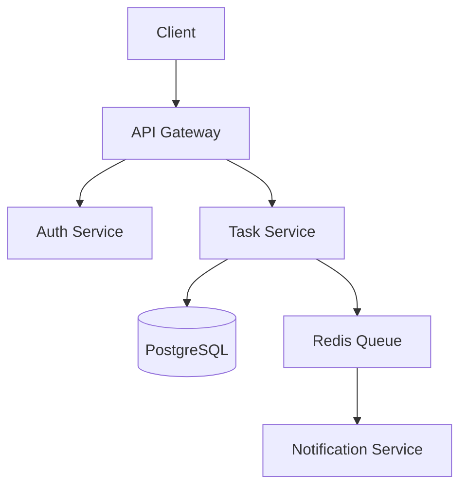

# Getting Started with Specky

> **From zero to your first specification in 5 minutes.**

This guide walks you through installing, configuring, and using Specky step by step. No prior knowledge of MCP, EARS notation, or Spec-Driven Development required.

---

## Table of Contents

1. [What is Specky?](#1-what-is-specky)
2. [Prerequisites](#2-prerequisites)
3. [Installation](#3-installation)
4. [Configuration](#4-configuration)
5. [Your First Specification](#5-your-first-specification)
6. [Understanding the Output](#6-understanding-the-output)
7. [Working with Transcripts](#7-working-with-transcripts)
8. [Next Steps](#8-next-steps)

---

## 1. What is Specky?

Specky is an **MCP server** — a program that runs in the background and gives AI assistants (GitHub Copilot, Claude) the ability to create real specification files on your disk.

```
You ──→ AI Assistant ──→ Specky MCP Server ──→ Files on disk
        (Copilot/Claude)   (17 tools)          (.specs/ folder)
```

**Without Specky:** You ask the AI to write a spec. It gives you text in chat. You copy-paste into a file. No structure, no validation, no traceability.

**With Specky:** You describe your project. The AI calls Specky tools automatically. Specky writes validated, structured files with EARS requirements, architecture diagrams, task breakdowns, and quality gates.

### What is MCP?

MCP (Model Context Protocol) is a standard that lets AI assistants call external tools. Think of it like USB — a universal plug that connects any AI to any tool. Specky is a "device" that speaks MCP.

### What is EARS?

EARS (Easy Approach to Requirements Syntax) is a notation for writing unambiguous requirements. Instead of vague statements like "the system should be fast", EARS produces testable requirements:

| Pattern | Example |
|---------|---------|
| **Ubiquitous** | The system shall respond to API requests within 200ms. |
| **Event-driven** | When a user logs in, the system shall create a session token. |
| **State-driven** | While in maintenance mode, the system shall reject write operations. |
| **Optional** | Where dark mode is enabled, the system shall use the dark theme. |
| **Unwanted** | If the database connection fails, then the system shall retry 3 times. |

---

## 2. Prerequisites

- **Node.js 18 or later** — [Download](https://nodejs.org/)
- **An AI assistant that supports MCP:**
  - VS Code with GitHub Copilot (recommended)
  - Claude Code (CLI)
  - Claude Desktop

Verify Node.js:

```bash
node --version
# Should print v18.x.x or higher
```

---

## 3. Installation

### Option A: npx (no install, recommended)

```bash
npx specky
```

That's it. npx downloads and runs Specky automatically. You don't need to install anything.

### Option B: Global install

```bash
npm install -g specky
specky
```

### Option C: Clone from GitHub (for development)

```bash
git clone https://github.com/paulasilvatech/specky.git
cd specky
npm install
npm run build
node dist/index.js
```

### Option D: Docker

```bash
docker pull ghcr.io/paulasilvatech/specky
docker run -p 3200:3200 -v $(pwd):/workspace ghcr.io/paulasilvatech/specky
```

---

## 4. Configuration

You need to tell your AI assistant where to find Specky. This is a one-time setup.

### VS Code (GitHub Copilot)

Create `.vscode/mcp.json` in your project root:

```json
{
  "servers": {
    "specky": {
      "command": "npx",
      "args": ["-y", "specky"],
      "env": {
        "SDD_WORKSPACE": "${workspaceFolder}"
      }
    }
  }
}
```

**What each field means:**
- `command`: How to start Specky (`npx` downloads and runs it)
- `args`: `["-y"]` auto-confirms the npx install prompt
- `env.SDD_WORKSPACE`: Tells Specky where your project is (VS Code fills `${workspaceFolder}` automatically)

After saving, restart VS Code. Copilot now has access to all 17 Specky tools.

### Claude Code

Run this command in your terminal:

```bash
claude mcp add specky npx -y specky --env SDD_WORKSPACE=$(pwd)
```

Or manually add to your Claude Code MCP settings:

```json
{
  "mcpServers": {
    "specky": {
      "command": "npx",
      "args": ["-y", "specky"],
      "env": {
        "SDD_WORKSPACE": "/path/to/your/project"
      }
    }
  }
}
```

### Claude Desktop

Find your config file:

| OS | Location |
|----|----------|
| macOS | `~/Library/Application Support/Claude/claude_desktop_config.json` |
| Linux | `~/.config/Claude/claude_desktop_config.json` |
| Windows | `%APPDATA%\Claude\claude_desktop_config.json` |

Add Specky:

```json
{
  "mcpServers": {
    "specky": {
      "command": "npx",
      "args": ["-y", "specky"],
      "env": {
        "SDD_WORKSPACE": "/path/to/your/project"
      }
    }
  }
}
```

---

## 5. Your First Specification

### Interactive Mode (recommended for learning)

Open your AI assistant and type:

```
Create a specification for a task management API with user authentication,
project organization, and real-time notifications.
```

The AI will use Specky tools in this order:

#### Step 1: Initialize

The AI calls `sdd_init` to create the project structure:

```
.specs/
  001-task-management-api/
    CONSTITUTION.md        ← Project charter created
  .sdd-state.json          ← Pipeline state: phase "init"
```

#### Step 2: Discover

The AI calls `sdd_discover` and asks you 7 questions:

```
1. Scope: What are the boundaries of the first release?
2. Users: Who are the primary users? Technical skill level?
3. Constraints: Language, framework, hosting, budget?
4. Integrations: External APIs or services?
5. Performance: Expected load and response times?
6. Security: Authentication and compliance requirements?
7. Deployment: CI/CD and monitoring strategy?
```

Answer each question. Your answers feed into the specification.

#### Step 3: Write Specification

The AI calls `sdd_write_spec` to generate EARS requirements:

```
.specs/001-task-management-api/
  SPECIFICATION.md         ← EARS requirements with acceptance criteria
```

The AI shows you the spec and asks: **"LGTM?"** (Looks Good To Me)

- Say **LGTM** to proceed
- Or ask for changes: "Add a requirement for rate limiting"

#### Step 4: Clarify

The AI calls `sdd_clarify` to find ambiguities:

```
"Requirement REQ-FUNC-003 says 'real-time notifications' —
 what transport: WebSocket, SSE, or push notifications?"
```

Your answers refine the specification.

#### Step 5: Design

The AI calls `sdd_write_design`:

```
.specs/001-task-management-api/
  DESIGN.md                ← Architecture + Mermaid diagrams + ADRs
```

#### Step 6: Tasks

The AI calls `sdd_write_tasks`:

```
.specs/001-task-management-api/
  TASKS.md                 ← Implementation breakdown with effort estimates
```

#### Step 7: Analysis

The AI calls `sdd_run_analysis`:

```
.specs/001-task-management-api/
  ANALYSIS.md              ← Traceability matrix + quality gate

Gate Decision: APPROVE ✅
Coverage: 100%
```

### Quick Mode (for experienced users)

If you already know what you want:

```
/sdd:spec "Build a REST API for task management with JWT auth and WebSocket notifications"
```

This triggers the same pipeline but faster — the AI makes reasonable defaults and asks fewer questions.

---

## 6. Understanding the Output

After a complete pipeline run, you have:

```
.specs/
  001-task-management-api/
    CONSTITUTION.md       ← WHY: Project charter, principles, constraints
    SPECIFICATION.md      ← WHAT: Requirements in EARS notation
    DESIGN.md             ← HOW: Architecture, diagrams, decisions
    TASKS.md              ← WHEN: Implementation plan, effort, dependencies
    ANALYSIS.md           ← QUALITY: Traceability, coverage, gate decision
  .sdd-state.json         ← Pipeline state (which phase you're in)
```

### CONSTITUTION.md — The "Why"

Defines the project's identity, principles, and constraints. Like a project charter.

### SPECIFICATION.md — The "What"

Every requirement follows EARS notation:

```markdown
### REQ-FUNC-001: User Authentication (event_driven)

When a user submits valid credentials, the system shall return a JWT token
with a 24-hour expiration.

**Acceptance Criteria:**
- Valid credentials return 200 with JWT token
- Invalid credentials return 401 with error message
- Token contains user ID, role, and expiration timestamp
```

### DESIGN.md — The "How"

Architecture overview with Mermaid diagrams:

```markdown
### System Architecture



### ADR-001: JWT over Session Tokens

**Decision:** Use JWT tokens for stateless authentication.
**Rationale:** Enables horizontal scaling without shared session storage.
**Consequences:** Tokens cannot be revoked before expiration.
```

### TASKS.md — The "When"

Implementation breakdown with dependencies:

```markdown
| ID    | Task                          | [P] | Effort | Depends | Traces To    |
|-------|-------------------------------|-----|--------|---------|--------------|
| T-001 | Project setup                 |     | M      | —       | REQ-CORE-001 |
| T-002 | JWT auth implementation       |     | L      | T-001   | REQ-FUNC-001 |
| T-003 | Task CRUD API                 | [P] | M      | T-001   | REQ-FUNC-002 |
| T-004 | WebSocket notification service| [P] | L      | T-001   | REQ-FUNC-003 |
```

### ANALYSIS.md — The Quality Gate

```markdown
Gate Decision: APPROVE ✅
Coverage: 100%

| Requirement    | Design Component | Task  | Status |
|----------------|-----------------|-------|--------|
| REQ-FUNC-001   | Auth Service    | T-002 | ✅     |
| REQ-FUNC-002   | Task Service    | T-003 | ✅     |
| REQ-FUNC-003   | Notify Service  | T-004 | ✅     |
```

---

## 7. Working with Transcripts

Specky can convert meeting recordings into full specifications automatically.

### From a Teams/Zoom Recording

If you have a `.vtt` transcript file:

```
/sdd:transcript meeting.vtt my-project
```

Specky parses the transcript, extracts:
- Participants and their contributions
- Topics discussed
- Decisions made
- Action items
- Requirements (converted to EARS notation)

And generates all 6 spec files in one call.

### From a OneDrive Folder (Power Automate)

If you have a Copilot Studio agent saving transcripts to OneDrive:

```
/sdd:onedrive ~/OneDrive/Recordings/Transcripts-Markdown/
```

Specky scans the folder and processes every transcript file. Each meeting becomes its own numbered feature spec.

### Supported Formats

| Format | Source | Extension |
|--------|--------|-----------|
| WebVTT | Microsoft Teams | `.vtt` |
| SubRip | Zoom | `.srt` |
| Plain text | Otter.ai, manual | `.txt` |
| Markdown | Copilot Studio agent | `.md` |

---

## 8. Next Steps

### Customize for Your Team

- Fork the repo and modify templates in `templates/` to match your organization's standards
- Add custom principles and constraints to CONSTITUTION.md
- Adjust EARS patterns for your domain

### Integrate with Your Workflow

- **GitHub Actions:** Use spec files as PR requirements
- **Azure DevOps:** Link tasks from TASKS.md to work items
- **Jira:** Map REQ IDs to Jira tickets

### Learn More

- [EARS Notation Guide](references/ears-notation.md) — Full syntax reference
- [README.md](README.md) — All 17 tools documented
- [CONTRIBUTING.md](CONTRIBUTING.md) — How to contribute to Specky

---

**Created by [Paula Silva](https://github.com/paulasilvatech)** ([@paulanunes85](https://twitter.com/paulanunes85)) | Americas Software GBB
