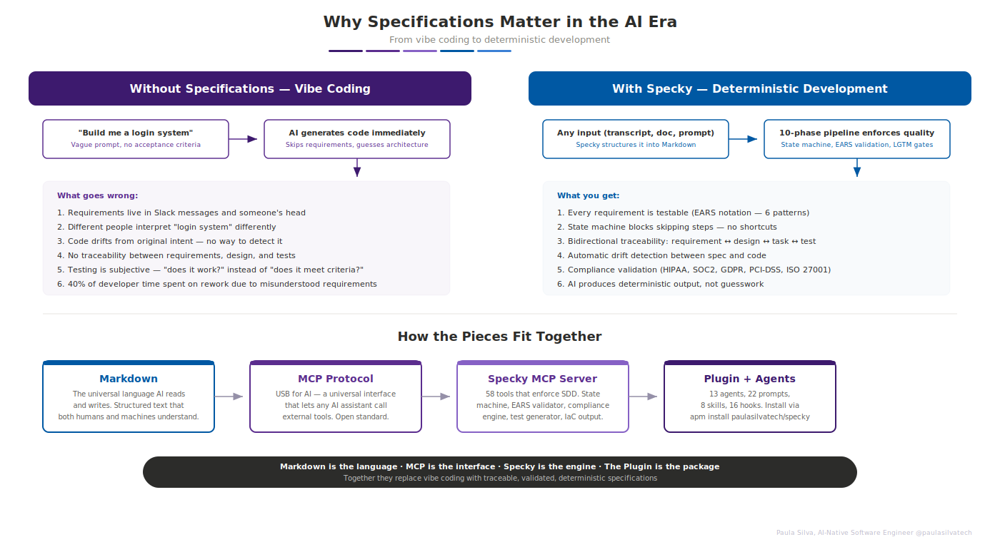
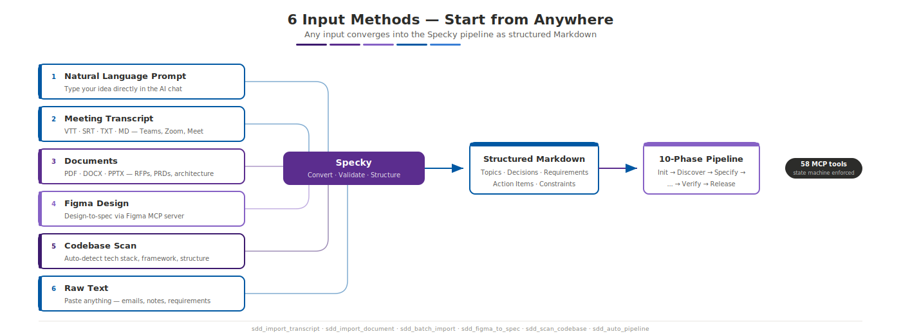
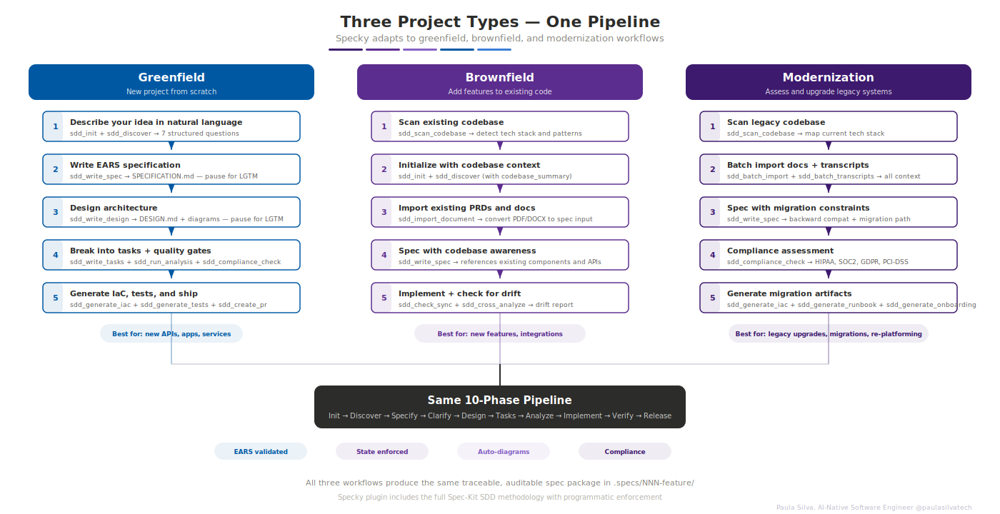
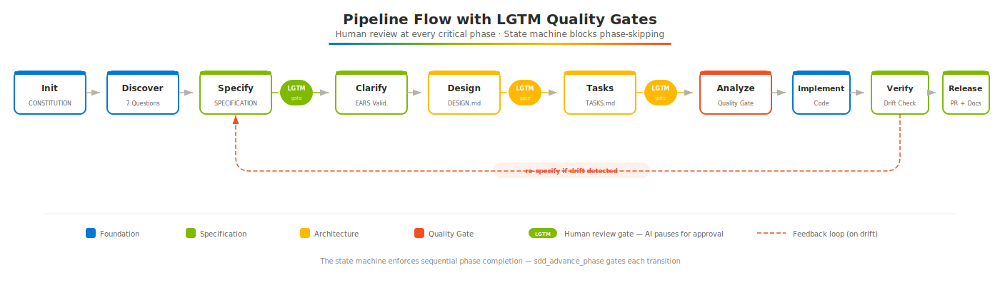
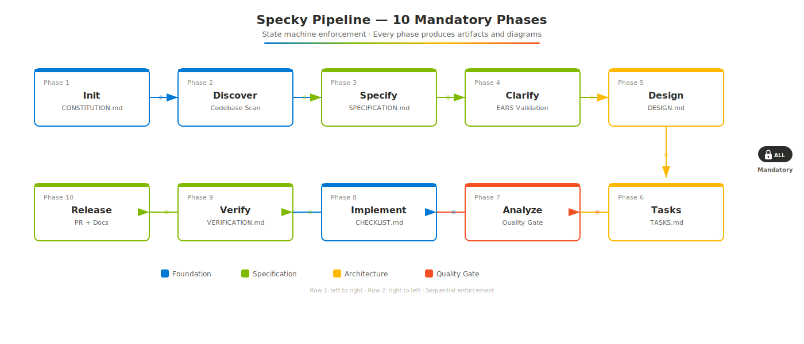
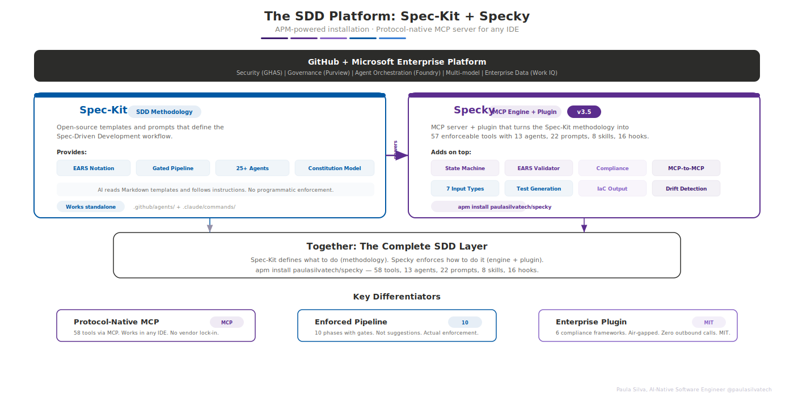
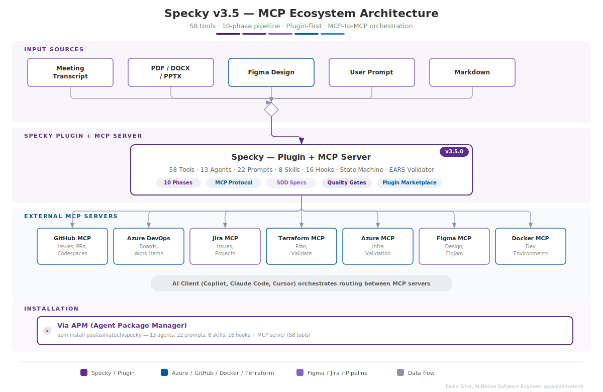
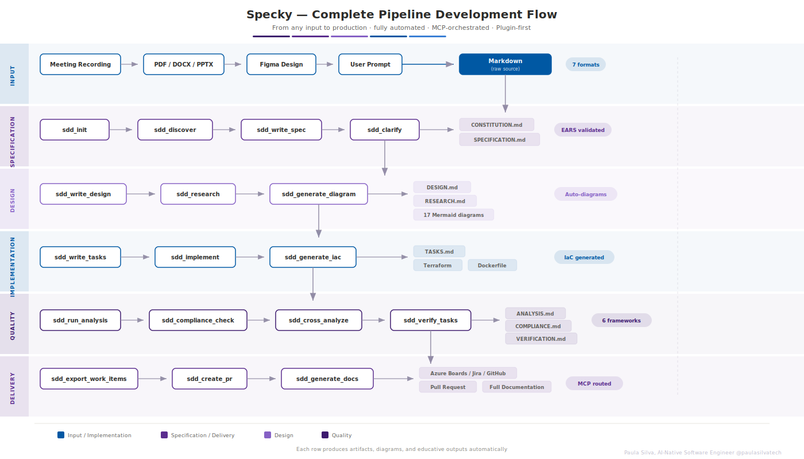

<div align="center">
  <br>
  
  <br><br>
  <p><strong>57 MCP tools. 10-phase pipeline. Works in any IDE.</strong></p>
  <p>Agentic Spec-Driven Development</p>

  <p>
    
    
    
    
    
  </p>

  <p>
    <a href="https://www.npmjs.com/package/specky-sdd"></a>
    <a href="https://github.com/paulasilvatech/specky/actions/workflows/ci.yml"></a>
    <a href="https://securityscorecards.dev/viewer/?uri=github.com/paulasilvatech/specky"></a>
    <a href="https://github.com/paulasilvatech/specky"></a>
  </p>

  <p>
    <a href="https://paulasilvatech.github.io/specky-site/">Website</a> ·
    <a href="GETTING-STARTED.md">Getting Started</a> ·
    <a href="plugins/specky-sdd/">Plugin</a> ·
    <a href="https://www.npmjs.com/package/specky-sdd">npm</a> ·
    <a href="SECURITY.md">Security</a>
  </p>
</div>


## Table of Contents

| | Section | Description |
|---|---------|-------------|
| **Start** | [What is Specky?](#what-is-specky) | Overview and ecosystem |
| | [Why Specifications Matter](#why-specifications-matter-in-the-ai-era) | Vibe coding vs deterministic development |
| | [Getting Started](GETTING-STARTED.md) | Complete educational guide |
| **Install** | [Quick Start](#quick-start) | Install plugin or MCP server, connect to your IDE |
| | [Plugin (recommended)](#install-as-plugin-recommended) | Enterprise-grade: agents, skills, hooks, MCP — all in one |
| | [MCP Server Only](#install-mcp-server-only) | Lightweight: just the 57 MCP tools |
| **Use** | [Where Specifications Live](#where-specifications-live) | File structure and naming conventions |
| | [Input Methods](#input-methods-6-ways-to-start) | 6 ways to feed Specky |
| | [Three Project Types](#three-project-types-one-pipeline) | Greenfield, Brownfield, Modernization |
| **Pipeline** | [Pipeline and LGTM Gates](#pipeline-and-lgtm-gates) | 10 phases with human review gates |
| | [All 57 Tools](#all-57-tools) | Complete tool reference by category |
| | [EARS Notation](#ears-notation) | The 6 requirement patterns |
| **Enterprise** | [Compliance Frameworks](#compliance-frameworks) | HIPAA, SOC2, GDPR, PCI-DSS, ISO 27001 |
| | [Enterprise Ready](#enterprise-ready) | Security, audit trail, quality gates |
| **Platform** | [The SDD Platform](#the-spec-driven-development-platform) | Built on Spec-Kit, everything included |
| | [Roadmap](#roadmap) | v3.2 current, v3.3+ planned |


## What is Specky?

Specky is an open-source **MCP server** that turns the [Spec-Kit](https://github.com/paulasilvatech/spec-kit) SDD methodology into a **programmable enforcement engine** with 57 validated tools. It provides a deterministic pipeline from **any input** (meeting transcripts, documents, Figma designs, or natural language prompts) through specifications, architecture, infrastructure as code, implementation, and deployment.

**Spec-Kit** provides the methodology: EARS notation, gated pipeline phases, constitution model, quality patterns. **Specky** reimplements all of it as MCP tools and adds programmatic enforcement: a state machine that blocks phase-skipping, an EARS validator, cross-artifact analysis, compliance engines, test generation, and MCP-to-MCP routing.

**Install the Specky plugin and you get everything.** The Spec-Kit methodology is built in. The plugin bundles 13 agents, 22 prompts, 8 skills, 14 automation hooks, and the MCP server — all configured automatically. It works inside VS Code with Copilot, Claude Code, Cursor, Windsurf, or any MCP-compatible client. See the [plugin documentation](plugins/specky-sdd/) or how Spec-Kit and Specky [complement each other](#the-spec-driven-development-platform).


## Why Specifications Matter in the AI Era

<p align="center">
  
</p>

### The Problem: Vibe Coding

AI coding assistants are fast but chaotic. You say *"build me a login system"* and the AI generates code immediately, skipping requirements, guessing architecture, and producing something that works but doesn't match what anyone actually needed. This is **vibe coding**: generating code based on vibes instead of validated specifications.

The result? Teams spend 40% of their time on rework because requirements were never written down, acceptance criteria were never defined, and there's no way to verify the code matches the original intent.

### The Solution: Deterministic Development

**Specifications** are structured documents that describe *what the system must do* before anyone writes code. They've existed for decades in engineering, but AI development mostly ignores them. Specky brings them back, with AI enforcement.

**Key concepts you should know:**

| Concept | What it is | Why it matters |
|---------|-----------|----------------|
| **Markdown** | The universal language that both humans and AI read fluently | All spec artifacts are `.md` files in your repo, versioned with Git |
| **MCP** | Model Context Protocol — an open standard that lets AI assistants call external tools | Specky is an MCP server; any AI IDE can connect to it |
| **EARS Notation** | A method for writing requirements that forces precision with 6 patterns | Eliminates vague statements like "the system should be fast" |
| **Agents and Skills** | Specialized AI roles that invoke Specky tools with domain expertise | Defined in `.github/agents/` and `.claude/commands/` |

### How Specky Enforces Determinism

Specky adds a **deterministic engine** between your intent and your code:

- **State Machine**: 10 mandatory phases, no skipping. Init, Discover, Specify, Clarify, Design, Tasks, Analyze, Implement, Verify, Release.
- **EARS Validator**: Every requirement validated against 6 patterns. No vague statements pass.
- **Cross-Artifact Analysis**: Automatic alignment checking between spec, design, and tasks. Orphaned requirements are flagged instantly.
- **MCP-to-MCP Architecture**: Specky outputs structured JSON that your AI client routes to GitHub, Azure DevOps, Jira, Terraform, Figma, and Docker MCP servers. No vendor lock-in.

> **The AI is the operator; Specky is the engine.** The AI's creativity is channeled through a validated pipeline instead of producing unstructured guesswork. For a complete educational walkthrough, see [GETTING-STARTED.md](GETTING-STARTED.md).

### What Makes Specky Different

| Capability | Specky |
|---|---|
| Any input (PDF, DOCX, PPTX, transcript, Figma) to spec | 57 MCP tools handle all input formats |
| EARS validation (programmatic, not AI guessing) | 6 patterns enforced at schema level |
| Enforced pipeline (not suggestions) | 10 phases with actual gates that block advancement |
| 17 diagram types generated automatically | C4 (4 levels), sequence, ER, activity, use case, DFD, deployment, network |
| Infrastructure as Code | Terraform, Bicep, Dockerfile from DESIGN.md |
| Work item export | GitHub Issues, Azure Boards, Jira via MCP-to-MCP routing |
| 6 compliance frameworks | HIPAA, SOC2, GDPR, PCI-DSS, ISO 27001 built-in |
| Cross-artifact traceability | Requirement to design to task to test to code |
| Phantom task detection | Catches tasks marked done with no code evidence |
| Property-based testing | fast-check (TypeScript) and Hypothesis (Python) |
| Checkpoint/restore | Persistent snapshots of all spec artifacts |
| 10 automation hooks (2 blocking) | Security scan, release gate, spec sync, checkpoint, quality, EARS, task trace, drift, cognitive debt, metrics |
| Works in any MCP host | VS Code + Copilot, Claude Code, Cursor, Windsurf, or any MCP client |
| Zero outbound network calls | Fully air-gapped, code never leaves your machine |
| MIT open source | Fork it, extend it, audit it. No vendor lock, no seat pricing |


## Quick Start

### Prerequisites

- **Node.js 18+**: [Download here](https://nodejs.org/)
- **An AI IDE**: VS Code with Copilot, Claude Code, Claude Desktop, Cursor, or Windsurf

### Install as Plugin (recommended)

The **Specky plugin** bundles everything: 13 agents, 22 prompts, 8 skills, 14 automation hooks, and the MCP server. There are two ways to install — choose based on your needs:

| What you get | MCP Only | Plugin (global) | Plugin (per-project) |
|-------------|:-:|:-:|:-:|
| 57 MCP tools | ✅ | ✅ | ✅ |
| 8 domain skills | — | ✅ | ✅ |
| 13 agents in Copilot Chat | — | — | ✅ |
| 22 slash-command prompts | — | — | ✅ |
| 14 automation hooks | — | — | ✅ |
| Pipeline orchestrator | — | — | ✅ |
| MCP server auto-configured | — | — | ✅ |
| Team sharing via Git | — | — | ✅ |

#### Via VS Code UI (global — skills only)

1. Open the **Extensions** sidebar (`Cmd+Shift+X`)
2. Expand **Agent Plugins - Installed**
3. Click the **+** button
4. Type `paulasilvatech/specky` and press Enter

This installs **8 skills globally** across all your projects. For the full experience (agents, prompts, hooks), use the per-project install below.

#### Via Copilot CLI (global — skills only)

```bash
copilot plugin install paulasilvatech/specky
```

Same as VS Code UI — installs skills globally. Agents and prompts require per-project files.

#### Per-Project Install (full experience — recommended)

```bash
cd your-project/
bash <(curl -sL https://raw.githubusercontent.com/paulasilvatech/specky/main/plugins/specky-sdd/install.sh)
```

This creates **workspace files** that VS Code Copilot Chat discovers automatically:

```
your-project/
├── .github/plugin/specky/          ← Full plugin (agents, skills, hooks, prompts)
│   ├── agents/                     ← 7 specialized Copilot agents
│   ├── prompts/                    ← 19 reusable prompts
│   ├── skills/                     ← 6 domain skills
│   ├── hooks/scripts/              ← 10 automation hooks
│   ├── instructions/
│   │   └── copilot-instructions.md ← SDD rules + agents + prompts
│   ├── config.yml                  ← Pipeline configuration
│   ├── README.md
│   ├── GETTING-STARTED.md
│   └── LICENSE
├── .vscode/
│   ├── mcp.json                    ← MCP server configuration
│   └── settings.json               ← Copilot + hook settings
└── ...
```

> **Tip:** Commit `.github/plugin/` and `.vscode/` to Git so every team member gets Specky automatically on clone.

See the full [plugin documentation](plugins/specky-sdd/README.md) for details.

### Install MCP Server Only

If you only need the 57 MCP tools without agents, skills, and hooks, install the MCP server directly.

<details>
<summary><strong>Global (npm)</strong></summary>

```bash
npm install -g specky-sdd
```

**VS Code** (`.vscode/mcp.json`):
```json
{
  "mcpServers": {
    "specky-sdd": {
      "type": "stdio",
      "command": "specky-sdd"
    }
  }
}
```

**Claude Code**:
```bash
claude mcp add specky-sdd -- specky-sdd
```

**Claude Desktop** (`claude_desktop_config.json`):
```json
{
  "mcpServers": {
    "specky-sdd": {
      "command": "specky-sdd"
    }
  }
}
```

</details>

<details>
<summary><strong>Per Workspace (npx)</strong></summary>

**VS Code** (`.vscode/mcp.json`):
```json
{
  "mcpServers": {
    "specky-sdd": {
      "type": "stdio",
      "command": "npx",
      "args": ["-y", "specky-sdd@latest"]
    }
  }
}
```

> Commit `.vscode/mcp.json` to Git so every team member gets Specky automatically.

</details>

<details>
<summary><strong>Docker (HTTP mode, no Node.js required)</strong></summary>

```bash
docker run -d --name specky -p 3200:3200 -v $(pwd):/workspace ghcr.io/paulasilvatech/specky:latest
```

Point any MCP client that supports HTTP to `http://localhost:3200/mcp`

</details>

### Verify

Open your AI IDE and type:

```
> What tools does Specky have?
```

The AI should list the 57 SDD tools. If you see them, Specky is working.

### Try It Now

Once connected, type this in your AI chat:

```
> Initialize a Specky project for a todo API and help me define the scope
```

Specky creates the project structure and asks you 7 discovery questions. From here, follow the guide for your project type:

| Your situation | Guide |
|---------------|-------|
| Building something new | [Greenfield](#greenfield-project-start-from-scratch) |
| Adding features to existing code | [Brownfield](#brownfield-project-add-features-to-existing-code) |
| Upgrading a legacy system | [Modernization](#modernization-project-assess-and-upgrade-legacy-systems) |

> **Tip:** **New to Spec-Driven Development?** Specky already includes all the SDD methodology from [Spec-Kit](https://github.com/paulasilvatech/spec-kit). Just install Specky and the pipeline guides you through every phase with [educative outputs](#educative-outputs) that explain the concepts as you work.


## Where Specifications Live

Every feature gets its own numbered directory inside `.specs/`. This keeps specifications, design documents, and quality reports together as a self-contained package.

```
your-project/
├── src/                          ← Your application code
├── .specs/                       ← All Specky specifications
│   ├── 001-user-authentication/  ← Feature #1
│   │   ├── CONSTITUTION.md       ← Project principles and governance
│   │   ├── SPECIFICATION.md      ← EARS requirements with acceptance criteria
│   │   ├── DESIGN.md             ← Architecture, data model, API contracts
│   │   ├── RESEARCH.md           ← Resolved unknowns and technical decisions
│   │   ├── TASKS.md              ← Implementation breakdown with dependencies
│   │   ├── ANALYSIS.md           ← Quality gate report
│   │   ├── CHECKLIST.md          ← Domain-specific quality checklist
│   │   ├── CROSS_ANALYSIS.md     ← Spec-design-tasks alignment score
│   │   ├── COMPLIANCE.md         ← Regulatory framework validation
│   │   ├── VERIFICATION.md       ← Drift and phantom task detection
│   │   └── .sdd-state.json       ← Pipeline state (current phase, history)
│   ├── 002-payment-gateway/      ← Feature #2
│   └── 003-notification-system/  ← Feature #3
├── reports/                      ← Cross-feature analysis reports
└── .specky/config.yml            ← Optional project-level configuration
```

**Naming convention:** `NNN-feature-name`, zero-padded number + kebab-case name. Each directory is independent; you can work on multiple features simultaneously.

**Branching convention:** Each spec directory maps to a branch: `spec/NNN-feature-name`. All artifacts for a feature are created on this branch. After Phase 7 passes, merge to `develop`, then `stage` for QA/gates, then `main` for production. Never commit spec work directly to develop, stage, or main.


## Input Methods: 6 Ways to Start

<p align="center">
  
</p>

Specky accepts multiple input types. Choose the one that matches your starting point:

### 1. Natural Language Prompt (simplest)

Type your idea directly into the AI chat. No files needed.

```
> I need a feature for user authentication with email/password login,
  password reset via email, and JWT session management
```

The AI calls `sdd_init` + `sdd_discover` to structure your idea into a spec project.

**Best for:** Quick prototyping, brainstorming, greenfield projects.

### 2. Meeting Transcript (VTT / SRT / TXT / MD)

Import a transcript from Teams, Zoom, or Google Meet. Specky extracts topics, decisions, action items, and requirements automatically.

```
> Import the requirements meeting transcript and create a specification
```

The AI calls `sdd_import_transcript` → extracts:
- Participants and speakers
- Topics discussed with summaries
- Decisions made
- Action items
- Raw requirement statements
- Constraints mentioned
- Open questions

**Supported formats:** `.vtt` (WebVTT), `.srt` (SubRip), `.txt`, `.md`

**Pro tip:** Use `sdd_auto_pipeline` to go from transcript to complete spec in one step:

```
> Run the auto pipeline from this meeting transcript: /path/to/meeting.vtt
```

**Got multiple transcripts?** Use batch processing:

```
> Batch import all transcripts from the meetings/ folder
```

The AI calls `sdd_batch_transcripts` → processes every `.vtt`, `.srt`, `.txt`, and `.md` file in the folder.

### 3. Existing Documents (PDF / DOCX / PPTX)

Import requirements documents, RFPs, architecture decks, or any existing documentation.

```
> Import this requirements document and create a specification:
  /path/to/requirements.pdf
```

The AI calls `sdd_import_document` → converts to Markdown, extracts sections, and feeds into the spec pipeline.

**Supported formats:** `.pdf`, `.docx`, `.pptx`, `.txt`, `.md`

**Batch import from a folder:**

```
> Import all documents from the docs/ folder into specs
```

The AI calls `sdd_batch_import` → processes every supported file in the directory.

> **Tip:** For best results with PDF/DOCX, install the optional `mammoth` and `pdfjs-dist` packages for enhanced formatting, table extraction, and image handling.

### 4. Figma Design (design-to-spec)

Convert Figma designs into requirements specifications. Works with the Figma MCP server.

```
> Convert this Figma design into a specification:
  https://figma.com/design/abc123/my-app
```

The AI calls `sdd_figma_to_spec` → extracts components, layouts, and interactions, then routes to the Figma MCP server for design context.

**Best for:** Design-first workflows, UI-driven projects.

### 5. Codebase Scan (brownfield / modernization)

Scan an existing codebase to detect tech stack, frameworks, structure, and patterns before writing specs.

```
> Scan this codebase and tell me what we're working with
```

The AI calls `sdd_scan_codebase` → detects:

| Detected | Examples |
|----------|---------|
| Language | TypeScript, Python, Go, Rust, Java |
| Framework | Next.js, Express, React, Django, FastAPI, Gin |
| Package Manager | npm, pip, poetry, cargo, maven, gradle |
| Runtime | Node.js, Python, Go, JVM |
| Directory Tree | Full project structure with file counts |

**Best for:** Understanding an existing project before adding features or modernizing.

### 6. Raw Text (paste anything)

No file? Just paste the content directly. Every import tool accepts a `raw_text` parameter as an alternative to a file path.

```
> Here's the raw requirements from the client email:

  The system needs to handle 10,000 concurrent users...
  Authentication must support SSO via Azure AD...
  All data must be encrypted at rest and in transit...

  Import this and create a specification.
```


## Three Project Types, One Pipeline

<p align="center">
  
</p>

Specky adapts to any project type. The pipeline is the same; the **starting point** is what changes.


## Greenfield Project: Start from Scratch

**Scenario:** You're building a new application with no existing code.

### Step 1: Initialize and discover

First, create your spec branch from develop:

```bash
git checkout develop && git checkout -b spec/001-task-management
```

Then in Copilot Chat:

```
> I'm building a task management API. Initialize a Specky project and help
  me define the scope.
```

The AI calls `sdd_init` → creates `.specs/001-task-management/CONSTITUTION.md`
Then calls `sdd_discover` → asks you **7 structured questions**:

1. **Scope**: What problem does this solve? What are the boundaries of v1?
2. **Users**: Who are the primary users? What are their skill levels?
3. **Constraints**: Language, framework, hosting, budget, timeline?
4. **Integrations**: What external systems, APIs, or services?
5. **Performance**: Expected load, concurrent users, response times?
6. **Security**: Authentication, authorization, compliance requirements?
7. **Deployment**: CI/CD, monitoring, rollback strategy?

Answer each question. Your answers feed directly into the specification.

### Step 2: Write the specification

```
> Write the specification based on my discovery answers
```

The AI calls `sdd_write_spec` → creates `SPECIFICATION.md` with EARS requirements:

```markdown
## Requirements

REQ-001 [Ubiquitous]: The system shall provide a REST API for task CRUD operations.

REQ-002 [Event-driven]: When a user creates a task, the system shall assign
a unique identifier and return it in the response.

REQ-003 [State-driven]: While a task is in "in-progress" state, the system
shall prevent deletion without explicit force confirmation.

REQ-004 [Unwanted]: If the API receives a malformed request body, then the
system shall return a 400 status with a descriptive error message.
```

**The AI pauses here.** Review `.specs/001-task-management/SPECIFICATION.md` and reply **LGTM** when satisfied.

### Step 3: Design the architecture

```
> LGTM.proceed to design
```

The AI calls `sdd_write_design` → creates `DESIGN.md` with:
- System architecture diagram (Mermaid)
- Data model / ER diagram
- API contracts with endpoints, request/response schemas
- Sequence diagrams for key flows
- Technology decisions with rationale

Review and reply **LGTM**.

### Step 4: Break into tasks

```
> LGTM.create the task breakdown
```

The AI calls `sdd_write_tasks` → creates `TASKS.md` with implementation tasks mapped to acceptance criteria, dependencies, and estimated complexity.

### Step 5: Quality gates

```
> Run analysis, compliance check for SOC2, and generate all diagrams
```

The AI calls:
- `sdd_run_analysis` → completeness audit, orphaned criteria detection
- `sdd_compliance_check` → SOC2 controls validation
- `sdd_generate_all_diagrams` → architecture, sequence, ER, flow, dependency, traceability diagrams

### Step 6: Generate infrastructure and tests

```
> Generate Terraform for Azure, a Dockerfile, and test stubs for vitest
```

The AI calls:
- `sdd_generate_iac` → Terraform configuration
- `sdd_generate_dockerfile` → Dockerfile + docker-compose
- `sdd_generate_tests` → Test stubs with acceptance criteria mapped to test cases

### Step 7: Export and ship

```
> Export tasks to GitHub Issues and create a PR
```

The AI calls `sdd_export_work_items` + `sdd_create_pr` → generates work item payloads and PR body with full spec traceability.

The PR targets `develop` (not `main`). After integration review on develop, promote to `stage` for QA and blocking gates, then to `main` for production.

> **Next:** **Next:** Learn about [EARS notation](#ears-notation) to understand the requirement patterns, or see [All 57 Tools](#all-57-tools) for a complete reference.


## Brownfield Project: Add Features to Existing Code

**Scenario:** You have a running application and need to add a new feature with proper specifications.

### Step 1: Scan the codebase first

```
> Scan this codebase so Specky understands what we're working with
```

The AI calls `sdd_scan_codebase` → detects tech stack, framework, directory structure. This context informs all subsequent tools.

```
Detected: TypeScript + Next.js + npm + Node.js
Files: 247 across 32 directories
```

### Step 2: Initialize with codebase context

```
> Initialize a feature for adding real-time notifications to this Next.js app.
  Use the codebase scan results as context.
```

The AI calls `sdd_init` → creates `.specs/001-real-time-notifications/CONSTITUTION.md`
Then calls `sdd_discover` with the codebase summary → the 7 discovery questions now include context about your existing tech stack:

> *"What technical constraints exist? **Note: This project already uses TypeScript, Next.js, npm, Node.js.** Consider compatibility with the existing stack."*

### Step 3: Import existing documentation

If you have existing PRDs, architecture docs, or meeting notes:

```
> Import the PRD for notifications: /docs/notifications-prd.pdf
```

The AI calls `sdd_import_document` → converts to Markdown and adds to the spec directory. The content is used as input when writing the specification.

### Step 4: Write spec with codebase awareness

```
> Write the specification for real-time notifications. Consider the existing
  Next.js architecture and any patterns already in the codebase.
```

The specification references existing components, APIs, and patterns from the codebase scan.

### Step 5: Check for drift

After implementation, verify specs match the code:

```
> Check if the implementation matches the specification
```

The AI calls `sdd_check_sync` → generates a drift report flagging any divergence between spec and code.

### Step 6: Cross-feature analysis

If you have multiple features specified:

```
> Run cross-analysis across all features to find conflicts
```

The AI calls `sdd_cross_analyze` → checks for contradictions, shared dependencies, and consistency issues across `.specs/001-*`, `.specs/002-*`, etc.

> **Next:** **Next:** See [compliance frameworks](#compliance-frameworks) for regulatory validation, or [MCP integration](#mcp-integration-architecture) for routing to external tools.


## Modernization Project: Assess and Upgrade Legacy Systems

**Scenario:** You have a legacy system that needs assessment, documentation, and incremental modernization.

### Step 1: Scan and document the current state

```
> Scan this legacy codebase and help me understand what we have
```

The AI calls `sdd_scan_codebase` → maps the technology stack, directory tree, and file counts.

### Step 2: Import all existing documentation

Gather everything you have.architecture documents, runbooks, meeting notes about the system:

```
> Batch import all documents from /docs/legacy-system/ into specs
```

The AI calls `sdd_batch_import` → processes PDFs, DOCX, PPTX, and text files. Each becomes a Markdown reference in the spec directory.

### Step 3: Import stakeholder meetings

If you have recorded meetings with stakeholders discussing the modernization:

```
> Batch import all meeting transcripts from /recordings/
```

The AI calls `sdd_batch_transcripts` → extracts decisions, requirements, constraints, and open questions from every transcript.

### Step 4: Create the modernization specification

```
> Write a specification for modernizing the authentication module.
  Consider the legacy constraints from the imported documents and
  meeting transcripts.
```

The specification accounts for:
- Current system behavior (from codebase scan)
- Existing documentation (from imported docs)
- Stakeholder decisions (from meeting transcripts)
- Migration constraints and backward compatibility

### Step 5: Compliance assessment

Legacy systems often need compliance validation during modernization:

```
> Run compliance checks against HIPAA and SOC2 for the modernized auth module
```

The AI calls `sdd_compliance_check` → validates the specification against regulatory controls and flags gaps.

### Step 6: Generate migration artifacts

```
> Generate the implementation plan, Terraform for the new infrastructure,
  and a runbook for the migration
```

The AI calls:
- `sdd_implement` → phased implementation plan with checkpoints
- `sdd_generate_iac` → infrastructure configuration for the target environment
- `sdd_generate_runbook` → operational runbook with rollback procedures

### Step 7: Generate onboarding for the team

```
> Generate an onboarding guide for developers joining the modernization project
```

The AI calls `sdd_generate_onboarding` → creates a guide covering architecture decisions, codebase navigation, development workflow, and testing strategy.

> **Next:** **Next:** See [compliance frameworks](#compliance-frameworks) for regulatory validation during modernization, or [project configuration](#project-configuration) to customize Specky for your team.


## Pipeline and LGTM Gates

<p align="center">
  
</p>

Every Specky project follows the same 10-phase pipeline. The state machine **blocks phase-skipping**. You cannot jump from Init to Design without completing Specify first.

**LGTM gates:** After each major phase (Specify, Design, Tasks), the AI pauses and asks you to review. Reply **LGTM** to proceed. This ensures human oversight at every quality gate.

**Feedback loop:** If `sdd_verify_tasks` detects drift between specification and implementation, Specky routes you back to the Specify phase to correct the divergence before proceeding.

**Advancing phases:** If you need to manually advance:

```
> Advance to the next phase
```

The AI calls `sdd_advance_phase` → moves the pipeline forward if all prerequisites are met.

<p align="center">
  
</p>

| Phase | What Happens | Required Output |
|-------|-------------|----------------|
| **Init** | Create project structure, constitution, scan codebase | CONSTITUTION.md |
| **Discover** | Interactive discovery: 7 structured questions about scope, users, constraints | Discovery answers |
| **Specify** | Write [EARS requirements](#ears-notation) with acceptance criteria | SPECIFICATION.md |
| **Clarify** | Resolve ambiguities, generate decision tree | Updated SPECIFICATION.md |
| **Design** | Architecture, data model, API contracts, research unknowns | DESIGN.md, RESEARCH.md |
| **Tasks** | Implementation breakdown by user story, dependency graph | TASKS.md |
| **Analyze** | Cross-artifact analysis, quality checklist, [compliance check](#compliance-frameworks) | ANALYSIS.md, CHECKLIST.md, CROSS_ANALYSIS.md |
| **Implement** | Ordered execution with checkpoints per user story | Implementation progress |
| **Verify** | Drift detection, phantom task detection | VERIFICATION.md |
| **Release** | PR generation, work item export, documentation | Complete package |

All artifacts are saved in [`.specs/NNN-feature/`](#where-specifications-live). See [Input Methods](#input-methods-6-ways-to-start) for how to feed data into the pipeline.


## All 57 Tools

### Input and Conversion (6)

| Tool | Description |
|------|-------------|
| `sdd_import_document` | Convert PDF, DOCX, PPTX, TXT, MD to Markdown |
| `sdd_import_transcript` | Parse meeting transcripts (Teams, Zoom, Google Meet) |
| `sdd_auto_pipeline` | Any input to complete spec pipeline (all documents) |
| `sdd_batch_import` | Process folder of mixed documents |
| `sdd_batch_transcripts` | Process folder of meeting transcripts |
| `sdd_figma_to_spec` | Figma design to requirements specification |

### Pipeline Core (9)

| Tool | Description |
|------|-------------|
| `sdd_init` | Initialize project with constitution and scope diagram |
| `sdd_discover` | Interactive discovery with stakeholder mapping |
| `sdd_write_spec` | Write EARS requirements with flow diagrams |
| `sdd_clarify` | Resolve ambiguities with decision tree |
| `sdd_write_design` | 12-section system design (C4 model) with sequence diagrams, ERD, API flow |
| `sdd_write_tasks` | Task breakdown with dependency graph |
| `sdd_write_bugfix` | Bugfix specification from issue description |
| `sdd_run_analysis` | Quality gate analysis with coverage heatmap |
| `sdd_advance_phase` | Move to next pipeline phase |

### Quality and Validation (5)

| Tool | Description |
|------|-------------|
| `sdd_checklist` | Mandatory quality checklist (security, accessibility, etc.) |
| `sdd_verify_tasks` | Detect phantom completions |
| `sdd_compliance_check` | HIPAA, SOC2, GDPR, PCI-DSS, ISO 27001 validation |
| `sdd_cross_analyze` | Spec-design-tasks alignment with consistency score |
| `sdd_validate_ears` | Batch EARS requirement validation |

### Diagrams and Visualization (4) -- 17 Diagram Types

| Tool | Description |
|------|-------------|
| `sdd_generate_diagram` | Single Mermaid diagram (17 software engineering diagram types) |
| `sdd_generate_all_diagrams` | All diagrams for a feature at once |
| `sdd_generate_user_stories` | User stories with flow diagrams |
| `sdd_figma_diagram` | FigJam-ready diagram via Figma MCP |

### Infrastructure as Code (3)

| Tool | Description |
|------|-------------|
| `sdd_generate_iac` | Terraform/Bicep from architecture design |
| `sdd_validate_iac` | Validation via Terraform MCP + Azure MCP |
| `sdd_generate_dockerfile` | Dockerfile + docker-compose from tech stack |

### Dev Environment (3)

| Tool | Description |
|------|-------------|
| `sdd_setup_local_env` | Docker-based local dev environment |
| `sdd_setup_codespaces` | GitHub Codespaces configuration |
| `sdd_generate_devcontainer` | .devcontainer/devcontainer.json generation |

### Integration and Export (7)

| Tool | Description |
|------|-------------|
| `sdd_create_branch` | Git branch naming convention |
| `sdd_export_work_items` | Tasks to GitHub Issues, Azure Boards, or Jira |
| `sdd_create_pr` | PR payload with spec summary |
| `sdd_implement` | Ordered implementation plan with checkpoints |
| `sdd_research` | Resolve unknowns in RESEARCH.md |
| `sdd_check_sync` | Detect drift between specification and implementation |
| `sdd_detect_drift` | Intent drift detection with amendment suggestions |

### Documentation (5)

| Tool | Description |
|------|-------------|
| `sdd_generate_docs` | Complete auto-documentation |
| `sdd_generate_all_docs` | Generate all documentation types in parallel |
| `sdd_generate_api_docs` | API documentation from design |
| `sdd_generate_runbook` | Operational runbook |
| `sdd_generate_onboarding` | Developer onboarding guide |

### Utility (8)

| Tool | Description |
|------|-------------|
| `sdd_get_status` | Pipeline status with guided next action |
| `sdd_get_template` | Get any template |
| `sdd_scan_codebase` | Detect tech stack and structure |
| `sdd_metrics` | Project metrics dashboard |
| `sdd_amend` | Amend project constitution |
| `sdd_context_status` | Context tiering status (Hot/Domain/Cold) |
| `sdd_model_routing` | Model routing guidance for current task |
| `sdd_check_access` | RBAC access check for current role |

### Testing (3)

| Tool | Description |
|------|-------------|
| `sdd_generate_tests` | Generate test stubs from acceptance criteria (vitest/jest/playwright/pytest/junit/xunit) |
| `sdd_verify_tests` | Verify test results against requirements, report traceability coverage |
| `sdd_generate_pbt` | Generate property-based tests using fast-check (TypeScript) or Hypothesis (Python). Extracts invariants, round-trips, idempotence, state transitions, and negative properties from EARS requirements |

### Turnkey Specification (1)

| Tool | Description |
|------|-------------|
| `sdd_turnkey_spec` | Generate a complete EARS specification from a natural language description. Auto-extracts requirements, classifies all 5 EARS patterns, generates acceptance criteria, infers non-functional requirements, and identifies clarification questions |

### Checkpointing (3)

| Tool | Description |
|------|-------------|
| `sdd_checkpoint` | Create a named snapshot of all spec artifacts and pipeline state |
| `sdd_restore` | Restore spec artifacts from a previous checkpoint (auto-creates backup before restoring) |
| `sdd_list_checkpoints` | List all available checkpoints for a feature with labels, dates, and phases |

### Ecosystem (1)

| Tool | Description |
|------|-------------|
| `sdd_check_ecosystem` | Report recommended MCP servers with install commands |


## The Spec-Driven Development Platform

<p align="center">
  
</p>

### How Spec-Kit and Specky Complement Each Other

**[Spec-Kit](https://github.com/paulasilvatech/spec-kit)** is the open-source SDD methodology: EARS notation, gated pipeline phases, constitution model, 25+ specialized agents, and Markdown prompt templates. It defines **what** to do.

**Specky** is the MCP engine that reimplements that methodology as 57 enforceable tools with programmatic validation. It enforces **how** to do it.

| | Spec-Kit (Methodology) | Specky (Engine) |
|--|------------------------|-----------------|
| **What it is** | Prompt templates + agent definitions | MCP server with 57 tools |
| **How it works** | AI reads `.md` templates and follows instructions | AI calls tools that validate, enforce, and generate |
| **Validation** | AI tries to follow the prompts | State machine, EARS regex, Zod schemas |
| **Install** | Copy `.github/agents/` and `.claude/commands/` | `copilot plugin install specky-sdd@specky` or `npm install -g specky-sdd` |
| **Works standalone** | Yes, in any AI IDE | Yes, includes all Spec-Kit patterns |
| **Best for** | Learning SDD, lightweight adoption | Production enforcement, enterprise, compliance |

### Together: The Complete SDD Layer

When you install Specky, you get the full Spec-Kit methodology reimplemented as validated MCP tools. **No separate installation of Spec-Kit needed.** But Spec-Kit remains available as a standalone learning tool for teams that want to adopt SDD concepts before using the engine.

Together they form the **SDD layer** of the GitHub + Microsoft enterprise platform. Specky reimplements the Spec-Kit methodology as enforceable MCP tools with compliance, traceability, and automation built in.

The recommended way to adopt this stack is via the [Specky plugin](plugins/specky-sdd/), which bundles the MCP server, agents, skills, and hooks into a single installable package:

```bash
copilot plugin install paulasilvatech/specky
```

Or via marketplace:

```bash
copilot plugin marketplace add paulasilvatech/specky   # one-time
copilot plugin install specky-sdd@specky
```

Or configure the MCP server directly:

```json
{
  "mcpServers": {
    "specky-sdd": {
      "type": "stdio",
      "command": "specky-sdd"
    }
  }
}
```

> **Note:** This example assumes `specky-sdd` is installed globally (`npm install -g specky-sdd`). See the [Quick Start](#quick-start) section for plugin installation, per-workspace, and Docker alternatives.

## Project Configuration

Create `.specky/config.yml` in your project root to customize Specky:

```yaml
# .specky/config.yml
templates_path: ./my-templates       # Override built-in templates
default_framework: vitest            # Default test framework
compliance_frameworks: [hipaa, soc2] # Frameworks to check
audit_enabled: true                  # Enable audit trail
```

When `templates_path` is set, Specky uses your custom templates instead of the built-in ones. When `audit_enabled` is true, tool invocations are logged locally.


## MCP Integration Architecture

<p align="center">
  
</p>

Specky outputs structured JSON with routing instructions. Your AI client calls the appropriate external MCP server:

```
Specky --> sdd_export_work_items(platform: "azure_boards") --> JSON payload
  --> AI Client --> Azure DevOps MCP --> create_work_item()

Specky --> sdd_validate_iac(provider: "terraform") --> validation payload
  --> AI Client --> Terraform MCP --> plan/validate

Specky --> sdd_figma_to_spec(file_key: "abc123") --> Figma request
  --> AI Client --> Figma MCP --> get_design_context()
```

### Supported External MCP Servers

| MCP Server | Integration |
|-----------|-------------|
| **GitHub MCP** | Issues, PRs, Codespaces |
| **Azure DevOps MCP** | Work Items, Boards |
| **Jira MCP** | Issues, Projects |
| **Terraform MCP** | Plan, Validate, Apply |
| **Azure MCP** | Template validation |
| **Figma MCP** | Design context, FigJam diagrams |
| **Docker MCP** | Local dev environments |


## EARS Notation

Every requirement in Specky follows EARS (Easy Approach to Requirements Syntax):

| Pattern | Format | Example |
|---------|--------|---------|
| Ubiquitous | The system shall... | The system shall encrypt all data at rest |
| Event-driven | When [event], the system shall... | When a user submits login, the system shall validate credentials |
| State-driven | While [state], the system shall... | While offline, the system shall queue requests |
| Optional | Where [condition], the system shall... | Where 2FA is enabled, the system shall require OTP |
| Unwanted | If [condition], then the system shall... | If session expires, the system shall redirect to login |
| Complex | While [state], when [event]... | While in maintenance, when request arrives, queue it |

The EARS validator programmatically checks every requirement against these 6 patterns. Vague terms like "fast", "good", "easy" are flagged automatically.


## Compliance Frameworks

Built-in compliance checking against:

- **HIPAA**: Access control, audit, encryption, PHI protection
- **SOC 2**: Logical access, monitoring, change management, incident response
- **GDPR**: Lawful processing, right to erasure, data portability, breach notification
- **PCI-DSS**: Firewall, stored data protection, encryption, user identification
- **ISO 27001**: Security policies, access control, cryptography, incident management


## Educative Outputs

Every tool response includes structured guidance:

```json
{
  "explanation": "What was done and why",
  "next_steps": "Guided next action with command suggestion",
  "learning_note": "Educational context about the concept",
  "diagram": "Mermaid diagram relevant to the output"
}
```


## Complete Pipeline Flow

<p align="center">
  
</p>

From any [input](#input-methods-6-ways-to-start) to production -- fully automated, [MCP-orchestrated](#mcp-integration-architecture), with artifacts and diagrams generated at every step. All artifacts are saved in [`.specs/NNN-feature/`](#where-specifications-live).


## Enterprise Ready

Specky is built with enterprise adoption in mind.

### Security Posture

- **2 runtime dependencies** — minimal attack surface (`@modelcontextprotocol/sdk`, `zod`)
- **Zero outbound network requests** — all data stays local
- **No `eval()` or dynamic code execution** — template rendering is string replacement only
- **Path traversal prevention**: FileManager sanitizes all paths, blocks `..` sequences
- **Zod `.strict()` validation** — every tool input is schema-validated; unknown fields rejected
- **security-scan hook** blocks commits containing hardcoded secrets (exit code 2)
- See [SECURITY.md](SECURITY.md) for full OWASP Top 10 coverage
- See [SECURITY.md](SECURITY.md) for complete security architecture

### Security Best Practices

When using Specky, follow these practices to protect your data:

| Practice | Why | How |
|----------|-----|-----|
| **Use stdio mode for local development** | No network exposure | `npx specky-sdd` (default) |
| **Never expose HTTP mode to public networks** | HTTP is unencrypted, no auth | If using `--http`, bind to localhost only. Use a reverse proxy (nginx, Caddy) with TLS and authentication for remote access |
| **Protect the `.specs/` directory** | Contains your specification artifacts (architecture, API contracts, business logic) | Add `.specs/` to `.gitignore` if specs contain sensitive IP, or use a private repo |
| **Protect checkpoints** | `.specs/{feature}/.checkpoints/` stores full artifact snapshots | Same as above — treat checkpoints like source code |
| **Review auto-generated specs before committing** | Turnkey and auto-pipeline generate from natural language — may capture sensitive details | Review SPECIFICATION.md and DESIGN.md before `git add` |
| **Keep the security-scan hook enabled** | Detects API keys, passwords, tokens in staged files | Comes pre-configured; don't disable `.claude/hooks/security-scan.sh` |
| **Use environment variables for secrets** | Specky never stores credentials, but your specs might reference them | Write `$DATABASE_URL` in specs, never the actual connection string |
| **Run `npm audit` regularly** | Catches dependency vulnerabilities | `npm audit` — CI runs this automatically on every PR |

### Data Sensitivity Guide

| What Specky creates | Contains | Sensitivity | Recommendation |
|---------------------|----------|-------------|----------------|
| `CONSTITUTION.md` | Project scope, principles | Low | Safe to commit |
| `SPECIFICATION.md` | Requirements, acceptance criteria | Medium | Review before committing — may contain business logic details |
| `DESIGN.md` | Architecture, API contracts, security model | **High** | May contain infrastructure details, auth flows, data schemas |
| `TASKS.md` | Implementation plan, effort estimates | Low | Safe to commit |
| `ANALYSIS.md` | Quality gate results, coverage | Low | Safe to commit |
| `.sdd-state.json` | Pipeline phase timestamps | Low | Safe to commit |
| `.checkpoints/*.json` | **Full copies of all artifacts** | **High** | Protect like source code — contains everything above |
| `docs/journey-*.md` | Complete SDD audit trail with timestamps | Medium | Review before sharing externally |
| Routing payloads | Branch names, PR bodies, work items | **Transient** (memory only) | Never persisted by Specky; forwarded to external MCPs by the AI client |

> **Key principle:** Specky creates files **only on your local filesystem**. Nothing is sent to any cloud service unless **you** push to git or the AI client routes a payload to an external MCP server. You are always in control.

### Compliance Validation

Built-in compliance checking validates your specifications against industry frameworks:

| Framework | Controls | Use Case |
|-----------|----------|----------|
| HIPAA | 6 controls | Healthcare applications |
| SOC 2 | 6 controls | SaaS and cloud services |
| GDPR | 6 controls | EU data processing |
| PCI-DSS | 6 controls | Payment card handling |
| ISO 27001 | 6 controls | Enterprise security management |

### Audit Trail

Every pipeline phase produces a traceable artifact in `.specs/NNN-feature/`. The complete specification-to-code journey is documented in the **SDD Journey** document (`docs/journey-{feature}.md`) with phase timestamps, gate decisions, and traceability metrics.

### Quality Gates

- **Phase Validation** — every tool validates it's being called in the correct pipeline phase
- **Gate Enforcement** — `advancePhase()` blocks if gate decision is BLOCK or CHANGES_NEEDED
- **EARS Validator** — programmatic requirement quality enforcement
- **Cross-Artifact Analysis** — automatic alignment checking between spec, design, and tasks
- **Phase Enforcement** — state machine blocks phase-skipping; required files gate advancement
- **Comprehensive test suite** — CI enforces thresholds on every push


## Development

```bash
# Install globally
npm install -g specky-sdd

# Verify MCP handshake (quick smoke test)
echo '{"jsonrpc":"2.0","id":1,"method":"initialize","params":{"protocolVersion":"2025-03-26","capabilities":{},"clientInfo":{"name":"test","version":"1.0"}}}' | specky-sdd 2>/dev/null
```

For contributors, see [CONTRIBUTING.md](CONTRIBUTING.md).


## Roadmap

### v3.2 (current)

| Capability | Status |
|------------|--------|
| 57 MCP tools across 10 enforced pipeline phases | Stable |
| Phase validation on every tool with gate enforcement | Stable |
| 17 software engineering diagram types (C4, sequence, ER, DFD, deployment, network) | Stable |
| 12-section system design template (C4 model, security, infrastructure) | Stable |
| Enriched interactive responses on all tools (progress, handoff, education) | Stable |
| Parallel documentation generation (5 types via Promise.all) | Stable |
| Turnkey spec from natural language (`sdd_turnkey_spec`) | Stable |
| Property-based testing with fast-check and Hypothesis (`sdd_generate_pbt`) | Stable |
| Checkpoint/restore for spec artifacts | Stable |
| Intelligence layer: model routing hints on all tools | Stable |
| Context tiering: Hot/Domain/Cold with token savings | Stable |
| Cognitive debt metrics at LGTM gates | Stable |
| Test traceability: REQ-ID → test coverage mapping | Stable |
| Intent drift detection with amendment suggestions | Stable |
| 10 automation hooks (2 blocking) | Stable |
| 7 Copilot agents + 19 prompts + 6 skills (via plugin) | Stable |
| 6 compliance frameworks (HIPAA, SOC2, GDPR, PCI-DSS, ISO 27001) | Stable |
| 6 input types (transcript, PDF, DOCX, Figma, codebase, raw text) | Stable |
| Test generation for 6 frameworks (vitest, jest, playwright, pytest, junit, xunit) | Stable |
| MCP-to-MCP routing (GitHub, Azure DevOps, Jira, Terraform, Figma, Docker) | Stable |
| SBOM + cosign signing on Docker image | Stable |
| JSONL audit logger (optional) | Stable |
| Comprehensive test suite | Stable |

### v3.3+ (planned)

| Feature | Description |
|---------|-------------|
| HTTP authentication | Token-based auth for the HTTP transport |
| Observability | OpenTelemetry metrics and structured logging |
| Internationalization | Spec templates in PT-BR, ES, FR, DE, JA |
| Automated shrinking | fast-check/Hypothesis shrinking feedback into spec refinement |
| Centralized audit log | SIEM-integrated tamper-evident audit trail |
| Multi-tenant | Isolated workspaces for multiple teams |
| SSO / SAML | Federated identity for enterprise auth |

Have a feature request? [Open an issue](https://github.com/paulasilvatech/specky/issues).


## Contributing

See [CONTRIBUTING.md](CONTRIBUTING.md) for architecture details and how to add tools, templates, or services.


## Links

- [CHANGELOG.md](CHANGELOG.md): Version history and release notes
- [SECURITY.md](SECURITY.md): Vulnerability disclosure policy and OWASP Top 10 coverage
- [CONTRIBUTING.md](CONTRIBUTING.md): How to add tools, templates, or services
- [Spec-Kit](https://github.com/paulasilvatech/spec-kit): The SDD methodology foundation
- [npm package](https://www.npmjs.com/package/specky-sdd): `specky-sdd` on npm


## License

MIT. Created by [Paula Silva](https://github.com/paulasilvatech) | Americas Software GBB, Microsoft
