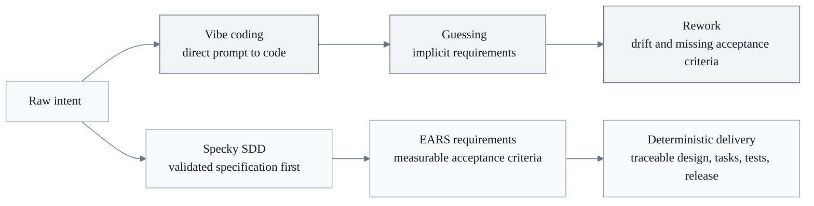
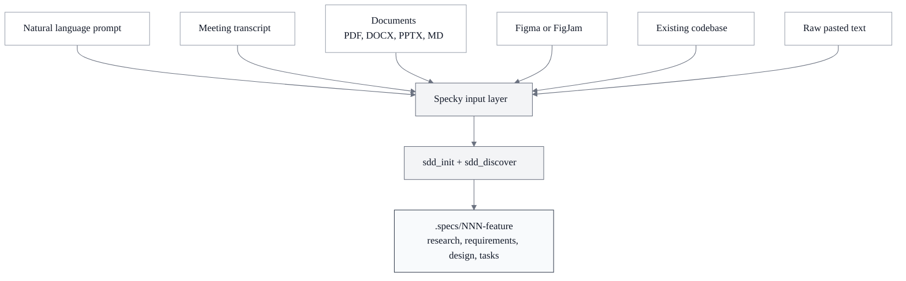
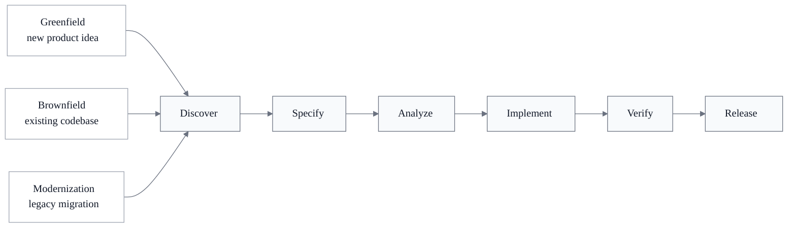
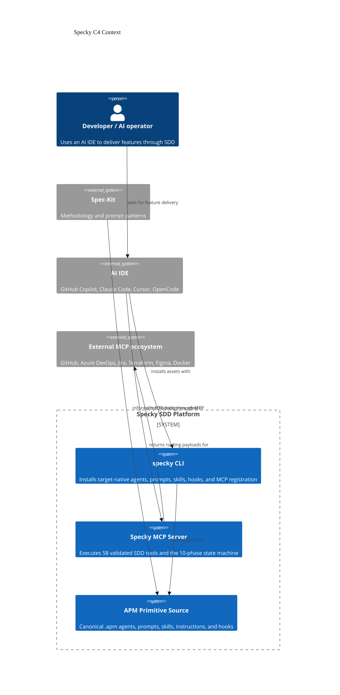
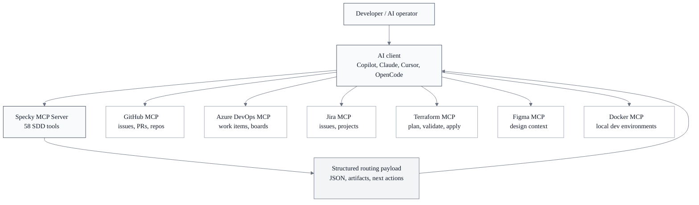

<div align="center">
  <br>
  
  <br><br>
  <p><strong>13 agents. 58 MCP tools. Explicit use-case contracts. One CLI.</strong></p>
  <p>Agentic Spec-Driven Development</p>

  <p>
    
    
    
    
    
  </p>

  <p>
    <a href="https://www.npmjs.com/package/specky-sdd"></a>
    <a href="https://www.npmjs.com/package/specky-sdd"></a>
    <a href="https://github.com/paulasilvatech/specky/actions/workflows/ci.yml"></a>
    <a href="https://securityscorecards.dev/viewer/?uri=github.com/paulasilvatech/specky"></a>
    <a href="https://github.com/paulasilvatech/specky"></a>
  </p>

  <p>
    
    
    
    
    
    <a href="https://github.com/paulasilvatech/specky/issues"></a>
  </p>

  <p>
    <a href="https://getspecky.ai">Website</a> ·
    <a href="docs/GETTING-STARTED.md">Getting Started</a> ·
    <a href="docs/USE-CASE-CONTRACTS.md">Use-Case Contracts</a> ·
    <a href="https://www.npmjs.com/package/specky-sdd">npm</a> ·
    <a href="SECURITY.md">Security</a>
  </p>
</div>

## Table of Contents

| | Section | Description |
|---|---------|-------------|
| **Start** | [What is Specky?](#what-is-specky) | Overview and ecosystem |
| | [What's Included](#whats-included) | Agents, prompts, skills, hooks, and MCP tools |
| | [Why Specifications Matter](#why-specifications-matter-in-the-ai-era) | Vibe coding vs deterministic development |
| | [Getting Started](docs/GETTING-STARTED.md) | Complete educational guide |
| **Use** | [Quick Start](#quick-start) | Install via npm CLI |
| | [Where Specifications Live](#where-specifications-live) | File structure and naming conventions |
| | [Input Methods](#input-methods-6-ways-to-start) | 6 ways to feed Specky |
| | [Three Project Types](#three-project-types-one-pipeline) | Greenfield, Brownfield, Modernization |
| | [Use-Case Contracts](docs/USE-CASE-CONTRACTS.md) | Lifecycle, workload, mode, capabilities, evidence, migration |
| | [How to upgrade](#how-to-upgrade) | Bump npm + refresh project assets (no `--target` needed) |
| | [Staying up to date](#staying-up-to-date) | Update notifications and opt-out |
| **Pipeline** | [Pipeline and LGTM Gates](#pipeline-and-lgtm-gates) | Feature-specific phase graphs and configured review gates |
| | [All 58 Tools](#all-58-tools) | Complete tool reference by category |
| | [EARS Notation](#ears-notation) | The 6 requirement patterns |
| **Enterprise** | [Compliance Frameworks](#compliance-frameworks) | HIPAA, SOC2, GDPR, PCI-DSS, ISO 27001 |
| | [Enterprise Ready](#enterprise-ready) | Security, audit trail, quality gates |
| **Platform** | [The SDD Platform](#the-spec-driven-development-platform) | Built on Spec-Kit, everything included |
| | [Roadmap](#roadmap) | v3.10 current, v3.11+ planned |

## What is Specky?

Specky is a **CLI toolkit for Spec-Driven Development** — 13 specialized agents, 58 MCP tools, 22 prompts, 14 skills, and 16 automation hooks. Each feature selects an explicit lifecycle, workload, execution mode, and capability configuration; Specky persists the resolved phase graph and rejects missing identity, hidden defaults, unsupported capabilities, and ungrounded artifact evidence.

Powered by the [Spec-Kit](https://github.com/paulasilvatech/spec-kit) methodology. Install the `specky` CLI and it places agents, prompts, skills, hooks, and the MCP server registration into your project — for **GitHub Copilot** (VS Code), **Claude Code**, **Cursor**, or **OpenCode**.

## What's Included

Specky is a **complete AI development toolkit** — not just an MCP server. The `specky` CLI installs everything your AI IDE needs into a single project:

| Primitive | What it is | Specky includes |
|-----------|-----------|------------------|
| **Agents** | Specialized AI personas with defined roles, tools, and guardrails | 13 agents — @specky-orchestrator (full pipeline), @specky-onboarding (wizard), @specky-spec-engineer, @specky-design-architect, @specky-task-planner, @specky-quality-reviewer, and 7 more |
| **Prompts** | Slash commands that activate the right agent for a task | 22 prompts — `/specky-greenfield`, `/specky-specify`, `/specky-release`, `/specky-orchestrate`, etc. |
| **Skills** | Domain knowledge files loaded into agent context automatically | 14 skills — SDD pipeline rules, phase playbooks, EARS patterns, implementation patterns, test criteria, release gate protocol |
| **Hooks** | Scripts that run before/after every tool call for validation | 16 hooks — specky-artifact-validator, specky-branch-validator, specky-phase-gate, specky-lgtm-gate, specky-security-scan, etc. |
| **MCP Server** | The tool engine that validates, generates, and enforces | 58 tools via Model Context Protocol (the runtime underneath) |

### Why not just an MCP server?

An MCP server gives you **tools**. The CLI toolkit gives you the **experience**:

- **Tools alone**: You must provide exact feature identity, use-case selection, capability parameters, and evidence.
- **CLI toolkit**: You invoke `@specky-orchestrator`; it loads the feature's signed contract, follows its persisted graph, delegates to lean agents that read rich skills, and applies configured gates.

The MCP engine is the runtime. The agents + hooks + skills are the product.

### How to install

Specky ships as a single npm package with a unified `specky` CLI. Works on macOS, Linux, Windows, and WSL.

```bash
# 1. Install the CLI globally (once per machine)
npm install -g specky-sdd@latest

# 2. Bootstrap your project — choose your target harness:
cd your-project
specky install --target=copilot      # VS Code + GitHub Copilot (recommended)
specky install --target=claude       # Claude Code
specky install --target=cursor       # Cursor
specky install --target=opencode     # OpenCode
specky install --target=agent-skills # Skills-only shared .agents/skills bundle
```

> **Important:** Prefer `--target=...`. The legacy `--ide` flag still works for `copilot`, `claude`, `both`, and `auto`, but it is deprecated in favor of APM-style targets. If Copilot is installed in a workspace, Specky strips Claude hooks from `.claude/settings.json` to prevent Copilot cross-read blocks. See [docs/INSTALL.md](docs/INSTALL.md) for details.

Or per-project (for teams — pins version in `package.json`, run via `npx`):

```bash
cd your-project
npm install --save-dev specky-sdd@latest
npx specky install --target=copilot
```

The CLI installs 13 agents, 22 prompts, 14 skills, 16 hooks, and target-local MCP registration pinned to the installed version. Canonical agent capabilities compile to the selected harness's native tools; they are not inferred from workflow prose. Use `--permission-profile=scoped` (default) for narrow Claude pre-authorization, or `--permission-profile=prompt` to leave every approval with the host. Specky does **not** pre-authorize arbitrary shell, `rm`, network access, or credentials. Add `--integration=github` only when GitHub MCP routing is required. Run `specky doctor` anytime to validate integrity and configuration.

Generated assets are platform-native. `specky install --target=copilot` writes GitHub Copilot agents/prompts with VS Code tool names such as `search`, `agent`, and `specky/sdd_get_status`, plus prompt `agent: agent` frontmatter. `specky install --target=claude` writes Claude Code agents/commands with `Read`, `Glob`, `Grep`, `Task`, and `mcp__specky__sdd_get_status`, with Copilot-only prompt metadata removed. Cursor and OpenCode receive their own native vocabulary. `agent-skills` is intentionally skills-only. See [Target Capabilities](docs/TARGET-CAPABILITIES.md) for the full capability matrix, GitHub MCP opt-in, and host approval boundaries.

Specky also has an APM governance layer for enterprise package control. `apm.yml` declares the package primitives, targets, and MCP runtime; `apm.lock.yaml` pins primitive hashes; `apm-policy.yml` enforces MCP and tool-name policy. Maintainers and CI can run `specky apm validate`, `specky apm policy`, `specky apm verify-lock`, and `specky apm sbom` before publishing or installing. See [Uso do APM pelo Specky](docs/APM-USAGE.md) for the detailed model, including why APM is not a runtime proxy and why users do not need to install the Microsoft APM CLI.

Full walkthroughs per OS, offline install, and CLI reference: [docs/INSTALL.md](docs/INSTALL.md) · [docs/CLI.md](docs/CLI.md).

### How to upgrade

When a new Specky version is out (banner from `specky doctor` / `specky status`, or [GitHub Releases](https://github.com/paulasilvatech/specky/releases)):

```bash
# Global CLI (most users)
npm install -g specky-sdd@latest
cd your-project
specky upgrade
```

```bash
# Per-project pin (teams)
npm install --save-dev specky-sdd@latest
npx specky upgrade
```

**You do not need `--target` on upgrade.** `specky upgrade` reads the harness you already installed from `.specky/install.json` and refreshes the same targets — agents, prompts, skills, hooks, and MCP registration (`.mcp.json`, `.vscode/mcp.json`, `.cursor/mcp.json`, or `opencode.json`). It preserves `.specs/` (pipeline artifacts) and `.specky/profile.json` (onboarding answers).

Updating only the npm package is not enough: without `specky upgrade`, MCP pins can still point at the old server version.

Use `--target` only for a **first install** or when **switching harness** (e.g. Copilot → Cursor):

```bash
specky install --target=cursor          # new target set
specky install --force --target=copilot   # reinstall / repair one target
```

See also [Staying up to date](#staying-up-to-date) for update notifications and opt-out.

## Why Specifications Matter in the AI Era



### The Problem: Vibe Coding

AI coding assistants are fast but chaotic. You say *"build me a login system"* and the AI generates code immediately, skipping requirements, guessing architecture, and producing something that works but doesn't match what anyone actually needed. This is **vibe coding**: generating code based on vibes instead of validated specifications.

The result is avoidable rework: requirements, acceptance criteria, design decisions, tasks, tests, and release evidence cannot be traced to one reviewed contract.

### The Solution: Deterministic Development

**Specifications** are structured documents that describe *what the system must do* before anyone writes code. They've existed for decades in engineering, but AI development mostly ignores them. Specky brings them back, with AI enforcement.

**Key concepts you should know:**

| Concept | What it is | Why it matters |
|---------|-----------|----------------|
| **Markdown** | The universal language that both humans and AI read fluently | All spec artifacts are `.md` files in your repo, versioned with Git |
| **MCP** | Model Context Protocol — an open standard that lets AI assistants call external tools | Specky is an MCP server; any AI IDE can connect to it |
| **EARS Notation** | A method for writing requirements that forces precision with 6 patterns | Eliminates vague statements like "the system should be fast" |
| **Agents and Skills** | Specialized AI roles that invoke Specky tools with domain expertise | 13 agents + 14 skills orchestrate the full pipeline |
| **CLI Toolkit** | A complete AI development package: agents + prompts + skills + hooks + MCP server | Installed via npm: `npm install -g specky-sdd` |

### How Specky Enforces Determinism

Specky adds a **deterministic engine** between your intent and your code:

- **State Machine**: signed per-feature phase graphs for full, rapid, and emergency execution modes.
- **EARS Validator**: Every requirement validated against 6 patterns. No vague statements pass.
- **Cross-Artifact Analysis**: Automatic alignment checking between spec, design, and tasks. Orphaned requirements are flagged instantly.
- **MCP-to-MCP Architecture**: Specky outputs structured JSON that your AI client routes to GitHub, Azure DevOps, Jira, Terraform, Figma, and Docker MCP servers. No vendor lock-in.

> **The AI is the operator; Specky is the engine.** The AI's creativity is channeled through a validated pipeline instead of producing unstructured guesswork. For a complete educational walkthrough, see [GETTING-STARTED.md](docs/GETTING-STARTED.md).

### What Makes Specky Different

| Capability | Specky |
|---|---|
| Complete CLI toolkit | 13 agents, 22 prompts, 14 skills, 16 hooks + 58 MCP tools |
| Pipeline orchestrator | @specky-orchestrator follows the selected feature's signed phase graph |
| Onboarding wizard | @specky-onboarding detects context and guides setup |
| Explicit input contracts | Document, transcript, and Figma tools require enabled capabilities and complete parameters |
| EARS validation (programmatic, not AI guessing) | 6 patterns enforced at schema level |
| Enforced pipeline (not suggestions) | Contract-specific phases, central analysis gate, optional configured LGTM blocking |
| Pre/post hooks on every phase | specky-artifact-validator, specky-branch-validator, specky-phase-gate, specky-lgtm-gate |
| Workload-specific diagrams | Exact required manifest, explicit Mermaid/FigJam payloads, source evidence references |
| Infrastructure as Code | Terraform from persisted cloud/resources; DESIGN.md evidence required |
| Work item export | GitHub Issues, Azure Boards, Jira via MCP-to-MCP routing |
| 5 compliance frameworks | HIPAA, SOC2, GDPR, PCI-DSS, ISO 27001 with explicit control-ID evidence |
| Cross-artifact traceability | Requirement to design to task to test to code |
| Explicit release policy | Branch prefix, base, draft, and checkpoint choices persisted per feature |
| Unified CLI distribution | `npm install -g specky-sdd && specky install --target=copilot` — one binary, multi-OS (macOS/Linux/Windows/WSL) |
| First-class harness targets | VS Code + Copilot, Claude Code, Cursor, OpenCode, plus shared `.agents/skills` |
| Zero outbound calls from the MCP server | Air-gap friendly; code never leaves your machine. The CLI's once-daily update check is [opt-out](#staying-up-to-date) |
| MIT open source | Fork it, extend it, audit it. No vendor lock, no seat pricing |

## Quick Start

### Prerequisites

- **Node.js 20+**: [Download here](https://nodejs.org/) (Node 20 LTS recommended)
- **An AI IDE or agent CLI**: VS Code with Copilot, Claude Code, Cursor, or OpenCode

### Install the Plugin

**One-time CLI install:**

```bash
npm install -g specky-sdd@latest
```

**Bootstrap each project:**

```bash
cd your-project
specky install
```

That's it. The CLI auto-detects supported harnesses or uses the explicit target and installs the 13 agents, 22 prompts, 14 skills, 16 hooks, and MCP server registration with least-privilege tool scope for the selected harness.

**Other install modes:**

```bash
# Per-project (teams — pins version in package.json)
cd your-project
npm install --save-dev specky-sdd@latest
npx specky install

# Zero-install (one command, no persistent CLI)
cd your-project
npx -y specky-sdd@latest install
```

Full per-OS walkthrough: [docs/INSTALL.md](docs/INSTALL.md) · CLI reference: [docs/CLI.md](docs/CLI.md).

### Verify

```bash
specky doctor          # validates integrity + configuration
specky status          # shows active features and pipeline phase
```

Then open your IDE and type:

```
@specky-onboarding
```

The onboarding wizard detects your project context (greenfield/brownfield/modernization) and guides you through setup.

### Try It Now

```
@specky-orchestrator run the pipeline for a todo API
```

The orchestrator resolves the selected feature contract and follows its `full`, `rapid`, or `emergency` phase graph. Specify, Design, and Tasks require `lgtm: true` only when workspace configuration enables LGTM enforcement.

| Your situation | Guide |
|---------------|-------|
| Building something new | [Greenfield](#greenfield-project-start-from-scratch) |
| Adding features to existing code | [Brownfield](#brownfield-project-add-features-to-existing-code) |
| Upgrading a legacy system | [Modernization](#modernization-project-assess-and-upgrade-legacy-systems) |

> **Tip:** **New to Spec-Driven Development?** Specky already includes all the SDD methodology from [Spec-Kit](https://github.com/paulasilvatech/spec-kit). Just install Specky and the pipeline guides you through every phase with [educative outputs](#educative-outputs) that explain the concepts as you work.

## Where Specifications Live

Every feature gets its own numbered directory inside `.specs/`. This keeps specifications, design documents, and quality reports together as a self-contained package.

```
your-project/
├── src/                          ← Your application code
├── .specs/                       ← All Specky specifications
│   ├── 001-user-authentication/  ← Feature #1
│   │   ├── CONSTITUTION.md       ← Project principles and governance
│   │   ├── SPECIFICATION.md      ← EARS requirements with acceptance criteria
│   │   ├── DESIGN.md             ← Architecture, data model, API contracts
│   │   ├── RESEARCH.md           ← Resolved unknowns and technical decisions
│   │   ├── TASKS.md              ← Implementation breakdown with dependencies
│   │   ├── ANALYSIS.md           ← Quality gate report
│   │   ├── CHECKLIST.md          ← Domain-specific quality checklist
│   │   ├── CROSS_ANALYSIS.md     ← Spec-design-tasks alignment score
│   │   ├── COMPLIANCE.md         ← Regulatory framework validation
│   │   ├── VERIFICATION.md       ← Drift and phantom task detection
│   │   └── .sdd-state.json       ← Pipeline state (current phase, history)
│   ├── 002-payment-gateway/      ← Feature #2
│   └── 003-notification-system/  ← Feature #3
├── reports/                      ← Cross-feature analysis reports
└── .specky/config.yml            ← Optional project-level configuration
```

**Naming convention:** `NNN-feature-name`, zero-padded number + kebab-case name. Each directory is independent; you can work on multiple features simultaneously.

## Input Methods: 6 Ways to Start



Specky accepts multiple input types. Choose the one that matches your starting point:

### 1. Natural Language Prompt (simplest)

Type your idea directly into the AI chat. No files needed.

```
> I need a feature for user authentication with email/password login,
  password reset via email, and JWT session management
```

The AI calls `sdd_init` + `sdd_discover` to structure your idea into a spec project.

**Best for:** Quick prototyping, brainstorming, greenfield projects.

### 2. Meeting Transcript (VTT / SRT / TXT / MD)

Import a transcript from Teams, Zoom, or Google Meet. Specky extracts topics, decisions, action items, and requirements automatically.

```
> Import the requirements meeting transcript and create a specification
```

The AI calls `sdd_import_transcript` → extracts:

- Participants and speakers
- Topics discussed with summaries
- Decisions made
- Action items
- Raw requirement statements
- Constraints mentioned
- Open questions

**Supported formats:** `.vtt` (WebVTT), `.srt` (SubRip), `.txt`, `.md`

**Pro tip:** Use `sdd_auto_pipeline` to go from transcript to complete spec in one step:

```
> Run the auto pipeline from this meeting transcript: /path/to/meeting.vtt
```

**Got multiple transcripts?** Use batch processing:

```
> Batch import all transcripts from the meetings/ folder
```

The AI calls `sdd_batch_transcripts` → processes every `.vtt`, `.srt`, `.txt`, and `.md` file in the folder.

### 3. Existing Documents (PDF / DOCX / PPTX)

Import requirements documents, RFPs, architecture decks, or any existing documentation.

```
> Import this requirements document and create a specification:
  /path/to/requirements.pdf
```

The AI calls `sdd_import_document` → converts to Markdown, extracts sections, and feeds into the spec pipeline.

**Supported formats:** `.pdf`, `.docx`, `.pptx`, `.txt`, `.md`

**Batch import from a folder:**

```
> Import all documents from the docs/ folder into specs
```

The AI calls `sdd_batch_import` → processes every supported file in the directory.

> **Honest note on binary formats:** the built-in extractor fully handles `md`/`txt` and simple uncompressed files. Real-world (compressed) PDF/DOCX/PPTX need one of: the optional `mammoth`/`pdfjs-dist` packages, or the recommended **MarkItDown MCP** integration. Since 3.6, unsupported binaries **fail with clear guidance** instead of silently importing garbage.

### 4. Figma Design (design-to-spec)

Convert Figma designs into requirements specifications. Works with the Figma MCP server.

```
> Convert this Figma design into a specification:
  https://figma.com/design/abc123/my-app
```

The AI calls `sdd_figma_to_spec` → extracts components, layouts, and interactions, then routes to the Figma MCP server for design context.

**Best for:** Design-first workflows, UI-driven projects.

### 5. Codebase Scan (brownfield / modernization)

Scan an existing codebase to detect tech stack, frameworks, structure, and patterns before writing specs.

```
> Scan this codebase and tell me what we're working with
```

The AI calls `sdd_scan_codebase` → detects:

| Detected | Examples |
|----------|---------|
| Language | TypeScript, Python, Go, Rust, Java |
| Framework | Next.js, Express, React, Django, FastAPI, Gin |
| Package Manager | npm, pip, poetry, cargo, maven, gradle |
| Runtime | Node.js, Python, Go, JVM |
| Directory Tree | Full project structure with file counts |

**Best for:** Understanding an existing project before adding features or modernizing.

### 6. Raw Text (paste anything)

No file? Just paste the content directly. Every import tool accepts a `raw_text` parameter as an alternative to a file path.

```
> Here's the raw requirements from the client email:

  The system needs to handle 10,000 concurrent users...
  Authentication must support SSO via Azure AD...
  All data must be encrypted at rest and in transit...

  Import this and create a specification.
```

## Three Project Types, One Pipeline



Specky adapts to any project type. The pipeline is the same; the **starting point** is what changes.

## Greenfield Project: Start from Scratch

**Scenario:** You're building a new application with no existing code.

### Step 1: Initialize and discover

```
> I'm building a task management API. Initialize a Specky project and help
  me define the scope.
```

The AI calls `sdd_init` → creates `.specs/001-task-management/CONSTITUTION.md`
Then calls `sdd_discover` → asks you **7 structured questions**:

1. **Scope**: What problem does this solve? What are the boundaries of v1?
2. **Users**: Who are the primary users? What are their skill levels?
3. **Constraints**: Language, framework, hosting, budget, timeline?
4. **Integrations**: What external systems, APIs, or services?
5. **Performance**: Expected load, concurrent users, response times?
6. **Security**: Authentication, authorization, compliance requirements?
7. **Deployment**: CI/CD, monitoring, rollback strategy?

Answer each question. Your answers feed directly into the specification.

### Step 2: Write the specification

```
> Write the specification based on my discovery answers
```

The AI calls `sdd_write_spec` → creates `SPECIFICATION.md` with EARS requirements:

```markdown
## Requirements

REQ-001 [Ubiquitous]: The system shall provide a REST API for task CRUD operations.

REQ-002 [Event-driven]: When a user creates a task, the system shall assign
a unique identifier and return it in the response.

REQ-003 [State-driven]: While a task is in "in-progress" state, the system
shall prevent deletion without explicit force confirmation.

REQ-004 [Unwanted]: If the API receives a malformed request body, then the
system shall return a 400 status with a descriptive error message.
```

**The AI pauses here.** Review `.specs/001-task-management/SPECIFICATION.md` and reply **LGTM** when satisfied.

### Step 3: Design the architecture

```
> LGTM.proceed to design
```

The AI calls `sdd_write_design` → creates `DESIGN.md` with:

- System architecture diagram (Mermaid)
- Data model / ER diagram
- API contracts with endpoints, request/response schemas
- Sequence diagrams for key flows
- Technology decisions with rationale

Review and reply **LGTM**.

### Step 4: Break into tasks

```
> LGTM.create the task breakdown
```

The AI calls `sdd_write_tasks` → creates `TASKS.md` with implementation tasks mapped to acceptance criteria, dependencies, and estimated complexity.

### Step 5: Quality gates

```
> Run analysis, submit SOC2 control evidence, and validate the workload-required diagram set
```

The AI calls:

- `sdd_run_analysis` → completeness audit, orphaned criteria detection
- `sdd_compliance_check` → evaluates the persisted SOC2 pack using evidence keyed by control ID
- `sdd_generate_all_diagrams` → validates exactly the workload-required Mermaid payloads against source evidence

### Step 6: Generate infrastructure and tests

```
> Generate the persisted Azure Terraform resources, Docker environment, and executable Vitest bindings
```

The AI calls:

- `sdd_generate_iac` → Terraform for the exact cloud/resources stored in the feature contract
- `sdd_generate_dockerfile` → Dockerfile/compose from the persisted development stack
- `sdd_generate_tests` → executable tests from fingerprinted requirement bindings

### Step 7: Export and ship

```
> Export tasks to GitHub Issues and create a PR
```

The AI calls `sdd_export_work_items` + `sdd_create_pr` → generates work item payloads and PR body with full spec traceability.

> **Next:** Learn about [EARS notation](#ears-notation) to understand the requirement patterns, or see [All 58 Tools](#all-58-tools) for a complete reference.

## Brownfield Project: Add Features to Existing Code

**Scenario:** You have a running application and need to add a new feature with proper specifications.

### Step 1: Scan the codebase first

```
> Scan this codebase so Specky understands what we're working with
```

The AI calls `sdd_scan_codebase` → detects tech stack, framework, directory structure. This context informs all subsequent tools.

```
Detected: TypeScript + Next.js + npm + Node.js
Files: 247 across 32 directories
```

### Step 2: Initialize with codebase context

```
> Initialize a feature for adding real-time notifications to this Next.js app.
  Use the codebase scan results as context.
```

The AI calls `sdd_init` → creates `.specs/001-real-time-notifications/CONSTITUTION.md`
Then calls `sdd_discover` with the codebase summary → the 7 discovery questions now include context about your existing tech stack:

> *"What technical constraints exist? **Note: This project already uses TypeScript, Next.js, npm, Node.js.** Consider compatibility with the existing stack."*

### Step 3: Import existing documentation

If you have existing PRDs, architecture docs, or meeting notes:

```
> Import the PRD for notifications: /docs/notifications-prd.pdf
```

The AI calls `sdd_import_document` → converts to Markdown and adds to the spec directory. The content is used as input when writing the specification.

### Step 4: Write spec with codebase awareness

```
> Write the specification for real-time notifications. Consider the existing
  Next.js architecture and any patterns already in the codebase.
```

The specification references existing components, APIs, and patterns from the codebase scan.

### Step 5: Check for drift

After implementation, verify specs match the code:

```
> Check if the implementation matches the specification
```

The AI calls `sdd_check_sync` → generates a drift report flagging any divergence between spec and code.

### Step 6: Cross-feature analysis

If you have multiple features specified:

```
> Run cross-analysis across all features to find conflicts
```

The AI calls `sdd_cross_analyze` → checks for contradictions, shared dependencies, and consistency issues across `.specs/001-*`, `.specs/002-*`, etc.

> **Next:** **Next:** See [compliance frameworks](#compliance-frameworks) for regulatory validation, or [MCP integration](#mcp-integration-architecture) for routing to external tools.

## Modernization Project: Assess and Upgrade Legacy Systems

**Scenario:** You have a legacy system that needs assessment, documentation, and incremental modernization.

### Step 1: Scan and document the current state

```
> Scan this legacy codebase and help me understand what we have
```

The AI calls `sdd_scan_codebase` → maps the technology stack, directory tree, and file counts.

### Step 2: Import all existing documentation

Gather everything you have.architecture documents, runbooks, meeting notes about the system:

```
> Batch import all documents from /docs/legacy-system/ into specs
```

The AI calls `sdd_batch_import` → processes PDFs, DOCX, PPTX, and text files. Each becomes a Markdown reference in the spec directory.

### Step 3: Import stakeholder meetings

If you have recorded meetings with stakeholders discussing the modernization:

```
> Batch import all meeting transcripts from /recordings/
```

The AI calls `sdd_batch_transcripts` → extracts decisions, requirements, constraints, and open questions from every transcript.

### Step 4: Create the modernization specification

```
> Write a specification for modernizing the authentication module.
  Consider the legacy constraints from the imported documents and
  meeting transcripts.
```

The specification accounts for:

- Current system behavior (from codebase scan)
- Existing documentation (from imported docs)
- Stakeholder decisions (from meeting transcripts)
- Migration constraints and backward compatibility

### Step 5: Compliance assessment

Legacy systems often need compliance validation during modernization:

```
> Run compliance checks against HIPAA and SOC2 for the modernized auth module
```

The AI calls `sdd_compliance_check` → validates the specification against regulatory controls and flags gaps.

### Step 6: Generate migration artifacts

```
> Generate the implementation plan, Terraform for the new infrastructure,
  and a runbook for the migration
```

The AI calls:

- `sdd_implement` → phased implementation plan with checkpoints
- `sdd_generate_iac` → infrastructure configuration for the target environment
- `sdd_generate_runbook` → operational runbook with rollback procedures

### Step 7: Generate onboarding for the team

```
> Generate an onboarding guide for developers joining the modernization project
```

The AI calls `sdd_generate_onboarding` → creates a guide covering architecture decisions, codebase navigation, development workflow, and testing strategy.

> **Next:** See [compliance frameworks](#compliance-frameworks) for regulatory validation during modernization, or [project configuration](#project-configuration) to customize Specky for your team.

## Pipeline and LGTM Gates

```mermaid
%%{init: {"theme":"base","themeVariables":{"background":"#ffffff","primaryColor":"#f8fafc","primaryBorderColor":"#9ca3af","primaryTextColor":"#111827","secondaryColor":"#f3f4f6","tertiaryColor":"#e5e7eb","lineColor":"#6b7280","fontFamily":"Segoe UI, Arial, sans-serif"}}}%%
flowchart LR
  I["Init"] --> D["Discover"] --> S["Specify"] --> G1{"LGTM gate"}
  G1 -->|approved| C["Clarify"] --> A["Design"] --> G2{"LGTM gate"}
  G2 -->|approved| T["Tasks"] --> G3{"LGTM gate"}
  G3 -->|approved| N["Analyze"] --> P["Implement"] --> V["Verify"] --> R["Release"]
  G1 -->|changes requested| S
  G2 -->|changes requested| A
  G3 -->|changes requested| T
  V -->|drift detected| S

  classDef phase fill:#f8fafc,stroke:#6b7280,color:#111827,stroke-width:1px;
  classDef gate fill:#f3f4f6,stroke:#374151,color:#111827,stroke-width:1px;
  class I,D,S,C,A,T,N,P,V,R phase;
  class G1,G2,G3 gate;
```



This diagram is the `full` execution-mode graph. Rapid and emergency contracts persist smaller ordered graphs. The state machine blocks transitions outside the selected feature's graph.

**LGTM gates:** Specify, Design, and Tasks can require `lgtm: true` when `.specky/config.yml` enables LGTM enforcement. When disabled, review remains useful but is not a hidden blocking default.

**Feedback loop:** If `sdd_verify_tasks` detects drift between specification and implementation, Specky routes you back to the Specify phase to correct the divergence before proceeding.

**Advancing phases:** If you need to manually advance:

```
> Advance to the next phase
```

The AI calls `sdd_advance_phase` → moves the pipeline forward if all prerequisites are met.


| Phase | What Happens | Required Output |
|-------|-------------|----------------|
| **Init** | Create project structure, constitution, scan codebase | CONSTITUTION.md |
| **Discover** | Interactive discovery: 7 structured questions about scope, users, constraints | Discovery answers |
| **Specify** | Write [EARS requirements](#ears-notation) with acceptance criteria | SPECIFICATION.md |
| **Clarify** | Resolve ambiguities, generate decision tree | Updated SPECIFICATION.md |
| **Design** | Architecture, data model, API contracts, research unknowns | DESIGN.md, RESEARCH.md |
| **Tasks** | Implementation breakdown by user story, dependency graph | TASKS.md |
| **Analyze** | Cross-artifact analysis, quality checklist, [compliance check](#compliance-frameworks) | ANALYSIS.md, CHECKLIST.md, CROSS_ANALYSIS.md |
| **Implement** | Ordered execution with checkpoints per user story | Implementation progress |
| **Verify** | Drift detection, phantom task detection | VERIFICATION.md |
| **Release** | PR generation, work item export, documentation | Complete package |

All artifacts are saved in [`.specs/NNN-feature/`](#where-specifications-live). See [Input Methods](#input-methods-6-ways-to-start) for how to feed data into the pipeline.

## All 58 Tools

### Input and Conversion (6)

| Tool | Description |
|------|-------------|
| `sdd_import_document` | Convert PDF, DOCX, PPTX, TXT, MD to Markdown |
| `sdd_import_transcript` | Parse meeting transcripts (Teams, Zoom, Google Meet) |
| `sdd_auto_pipeline` | Any input to complete spec pipeline (all documents) |
| `sdd_batch_import` | Process folder of mixed documents |
| `sdd_batch_transcripts` | Scan folder of transcripts and run full auto-pipeline for each |
| `sdd_figma_to_spec` | Figma design to requirements specification |

### Pipeline Core (8)

| Tool | Description |
|------|-------------|
| `sdd_init` | Initialize project with constitution and scope diagram |
| `sdd_discover` | Interactive discovery with stakeholder mapping |
| `sdd_write_spec` | Write EARS requirements with flow diagrams |
| `sdd_clarify` | Resolve ambiguities with decision tree |
| `sdd_write_design` | 12-section system design (C4 model) with sequence diagrams, ERD, API flow |
| `sdd_write_tasks` | Task breakdown with dependency graph |
| `sdd_run_analysis` | Quality gate analysis with coverage heatmap |
| `sdd_advance_phase` | Move to next pipeline phase |

### Quality and Validation (6)

| Tool | Description |
|------|-------------|
| `sdd_checklist` | Mandatory quality checklist (security, accessibility, etc.) |
| `sdd_verify_tasks` | Detect phantom completions |
| `sdd_compliance_check` | HIPAA, SOC2, GDPR, PCI-DSS, ISO 27001 validation |
| `sdd_cross_analyze` | Spec-design-tasks alignment with consistency score |
| `sdd_validate_ears` | Batch EARS requirement validation |
| `sdd_check_sync` | Spec-vs-implementation drift detection report |

### Diagrams and Visualization (4) — Workload-Contracted Payloads

| Tool | Description |
|------|-------------|
| `sdd_generate_diagram` | Single Mermaid diagram validated against the workload contract's required set |
| `sdd_generate_all_diagrams` | The exact diagram set the feature contract requires, written atomically |
| `sdd_generate_user_stories` | User stories with flow diagrams (web-application workload) |
| `sdd_figma_diagram` | FigJam-ready diagram via Figma MCP |

### Infrastructure as Code (3)

| Tool | Description |
|------|-------------|
| `sdd_generate_iac` | Terraform/Bicep from architecture design |
| `sdd_validate_iac` | Validation via Terraform MCP + Azure MCP |
| `sdd_generate_dockerfile` | Dockerfile + docker-compose from tech stack |

### Dev Environment (3)

| Tool | Description |
|------|-------------|
| `sdd_setup_local_env` | Docker-based local dev environment |
| `sdd_setup_codespaces` | GitHub Codespaces configuration |
| `sdd_generate_devcontainer` | .devcontainer/devcontainer.json generation |

### Integration and Export (5)

| Tool | Description |
|------|-------------|
| `sdd_create_branch` | Git branch naming convention |
| `sdd_export_work_items` | Tasks to GitHub Issues, Azure Boards, or Jira |
| `sdd_create_pr` | PR payload with spec summary |
| `sdd_implement` | Ordered implementation plan with checkpoints |
| `sdd_research` | Resolve unknowns in RESEARCH.md |

### Documentation (5)

| Tool | Description |
|------|-------------|
| `sdd_generate_docs` | Complete auto-documentation |
| `sdd_generate_api_docs` | API documentation from design |
| `sdd_generate_runbook` | Operational runbook |
| `sdd_generate_onboarding` | Developer onboarding guide |
| `sdd_generate_all_docs` | Generate all documentation types in parallel (docs, API, runbook, onboarding, journey) |

### Utility (6)

| Tool | Description |
|------|-------------|
| `sdd_get_status` | Pipeline status with guided next action |
| `sdd_get_template` | Get any template |
| `sdd_scan_codebase` | Detect tech stack and structure |
| `sdd_metrics` | Project metrics dashboard |
| `sdd_amend` | Amend project constitution |
| `sdd_write_bugfix` | Generate bugfix spec with root cause analysis and test plan |

### Testing (3)

| Tool | Description |
|------|-------------|
| `sdd_generate_tests` | Assemble executable tests from persisted requirement bindings (vitest/jest/playwright/pytest/junit/xunit) |
| `sdd_verify_tests` | Verify test results against requirements, report traceability coverage |
| `sdd_generate_pbt` | Assemble executable fast-check or Hypothesis properties from persisted requirement bindings; no generated model stubs |

### Turnkey Specification (1)

| Tool | Description |
|------|-------------|
| `sdd_turnkey_spec` | Assemble caller-authored EARS requirements, criteria, evidence, discovery context, and clarification responses for an initialized feature; never infers requirements or creates state |

### Checkpointing (3)

| Tool | Description |
|------|-------------|
| `sdd_checkpoint` | Create a named snapshot of all spec artifacts and pipeline state |
| `sdd_restore` | Restore spec artifacts from a previous checkpoint (auto-creates backup before restoring) |
| `sdd_list_checkpoints` | List all available checkpoints for a feature with labels, dates, and phases |

### Ecosystem (1)

| Tool | Description |
|------|-------------|
| `sdd_check_ecosystem` | Report recommended MCP servers with install commands |

### Governance (3)

| Tool | Description |
|------|-------------|
| `sdd_model_routing` | Capability-class routing guidance for the phase vocabulary; the selected feature graph controls applicable phases |
| `sdd_context_status` | Context tier assignment (Hot/Domain/Cold) for spec artifacts with token savings |
| `sdd_check_access` | RBAC access check for current role with per-tool permissions summary |

### Security and Audit (1)

| Tool | Description |
|------|-------------|
| `sdd_verify_audit` | Verify the hash-chained audit trail (`.audit.jsonl`) for tamper evidence and report chain integrity |

## The Spec-Driven Development Platform



### How Spec-Kit and Specky Complement Each Other

**Spec-Kit** — the open-source SDD methodology from [github/spec-kit](https://github.com/github/spec-kit), extended in [paulasilvatech/spec-kit](https://github.com/paulasilvatech/spec-kit) — provides a constitution model, gated workflow phases expressed as prompt templates, and broad coding-assistant support. It defines **what** to do. (Upstream Spec-Kit's phases are advisory prompts; the **EARS** requirements notation and programmatic enforcement below are Specky's additions — EARS was popularized for AI specs by AWS Kiro and originates in the Mavin/Rolls-Royce EARS approach.)

**Specky** is the CLI toolkit that reimplements that methodology as 58 enforceable MCP tools with 13 agents, 22 prompts, 14 skills, and 16 hooks. It enforces **how** to do it.

| | Spec-Kit (Methodology) | Specky (Plugin) |
|--|------------------------|-----------------|
| **What it is** | Prompt templates + agent definitions | CLI toolkit: 13 agents + 58 MCP tools + 22 prompts + 14 skills + 16 hooks |
| **How it works** | AI reads `.md` templates and follows instructions | AI calls agents that orchestrate tools with hook validation |
| **Validation** | AI tries to follow the prompts | State machine, EARS regex, Zod schemas, pre/post hooks |
| **Install** | Copy `.github/agents/` and `.claude/commands/` | `npm install -g specky-sdd && specky install` |
| **Works standalone** | Yes, in any AI IDE | Yes, includes all Spec-Kit patterns |
| **Best for** | Learning SDD, lightweight adoption | Production enforcement, enterprise, compliance |

### Together: The Complete SDD Layer

When you install Specky, you get the full Spec-Kit methodology reimplemented as validated MCP tools. **No separate installation of Spec-Kit needed.** But Spec-Kit remains available as a standalone learning tool for teams that want to adopt SDD concepts before using the engine.

Together they form the **SDD layer** of the GitHub + Microsoft enterprise platform. Specky reimplements the Spec-Kit methodology as enforceable MCP tools with compliance, traceability, and automation built in.

```json
{
  "servers": {
    "specky": {
      "command": "specky-sdd"
    }
  }
}
```

> **Note:** This example assumes Specky is installed via `specky install --target=copilot` (after `npm install -g specky-sdd@latest`). See [Quick Start](#quick-start) for details.

## Project Configuration

Create `.specky/config.yml` in your project root to customize Specky:

```yaml
# .specky/config.yml
profile: standard                    # standard | enterprise (flips security defaults ON)
templates_path: ./my-templates       # Override built-in templates
default_framework: vitest            # Default test framework
compliance_frameworks: [hipaa, soc2] # Frameworks to check
audit_enabled: true                  # Enable audit trail
update_check: true                   # Once-daily CLI update check (set false to disable)
rbac:
  enabled: false                     # Role checks (viewer/contributor/admin)
  default_role: contributor
rate_limit:
  enabled: false                     # HTTP token bucket (60 rpm, burst 10)
pipeline:
  require_lgtm: false                # Server-side LGTM: sdd_advance_phase refuses to pass
                                     # the Specify/Design/Tasks gates unless lgtm: true
```

When `templates_path` is set, Specky uses your custom templates instead of the built-in ones. When `audit_enabled` is true, tool invocations are logged locally. `profile: enterprise` turns audit, RBAC, rate limiting, and fail-closed auditing on by default (explicit values win) — see [docs/ENTERPRISE-DEPLOYMENT.md](docs/ENTERPRISE-DEPLOYMENT.md). With `pipeline.require_lgtm: true`, the LGTM quality gates become server-enforced instead of an agent convention: advancing past Specify/Design/Tasks requires the explicit `lgtm: true` input on `sdd_advance_phase`.

## Staying up to date

Specky tells you about new versions in two ways:

- **Version drift warning (always on, zero network):** `specky doctor` and `specky status` warn when the assets installed in your project differ from the version of the CLI running them, and suggest `specky upgrade`. The MCP server prints the same warning at startup. This is a local file comparison — no network involved.
- **Update banner (once daily):** after `install`, `doctor`, `status`, `upgrade`, or `--version`, the CLI checks the npm registry at most once per day and prints `Update available: vX → vY` when a newer release exists. This is a single GET to `registry.npmjs.org` — no telemetry, nothing sent beyond the request itself. It fails silently offline, is disabled in CI (`CI=true`), and **never runs in `specky serve`** — the MCP server itself never phones home.

Upgrading is two steps — bump the package, then refresh the project:

```bash
npm install -g specky-sdd@latest && cd your-project && specky upgrade
```

Per-project installs: `npm install --save-dev specky-sdd@latest && npx specky upgrade`.

**No `--target` on upgrade** — Specky reuses the targets recorded in `.specky/install.json`. See [How to upgrade](#how-to-upgrade) for the full flow and when `--target` is still required (first install or harness switch).

`specky upgrade` matters: it refreshes the installed agents, prompts, skills, and hooks **and re-pins `.mcp.json` / `.vscode/mcp.json` to the new version** — updating the npm package alone leaves the MCP registration pointing at the old pinned server.

Teams pinning per-project (`npm install --save-dev specky-sdd`) should let [Renovate](https://docs.renovatebot.com/) or [Dependabot](https://docs.github.com/en/code-security/dependabot) propose the `package.json` bump. For release emails, use **Watch → Custom → Releases** on the [GitHub repo](https://github.com/paulasilvatech/specky).

**Opt out** of the registry check with `SPECKY_NO_UPDATE_CHECK=1` in the environment or `update_check: false` in `.specky/config.yml`. The drift warning stays on — it never touches the network.

## MCP Integration Architecture



Specky outputs structured JSON with routing instructions. Your AI client calls the appropriate external MCP server:

```
Specky --> sdd_export_work_items(platform: "azure_boards") --> JSON payload
  --> AI Client --> Azure DevOps MCP --> create_work_item()

Specky --> sdd_validate_iac(provider: "terraform") --> validation payload
  --> AI Client --> Terraform MCP --> plan/validate

Specky --> sdd_figma_to_spec(file_key: "abc123") --> Figma request
  --> AI Client --> Figma MCP --> get_design_context()
```

### Supported External MCP Servers

| MCP Server | Integration |
|-----------|-------------|
| **GitHub MCP** | Issues, PRs, Codespaces |
| **Azure DevOps MCP** | Work Items, Boards |
| **Jira MCP** | Issues, Projects |
| **Terraform MCP** | Plan, Validate, Apply |
| **Azure MCP** | Template validation |
| **Figma MCP** | Design context, FigJam diagrams |
| **Docker MCP** | Local dev environments |

## EARS Notation

Every requirement in Specky follows EARS (Easy Approach to Requirements Syntax):

| Pattern | Format | Example |
|---------|--------|---------|
| Ubiquitous | The system shall... | The system shall encrypt all data at rest |
| Event-driven | When [event], the system shall... | When a user submits login, the system shall validate credentials |
| State-driven | While [state], the system shall... | While offline, the system shall queue requests |
| Optional | Where [condition], the system shall... | Where 2FA is enabled, the system shall require OTP |
| Unwanted | If [condition], then the system shall... | If session expires, the system shall redirect to login |
| Complex | While [state], when [event]... | While in maintenance, when request arrives, queue it |

The EARS validator programmatically checks every requirement against these 6 patterns. Vague terms like "fast", "good", "easy" are flagged automatically.

## Compliance Frameworks

Built-in compliance checking against:

- **HIPAA**: Access control, audit, encryption, PHI protection
- **SOC 2**: Logical access, monitoring, change management, incident response
- **GDPR**: Lawful processing, right to erasure, data portability, breach notification
- **PCI-DSS**: Firewall, stored data protection, encryption, user identification
- **ISO 27001**: Security policies, access control, cryptography, incident management

## Educative Outputs

Every tool response includes structured guidance:

```json
{
  "explanation": "What was done and why",
  "next_steps": "Guided next action with command suggestion",
  "learning_note": "Educational context about the concept",
  "diagram": "Mermaid diagram relevant to the output"
}
```

## Complete Pipeline Flow

```mermaid
%%{init: {"theme":"base","themeVariables":{"background":"#ffffff","primaryColor":"#f8fafc","primaryBorderColor":"#9ca3af","primaryTextColor":"#111827","secondaryColor":"#f3f4f6","tertiaryColor":"#e5e7eb","lineColor":"#6b7280","fontFamily":"Segoe UI, Arial, sans-serif"}}}%%
flowchart LR
  Input["Any input"] --> Research["Discover<br/>research and constraints"]
  Research --> Spec["Specify<br/>EARS requirements"]
  Spec --> Design["Design<br/>architecture, APIs, data"]
  Design --> Tasks["Tasks<br/>dependency-ordered work"]
  Tasks --> Build["Implement<br/>code, IaC, tests"]
  Build --> Verify["Verify<br/>drift and phantom task checks"]
  Verify --> Release["Release<br/>PR, work items, runbook"]
  Release --> Ops["Production-ready package"]
  Verify -->|drift found| Spec

  classDef step fill:#ffffff,stroke:#9ca3af,color:#111827,stroke-width:1px;
  classDef terminal fill:#f3f4f6,stroke:#374151,color:#111827,stroke-width:1px;
  class Input,Research,Spec,Design,Tasks,Build,Verify,Release step;
  class Ops terminal;
```



From any [input](#input-methods-6-ways-to-start) to production -- fully automated, [MCP-orchestrated](#mcp-integration-architecture), with artifacts and diagrams generated at every step. All artifacts are saved in [`.specs/NNN-feature/`](#where-specifications-live).

## Enterprise Ready

Specky is built with enterprise adoption in mind.

### Enterprise profile (opt-in)

Specky is 100% open source (MIT) — enterprise mode is just an opt-in configuration profile of the same package: `profile: enterprise` (or `SPECKY_PROFILE=enterprise`, or `specky serve --profile=enterprise`) flips the governance defaults ON — hash-chained **audit trail** (fail-closed), **RBAC**, and HTTP **rate limiting** — while explicit config values still win. Add `SDD_HTTP_TOKENS_FILE` for **identity-based roles** (each bearer token maps to a named principal + role; audit entries record who did what) and `SDD_AUDIT_HMAC_KEY[_FILE]` for a **tamper-evident audit log** signed with a key the workspace never sees. The standard profile is untouched — all of this stays off unless you opt in.

→ Full guide: [docs/ENTERPRISE-DEPLOYMENT.md](docs/ENTERPRISE-DEPLOYMENT.md) (hosted HTTP, tokens, HMAC audit, air-gapped installs, containers, CI gates)

### Security Posture

- **3 runtime dependencies** — minimal attack surface (`@modelcontextprotocol/sdk`, `zod`, `yaml`)
- **Zero outbound network requests from the MCP server** — all data stays local; the CLI's optional once-daily update check is the only network touch ([opt-out](#staying-up-to-date))
- **Strict template rendering** — missing variables/loops raise `TemplateRenderError`; no TODO substitution or dynamic template execution
- **Path traversal prevention**: FileManager sanitizes all paths, blocks `..` sequences
- **Zod `.strict()` validation** — every tool input is schema-validated; unknown fields rejected
- **specky-security-scan hook** blocks commits containing hardcoded secrets (exit code 2)
- See [SECURITY.md](SECURITY.md) for full OWASP Top 10 coverage
- See [docs/SYSTEM-DESIGN.md](docs/SYSTEM-DESIGN.md) for complete security architecture
- See [docs/ENTERPRISE-CONTROLS.md](docs/ENTERPRISE-CONTROLS.md) for RBAC, audit trail, and tool-enforcement controls
- See [docs/ENTERPRISE-DEPLOYMENT.md](docs/ENTERPRISE-DEPLOYMENT.md) for the enterprise profile, identity tokens, HMAC audit, and hosted/air-gapped deployment
- See [docs/DETERMINISM.md](docs/DETERMINISM.md) for reproducible-output guarantees
- See [docs/BRANCH-GOVERNANCE.md](docs/BRANCH-GOVERNANCE.md) for branch and release governance
- See [docs/EVIDENCE.md](docs/EVIDENCE.md) for the validation evidence pack

### Security Best Practices

When using Specky, follow these practices to protect your data:

| Practice | Why | How |
|----------|-----|-----|
| **Use stdio mode for local development** | No network exposure | `npx specky-sdd` (default) |
| **Never expose HTTP mode to public networks without TLS** | HTTP has optional bearer-token auth but no TLS | `--http` binds to `127.0.0.1` by default; set `SDD_HTTP_TOKEN` (shared) or `SDD_HTTP_TOKENS_FILE` (per-user identity + role) for bearer auth. For remote access, add a reverse proxy (nginx, Caddy) terminating TLS |
| **Protect the `.specs/` directory** | Contains your specification artifacts (architecture, API contracts, business logic) | Add `.specs/` to `.gitignore` if specs contain sensitive IP, or use a private repo |
| **Protect checkpoints** | `.specs/{feature}/.checkpoints/` stores full artifact snapshots | Same as above — treat checkpoints like source code |
| **Review source-backed artifacts before committing** | Transcript/document inputs and explicit source quotes may contain sensitive details | Review SPECIFICATION.md, DESIGN.md, and TRANSCRIPT.md before `git add` |
| **Keep the specky-security-scan hook enabled** | Detects API keys, passwords, tokens in staged files | Comes pre-configured; don't disable `.claude/hooks/specky-security-scan.sh` |
| **Use environment variables for secrets** | Specky never stores credentials, but your specs might reference them | Write `$DATABASE_URL` in specs, never the actual connection string |
| **Run `npm audit` regularly** | Catches dependency vulnerabilities | `npm audit` — CI runs this automatically on every PR |

### Data Sensitivity Guide

| What Specky creates | Contains | Sensitivity | Recommendation |
|---------------------|----------|-------------|----------------|
| `CONSTITUTION.md` | Project scope, principles | Low | Safe to commit |
| `SPECIFICATION.md` | Requirements, acceptance criteria | Medium | Review before committing — may contain business logic details |
| `DESIGN.md` | Architecture, API contracts, security model | **High** | May contain infrastructure details, auth flows, data schemas |
| `TASKS.md` | Implementation plan, effort estimates | Low | Safe to commit |
| `ANALYSIS.md` | Quality gate results, coverage | Low | Safe to commit |
| `.sdd-state.json` | Pipeline phase timestamps | Low | Safe to commit |
| `.checkpoints/*.json` | **Full copies of all artifacts** | **High** | Protect like source code — contains everything above |
| `docs/journey-*.md` | Complete SDD audit trail with timestamps | Medium | Review before sharing externally |
| Routing payloads | Branch names, PR bodies, work items | **Transient** (memory only) | Never persisted by Specky; forwarded to external MCPs by the AI client |

> **Key principle:** Specky creates files **only on your local filesystem**. Nothing is sent to any cloud service unless **you** push to git or the AI client routes a payload to an external MCP server. You are always in control.

### Compliance Validation

Built-in compliance checking validates your specifications against industry frameworks:

| Framework | Controls | Use Case |
|-----------|----------|----------|
| HIPAA | 6 controls | Healthcare applications |
| SOC 2 | 6 controls | SaaS and cloud services |
| GDPR | 6 controls | EU data processing |
| PCI-DSS | 6 controls | Payment card handling |
| ISO 27001 | 6 controls | Enterprise security management |

### Audit Trail

Every pipeline phase produces a traceable artifact in `.specs/NNN-feature/`. The complete specification-to-code journey is documented in the **SDD Journey** document (`docs/journey-{feature}.md`) with phase timestamps, gate decisions, and traceability metrics.

### Quality Gates

- **Phase Validation** — every tool validates it's being called in the correct pipeline phase
- **Gate Enforcement** — `advancePhase()` blocks if gate decision is BLOCK or CHANGES_NEEDED
- **EARS Validator** — programmatic requirement quality enforcement
- **Cross-Artifact Analysis** — automatic alignment checking between spec, design, and tasks
- **Phase Enforcement** — state machine blocks phase-skipping; required files gate advancement
- **Unit tests** — CI enforces thresholds on every push

## Development

```bash
# Clone and setup
git clone https://github.com/paulasilvatech/specky.git
cd specky
npm install

# Build
npm run build

# Run the full test suite
npm test

# Run tests with coverage report
npm run test:coverage

# Development mode (auto-reload on file changes)
npm run dev

# Verify MCP handshake (quick smoke test)
echo '{"jsonrpc":"2.0","id":1,"method":"initialize","params":{"protocolVersion":"2025-03-26","capabilities":{},"clientInfo":{"name":"test","version":"1.0"}}}' | node dist/index.js 2>/dev/null

# Run the published image from GHCR (multi-arch: linux/amd64 + linux/arm64)
docker pull ghcr.io/paulasilvatech/specky:latest        # or pin a release: :3.11.0
docker run --rm -p 3200:3200 ghcr.io/paulasilvatech/specky:latest
curl http://localhost:3200/health                       # -> {"status":"ok","version":"3.11.0"}

# Or build and run locally from source
docker build -t specky-sdd:dev .
docker run -p 3200:3200 -v $(pwd):/workspace specky-sdd:dev
curl http://localhost:3200/health
```

The published image binds `0.0.0.0:3200` inside the container (so `-p` works)
and serves an unauthenticated `GET /health`. For hardened/authenticated
deployments (enterprise profile, token auth, TLS proxy, private packages) see
[docs/ENTERPRISE-DEPLOYMENT.md](docs/ENTERPRISE-DEPLOYMENT.md).

## Roadmap

### v3.10 (current)

| Capability | Status |
|------------|--------|
| 58 MCP tools driven by signed per-feature use-case contracts | Stable |
| Unified `specky` CLI: install, doctor, status, upgrade, hooks, serve | Stable |
| Target-specific install: `--target=copilot`, `claude`, `cursor`, `opencode`, or `agent-skills` | Stable |
| Copilot-safe hook manifests (no lifecycle event cross-read) | Stable |
| Phase validation on every tool with gate enforcement | Stable |
| Workload-contracted diagram sets (C4, sequence, ER, DFD, deployment, network) | Stable |
| 12-section system design template (C4 model, security, infrastructure) | Stable |
| Enriched interactive responses on all tools (progress, handoff, education) | Stable |
| Parallel documentation generation (5 types via Promise.all) | Stable |
| Explicit turnkey specification assembly (`sdd_turnkey_spec`) | Stable |
| Property-based testing with fast-check and Hypothesis (`sdd_generate_pbt`) | Stable |
| Checkpoint/restore for spec artifacts | Stable |
| Intelligence layer: model routing hints on all tools | Stable |
| Context tiering: Hot/Domain/Cold with token savings | Stable |
| Cognitive debt metrics at LGTM gates | Stable |
| Test traceability: REQ-ID → test coverage mapping | Stable |
| Intent drift detection with amendment suggestions | Stable |
| 16 automation hooks (advisory-default, strict opt-in via SPECKY_GUARD) | Stable |
| 13 specialized agents + 22 prompts + 14 skills | Stable |
| 5 compliance frameworks (HIPAA, SOC2, GDPR, PCI-DSS, ISO 27001) with explicit control evidence | Stable |
| 6 input types (transcript, PDF, DOCX, Figma, codebase, raw text) | Stable |
| Test generation for 6 frameworks (vitest, jest, playwright, pytest, junit, xunit) | Stable |
| MCP-to-MCP routing (GitHub, Azure DevOps, Jira, Terraform, Figma, Docker) | Stable |
| CycloneDX SBOM artifact + optional Cosign signing on Docker image | Stable |
| JSONL audit logger (optional) | Stable |
| RBAC foundation (opt-in role-based access control) | Stable |
| Rate limiting for HTTP transport (opt-in) | Stable |
| HTTP transport: loopback bind by default, bearer-token auth (`SDD_HTTP_TOKEN`), DNS-rebinding protection | Stable |
| Enterprise profile (`profile: enterprise` — audit/RBAC/rate-limit defaults ON, opt-in) | Stable |
| Identity-based RBAC over HTTP (`SDD_HTTP_TOKENS_FILE`: token → principal + role) | Stable |
| Tamper-evident audit trail (HMAC-signed entries, fail-closed mode, `sdd_verify_audit`) | Stable |
| Server-enforced analysis gate on implement tools | Stable |
| Strict phase bookkeeping (`ensurePhasesThrough`) | Stable |
| Stale gate invalidation on artifact rewrite | Stable |
| Strict multi-feature resolution | Stable |
| OpenCode two-step bootstrap (`install` + `compile`) | Stable |
| VS Code MCP dual schema (`servers` + `mcpServers`) | Stable |

### v3.11+ (planned)

| Feature | Description |
|---------|-------------|
| Observability | OpenTelemetry metrics and structured logging |
| Internationalization | Spec templates in PT-BR, ES, FR, DE, JA |
| Automated shrinking | fast-check/Hypothesis shrinking feedback into spec refinement |
| Centralized audit log | SIEM export (syslog shipping, OTLP) of the tamper-evident audit trail |
| Multi-tenant | Isolated workspaces for multiple teams |
| SSO / SAML | Federated identity for enterprise auth (beyond the static token table) |

Have a feature request? [Open an issue](https://github.com/paulasilvatech/specky/issues).

## Examples

See [`examples/`](examples/) for a complete, real spec package generated by
running the pipeline end-to-end — [`examples/todo-api/`](examples/todo-api/)
is a greenfield REST API taken from `sdd_init` all the way to an `APPROVE`
quality gate at 100% traceability. `examples/specky-verify.example.yml` is a
drop-in GitHub Action that verifies EARS + the quality gate on every PR.

## Contributing

See [CONTRIBUTING.md](docs/CONTRIBUTING.md) for architecture details and how to add tools, templates, or services.

## Links

- [docs/README.md](docs/README.md): Documentation index
- [docs/GETTING-STARTED.md](docs/GETTING-STARTED.md): Complete educational guide
- [CHANGELOG.md](CHANGELOG.md): Version history and release notes
- [SECURITY.md](SECURITY.md): Vulnerability disclosure policy and OWASP Top 10 coverage
- [docs/CONTRIBUTING.md](docs/CONTRIBUTING.md): How to add tools, templates, or services
- [Spec-Kit](https://github.com/paulasilvatech/spec-kit): The SDD methodology foundation
- [npm package](https://www.npmjs.com/package/specky-sdd): `specky-sdd` on npm

## License

MIT. Created by [Paula Silva](https://github.com/paulasilvatech) | Americas Software GBB, Microsoft
