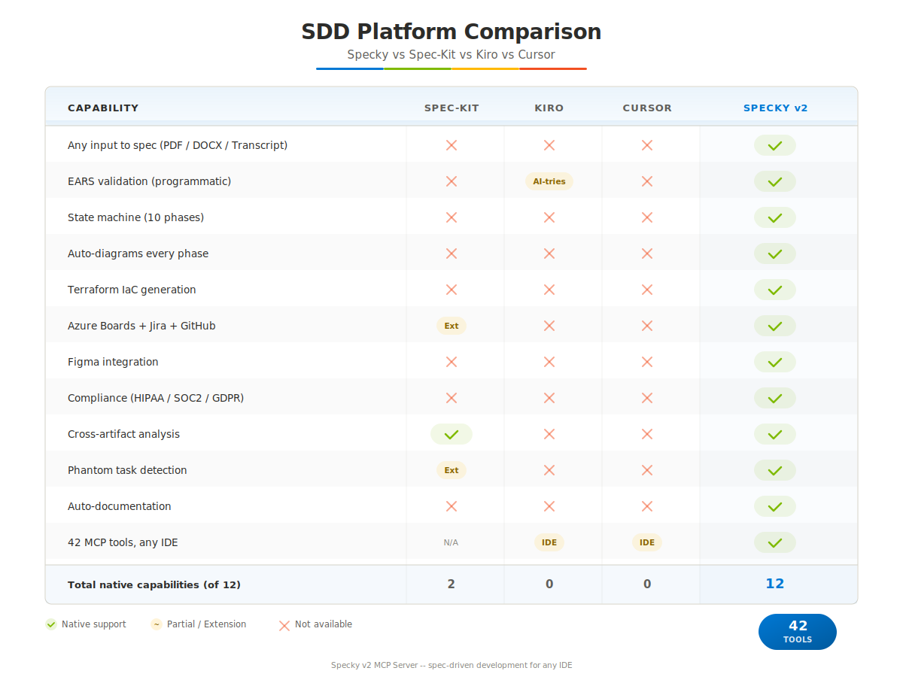

<div align="center">
  <h1>Specky</h1>
  <h3>The Complete Spec-Driven Development Platform</h3>
  <p><strong>47 MCP tools. 10-phase pipeline. Works in any IDE.</strong></p>

  <p>
    <a href="https://www.npmjs.com/package/specky-sdd"></a>
    <a href="https://github.com/paulasilvatech/specky/actions/workflows/ci.yml"></a>
    <a href="https://securityscorecards.dev/viewer/?uri=github.com/paulasilvatech/specky"></a>
    <a href="https://github.com/paulasilvatech/specky"></a>
    <a href="https://github.com/paulasilvatech/specky/blob/main/LICENSE"></a>
  </p>
</div>

---

## What is Specky?

Specky is an open-source MCP (Model Context Protocol) server that transforms how software is built. It provides a complete, deterministic pipeline from any input -- meeting transcripts, documents, designs, or user prompts -- through specifications, architecture, infrastructure as code, implementation, and deployment.

Unlike template-based tools, Specky enforces every step programmatically: a state machine blocks phase-skipping, an EARS validator ensures testable requirements, cross-artifact analysis catches drift, and compliance engines validate against frameworks like HIPAA and SOC2.

**Specky works inside the tools you already use** -- VS Code with GitHub Copilot, Claude Code, Cursor, Windsurf, or any AI agent that supports MCP.

---

## Why Specky?

### The Problem

AI coding assistants are fast but chaotic. They skip requirements, ignore architecture, and produce code that drifts from the original intent. Template-based approaches help but rely on the AI to follow instructions -- with no programmatic enforcement.

### The Solution

Specky adds a **deterministic engine** between your intent and your code:

- **State Machine** -- 10 mandatory phases, no skipping. Init, Discover, Specify, Clarify, Design, Tasks, Analyze, Implement, Verify, Release.
- **EARS Validator** -- Every requirement validated against 6 patterns (Ubiquitous, Event-driven, State-driven, Optional, Unwanted, Complex). No vague statements pass.
- **Cross-Artifact Analysis** -- Automatic alignment checking between spec, design, and tasks. Orphaned requirements are flagged instantly.
- **MCP-to-MCP Architecture** -- Specky outputs structured JSON that your AI client routes to GitHub, Azure DevOps, Jira, Terraform, Figma, and Docker MCP servers. No vendor lock-in.

### Differentiators

<p align="center">
  
</p>

<details>
<summary>View as table</summary>

| Capability | Spec-Kit | Kiro | Cursor | **Specky** |
|---|---|---|---|---|
| Any input (PDF/DOCX/PPTX/transcript) to spec | No | No | No | **Yes** |
| EARS validation (programmatic) | No | AI-tries | No | **Yes** |
| State machine (10 phases) | No | No | No | **Yes** |
| Auto-diagrams every phase (Mermaid) | No | No | No | **Yes** |
| Terraform IaC generation | No | No | No | **Yes** |
| Azure Boards + Jira + GitHub Issues (MCP) | Extension | No | No | **Yes** |
| Figma design to spec (reverse) | No | No | No | **Yes** |
| FigJam diagram generation | No | No | No | **Yes** |
| Docker dev environment | No | No | No | **Yes** |
| Codespaces setup | No | No | No | **Yes** |
| Cross-artifact analysis | Yes | No | No | **Yes** |
| Compliance (HIPAA/SOC2/GDPR) | No | No | No | **Yes** |
| Phantom task detection | Extension | No | No | **Yes** |
| Complete auto-documentation | No | No | No | **Yes** |
| Educative outputs | No | No | No | **Yes** |
| 47 MCP tools | N/A | N/A | N/A | **Yes** |
| Works in ANY IDE via MCP | Templates | IDE-locked | IDE-locked | **Yes** |

</details>

---

## Quick Start

### Prerequisites

- **Node.js 18+** — [Download here](https://nodejs.org/)
- **An AI IDE or client** — VS Code with Copilot, Claude Code, Claude Desktop, Cursor, or Windsurf

### Option 1: npm (Recommended)

No installation needed — `npx` downloads and runs Specky on demand:

```bash
npx specky-sdd
```

Or install globally for faster startup:

```bash
npm install -g specky-sdd
specky-sdd
```

### Option 2: Docker

Run Specky as an HTTP server in a container — no Node.js required on the host:

```bash
# Pull and run (mounts your project into /workspace)
docker run -p 3200:3200 -v $(pwd):/workspace ghcr.io/paulasilvatech/specky:latest
```

Or use Docker Compose for a persistent setup:

```bash
# Create a workspace directory and start
mkdir -p workspace
docker compose up -d

# Check health
curl http://localhost:3200/health
# → {"status":"ok","version":"2.2.0"}

# View logs
docker compose logs -f specky

# Stop
docker compose down
```

<details>
<summary>Build from source with Docker</summary>

```bash
git clone https://github.com/paulasilvatech/specky.git
cd specky

# Build the image locally
docker build -t specky-sdd:local .

# Run it
docker run -p 3200:3200 -v $(pwd):/workspace specky-sdd:local

# Or with docker compose
docker compose up -d --build
```

</details>

> **stdio vs HTTP:** When run via `npx`, Specky uses stdio (direct pipe to the AI client). When run in Docker, it uses HTTP mode on port 3200. Both modes expose the same 47 MCP tools.

### Connect to Your AI IDE

Once Specky is running, connect it to your preferred AI tool:

<details>
<summary><strong>VS Code with GitHub Copilot</strong></summary>

Create `.vscode/mcp.json` in your project root:

```json
{
  "servers": {
    "specky": {
      "command": "npx",
      "args": ["-y", "specky-sdd"],
      "env": {
        "SDD_WORKSPACE": "${workspaceFolder}"
      }
    }
  }
}
```

Open Copilot Chat — Specky's 47 tools are now available. Type `@specky` to scope your prompts.

</details>

<details>
<summary><strong>Claude Code</strong></summary>

One command:

```bash
claude mcp add specky -- npx -y specky-sdd
```

Or add to your MCP settings manually:

```json
{
  "mcpServers": {
    "specky": {
      "command": "npx",
      "args": ["-y", "specky-sdd"],
      "env": {
        "SDD_WORKSPACE": "/path/to/your/project"
      }
    }
  }
}
```

</details>

<details>
<summary><strong>Claude Desktop</strong></summary>

Add to your `claude_desktop_config.json`:

| OS | Config File Location |
|----|---------------------|
| macOS | `~/Library/Application Support/Claude/claude_desktop_config.json` |
| Linux | `~/.config/Claude/claude_desktop_config.json` |
| Windows | `%APPDATA%\Claude\claude_desktop_config.json` |

```json
{
  "mcpServers": {
    "specky": {
      "command": "npx",
      "args": ["-y", "specky-sdd"],
      "env": {
        "SDD_WORKSPACE": "/path/to/your/project"
      }
    }
  }
}
```

</details>

<details>
<summary><strong>Cursor</strong></summary>

Add to Cursor's MCP settings (Settings > MCP Servers):

```json
{
  "specky": {
    "command": "npx",
    "args": ["-y", "specky-sdd"]
  }
}
```

</details>

<details>
<summary><strong>Docker (HTTP mode) — for any MCP client</strong></summary>

If your AI client supports HTTP-based MCP servers, point it to:

```
http://localhost:3200/mcp
```

Start the container first:

```bash
docker compose up -d
```

</details>

---

## Where Specifications Live

Every feature gets its own numbered directory inside `.specs/`. This keeps specifications, design documents, and quality reports together as a self-contained package.

```
your-project/
├── src/                          ← Your application code
├── .specs/                       ← All Specky specifications
│   ├── 001-user-authentication/  ← Feature #1
│   │   ├── CONSTITUTION.md       ← Project principles and governance
│   │   ├── SPECIFICATION.md      ← EARS requirements with acceptance criteria
│   │   ├── DESIGN.md             ← Architecture, data model, API contracts
│   │   ├── RESEARCH.md           ← Resolved unknowns and technical decisions
│   │   ├── TASKS.md              ← Implementation breakdown with dependencies
│   │   ├── ANALYSIS.md           ← Quality gate report
│   │   ├── CHECKLIST.md          ← Domain-specific quality checklist
│   │   ├── CROSS_ANALYSIS.md     ← Spec-design-tasks alignment score
│   │   ├── COMPLIANCE.md         ← Regulatory framework validation
│   │   ├── VERIFICATION.md       ← Drift and phantom task detection
│   │   └── .sdd-state.json       ← Pipeline state (current phase, history)
│   ├── 002-payment-gateway/      ← Feature #2
│   └── 003-notification-system/  ← Feature #3
├── reports/                      ← Cross-feature analysis reports
└── .specky/config.yml            ← Optional project-level configuration
```

**Naming convention:** `NNN-feature-name` — zero-padded number + kebab-case name. Each directory is independent; you can work on multiple features simultaneously.

---

## Input Methods — 6 Ways to Start

<p align="center">
  
</p>

Specky accepts multiple input types. Choose the one that matches your starting point:

### 1. Natural Language Prompt (simplest)

Type your idea directly into the AI chat. No files needed.

```
> I need a feature for user authentication with email/password login,
  password reset via email, and JWT session management
```

The AI calls `sdd_init` + `sdd_discover` to structure your idea into a spec project.

**Best for:** Quick prototyping, brainstorming, greenfield projects.

### 2. Meeting Transcript (VTT / SRT / TXT / MD)

Import a transcript from Teams, Zoom, or Google Meet. Specky extracts topics, decisions, action items, and requirements automatically.

```
> Import the requirements meeting transcript and create a specification
```

The AI calls `sdd_import_transcript` → extracts:
- Participants and speakers
- Topics discussed with summaries
- Decisions made
- Action items
- Raw requirement statements
- Constraints mentioned
- Open questions

**Supported formats:** `.vtt` (WebVTT), `.srt` (SubRip), `.txt`, `.md`

**Pro tip:** Use `sdd_auto_pipeline` to go from transcript to complete spec in one step:

```
> Run the auto pipeline from this meeting transcript: /path/to/meeting.vtt
```

**Got multiple transcripts?** Use batch processing:

```
> Batch import all transcripts from the meetings/ folder
```

The AI calls `sdd_batch_transcripts` → processes every `.vtt`, `.srt`, `.txt`, and `.md` file in the folder.

### 3. Existing Documents (PDF / DOCX / PPTX)

Import requirements documents, RFPs, architecture decks, or any existing documentation.

```
> Import this requirements document and create a specification:
  /path/to/requirements.pdf
```

The AI calls `sdd_import_document` → converts to Markdown, extracts sections, and feeds into the spec pipeline.

**Supported formats:** `.pdf`, `.docx`, `.pptx`, `.txt`, `.md`

**Batch import from a folder:**

```
> Import all documents from the docs/ folder into specs
```

The AI calls `sdd_batch_import` → processes every supported file in the directory.

> **Tip:** For best results with PDF/DOCX, install the optional `mammoth` and `pdfjs-dist` packages for enhanced formatting, table extraction, and image handling.

### 4. Figma Design (design-to-spec)

Convert Figma designs into requirements specifications. Works with the Figma MCP server.

```
> Convert this Figma design into a specification:
  https://figma.com/design/abc123/my-app
```

The AI calls `sdd_figma_to_spec` → extracts components, layouts, and interactions, then routes to the Figma MCP server for design context.

**Best for:** Design-first workflows, UI-driven projects.

### 5. Codebase Scan (brownfield / modernization)

Scan an existing codebase to detect tech stack, frameworks, structure, and patterns before writing specs.

```
> Scan this codebase and tell me what we're working with
```

The AI calls `sdd_scan_codebase` → detects:

| Detected | Examples |
|----------|---------|
| Language | TypeScript, Python, Go, Rust, Java |
| Framework | Next.js, Express, React, Django, FastAPI, Gin |
| Package Manager | npm, pip, poetry, cargo, maven, gradle |
| Runtime | Node.js, Python, Go, JVM |
| Directory Tree | Full project structure with file counts |

**Best for:** Understanding an existing project before adding features or modernizing.

### 6. Raw Text (paste anything)

No file? Just paste the content directly. Every import tool accepts a `raw_text` parameter as an alternative to a file path.

```
> Here's the raw requirements from the client email:

  The system needs to handle 10,000 concurrent users...
  Authentication must support SSO via Azure AD...
  All data must be encrypted at rest and in transit...

  Import this and create a specification.
```

---

## Three Project Types — One Pipeline

<p align="center">
  
</p>

Specky adapts to any project type. The pipeline is the same; the **starting point** is what changes.

---

## Greenfield Project — Start from Scratch

**Scenario:** You're building a new application with no existing code.

### Step 1: Initialize and discover

```
> I'm building a task management API. Initialize a Specky project and help
  me define the scope.
```

The AI calls `sdd_init` → creates `.specs/001-task-management/CONSTITUTION.md`
Then calls `sdd_discover` → asks you **7 structured questions**:

1. **Scope** — What problem does this solve? What are the boundaries of v1?
2. **Users** — Who are the primary users? What are their skill levels?
3. **Constraints** — Language, framework, hosting, budget, timeline?
4. **Integrations** — What external systems, APIs, or services?
5. **Performance** — Expected load, concurrent users, response times?
6. **Security** — Authentication, authorization, compliance requirements?
7. **Deployment** — CI/CD, monitoring, rollback strategy?

Answer each question. Your answers feed directly into the specification.

### Step 2: Write the specification

```
> Write the specification based on my discovery answers
```

The AI calls `sdd_write_spec` → creates `SPECIFICATION.md` with EARS requirements:

```markdown
## Requirements

REQ-001 [Ubiquitous]: The system shall provide a REST API for task CRUD operations.

REQ-002 [Event-driven]: When a user creates a task, the system shall assign
a unique identifier and return it in the response.

REQ-003 [State-driven]: While a task is in "in-progress" state, the system
shall prevent deletion without explicit force confirmation.

REQ-004 [Unwanted]: If the API receives a malformed request body, then the
system shall return a 400 status with a descriptive error message.
```

**The AI pauses here.** Review `.specs/001-task-management/SPECIFICATION.md` and reply **LGTM** when satisfied.

### Step 3: Design the architecture

```
> LGTM — proceed to design
```

The AI calls `sdd_write_design` → creates `DESIGN.md` with:
- System architecture diagram (Mermaid)
- Data model / ER diagram
- API contracts with endpoints, request/response schemas
- Sequence diagrams for key flows
- Technology decisions with rationale

Review and reply **LGTM**.

### Step 4: Break into tasks

```
> LGTM — create the task breakdown
```

The AI calls `sdd_write_tasks` → creates `TASKS.md` with implementation tasks mapped to acceptance criteria, dependencies, and estimated complexity.

### Step 5: Quality gates

```
> Run analysis, compliance check for SOC2, and generate all diagrams
```

The AI calls:
- `sdd_run_analysis` → completeness audit, orphaned criteria detection
- `sdd_compliance_check` → SOC2 controls validation
- `sdd_generate_all_diagrams` → architecture, sequence, ER, flow, dependency, traceability diagrams

### Step 6: Generate infrastructure and tests

```
> Generate Terraform for Azure, a Dockerfile, and test stubs for vitest
```

The AI calls:
- `sdd_generate_iac` → Terraform configuration
- `sdd_generate_dockerfile` → Dockerfile + docker-compose
- `sdd_generate_tests` → Test stubs with acceptance criteria mapped to test cases

### Step 7: Export and ship

```
> Export tasks to GitHub Issues and create a PR
```

The AI calls `sdd_export_work_items` + `sdd_create_pr` → generates work item payloads and PR body with full spec traceability.

---

## Brownfield Project — Add Features to Existing Code

**Scenario:** You have a running application and need to add a new feature with proper specifications.

### Step 1: Scan the codebase first

```
> Scan this codebase so Specky understands what we're working with
```

The AI calls `sdd_scan_codebase` → detects tech stack, framework, directory structure. This context informs all subsequent tools.

```
Detected: TypeScript + Next.js + npm + Node.js
Files: 247 across 32 directories
```

### Step 2: Initialize with codebase context

```
> Initialize a feature for adding real-time notifications to this Next.js app.
  Use the codebase scan results as context.
```

The AI calls `sdd_init` → creates `.specs/001-real-time-notifications/CONSTITUTION.md`
Then calls `sdd_discover` with the codebase summary → the 7 discovery questions now include context about your existing tech stack:

> *"What technical constraints exist? **Note: This project already uses TypeScript, Next.js, npm, Node.js.** Consider compatibility with the existing stack."*

### Step 3: Import existing documentation

If you have existing PRDs, architecture docs, or meeting notes:

```
> Import the PRD for notifications: /docs/notifications-prd.pdf
```

The AI calls `sdd_import_document` → converts to Markdown and adds to the spec directory. The content is used as input when writing the specification.

### Step 4: Write spec with codebase awareness

```
> Write the specification for real-time notifications. Consider the existing
  Next.js architecture and any patterns already in the codebase.
```

The specification references existing components, APIs, and patterns from the codebase scan.

### Step 5: Check for drift

After implementation, verify specs match the code:

```
> Check if the implementation matches the specification
```

The AI calls `sdd_check_sync` → generates a drift report flagging any divergence between spec and code.

### Step 6: Cross-feature analysis

If you have multiple features specified:

```
> Run cross-analysis across all features to find conflicts
```

The AI calls `sdd_cross_analyze` → checks for contradictions, shared dependencies, and consistency issues across `.specs/001-*`, `.specs/002-*`, etc.

---

## Modernization Project — Assess and Upgrade Legacy Systems

**Scenario:** You have a legacy system that needs assessment, documentation, and incremental modernization.

### Step 1: Scan and document the current state

```
> Scan this legacy codebase and help me understand what we have
```

The AI calls `sdd_scan_codebase` → maps the technology stack, directory tree, and file counts.

### Step 2: Import all existing documentation

Gather everything you have — architecture documents, runbooks, meeting notes about the system:

```
> Batch import all documents from /docs/legacy-system/ into specs
```

The AI calls `sdd_batch_import` → processes PDFs, DOCX, PPTX, and text files. Each becomes a Markdown reference in the spec directory.

### Step 3: Import stakeholder meetings

If you have recorded meetings with stakeholders discussing the modernization:

```
> Batch import all meeting transcripts from /recordings/
```

The AI calls `sdd_batch_transcripts` → extracts decisions, requirements, constraints, and open questions from every transcript.

### Step 4: Create the modernization specification

```
> Write a specification for modernizing the authentication module.
  Consider the legacy constraints from the imported documents and
  meeting transcripts.
```

The specification accounts for:
- Current system behavior (from codebase scan)
- Existing documentation (from imported docs)
- Stakeholder decisions (from meeting transcripts)
- Migration constraints and backward compatibility

### Step 5: Compliance assessment

Legacy systems often need compliance validation during modernization:

```
> Run compliance checks against HIPAA and SOC2 for the modernized auth module
```

The AI calls `sdd_compliance_check` → validates the specification against regulatory controls and flags gaps.

### Step 6: Generate migration artifacts

```
> Generate the implementation plan, Terraform for the new infrastructure,
  and a runbook for the migration
```

The AI calls:
- `sdd_implement` → phased implementation plan with checkpoints
- `sdd_generate_iac` → infrastructure configuration for the target environment
- `sdd_generate_runbook` → operational runbook with rollback procedures

### Step 7: Generate onboarding for the team

```
> Generate an onboarding guide for developers joining the modernization project
```

The AI calls `sdd_generate_onboarding` → creates a guide covering architecture decisions, codebase navigation, development workflow, and testing strategy.

---

## Pipeline Flow and LGTM Gates

<p align="center">
  
</p>

Every Specky project follows the same 10-phase pipeline. The state machine **blocks phase-skipping** — you cannot jump from Init to Design without completing Specify first.

**LGTM gates:** After each major phase (Specify, Design, Tasks), the AI pauses and asks you to review. Reply **LGTM** to proceed. This ensures human oversight at every quality gate.

**Feedback loop:** If `sdd_verify_tasks` detects drift between specification and implementation, Specky routes you back to the Specify phase to correct the divergence before proceeding.

**Advancing phases:** If you need to manually advance:

```
> Advance to the next phase
```

The AI calls `sdd_advance_phase` → moves the pipeline forward if all prerequisites are met.

---

## The 10-Phase Pipeline

<p align="center">
  
</p>

Each phase is **mandatory**. The state machine blocks advancement until prerequisites are met.

| Phase | What Happens | Required Output |
|-------|-------------|----------------|
| **Init** | Create project structure, constitution, scan codebase | CONSTITUTION.md |
| **Discover** | Interactive discovery: 7 structured questions about scope, users, constraints | Discovery answers |
| **Specify** | Write EARS requirements with acceptance criteria | SPECIFICATION.md |
| **Clarify** | Resolve ambiguities, generate decision tree | Updated SPECIFICATION.md |
| **Design** | Architecture, data model, API contracts, research unknowns | DESIGN.md, RESEARCH.md |
| **Tasks** | Implementation breakdown by user story, dependency graph | TASKS.md |
| **Analyze** | Cross-artifact analysis, quality checklist, compliance check | ANALYSIS.md, CHECKLIST.md, CROSS_ANALYSIS.md |
| **Implement** | Ordered execution with checkpoints per user story | Implementation progress |
| **Verify** | Drift detection, phantom task detection | VERIFICATION.md |
| **Release** | PR generation, work item export, documentation | Complete package |

---

## All 47 Tools

### Input and Conversion (5)

| Tool | Description |
|------|-------------|
| `sdd_import_document` | Convert PDF, DOCX, PPTX, TXT, MD to Markdown |
| `sdd_import_transcript` | Parse meeting transcripts (Teams, Zoom, Google Meet) |
| `sdd_auto_pipeline` | Any input to complete spec pipeline (all documents) |
| `sdd_batch_import` | Process folder of mixed documents |
| `sdd_figma_to_spec` | Figma design to requirements specification |

### Pipeline Core (8)

| Tool | Description |
|------|-------------|
| `sdd_init` | Initialize project with constitution and scope diagram |
| `sdd_discover` | Interactive discovery with stakeholder mapping |
| `sdd_write_spec` | Write EARS requirements with flow diagrams |
| `sdd_clarify` | Resolve ambiguities with decision tree |
| `sdd_write_design` | Architecture with sequence diagrams, ERD, API flow |
| `sdd_write_tasks` | Task breakdown with dependency graph |
| `sdd_run_analysis` | Quality gate analysis with coverage heatmap |
| `sdd_advance_phase` | Move to next pipeline phase |

### Quality and Validation (5)

| Tool | Description |
|------|-------------|
| `sdd_checklist` | Mandatory quality checklist (security, accessibility, etc.) |
| `sdd_verify_tasks` | Detect phantom completions |
| `sdd_compliance_check` | HIPAA, SOC2, GDPR, PCI-DSS, ISO 27001 validation |
| `sdd_cross_analyze` | Spec-design-tasks alignment with consistency score |
| `sdd_validate_ears` | Batch EARS requirement validation |

### Diagrams and Visualization (4)

| Tool | Description |
|------|-------------|
| `sdd_generate_diagram` | Single Mermaid diagram (10 types) |
| `sdd_generate_all_diagrams` | All diagrams for a feature at once |
| `sdd_generate_user_stories` | User stories with flow diagrams |
| `sdd_figma_diagram` | FigJam-ready diagram via Figma MCP |

### Infrastructure as Code (3)

| Tool | Description |
|------|-------------|
| `sdd_generate_iac` | Terraform/Bicep from architecture design |
| `sdd_validate_iac` | Validation via Terraform MCP + Azure MCP |
| `sdd_generate_dockerfile` | Dockerfile + docker-compose from tech stack |

### Dev Environment (3)

| Tool | Description |
|------|-------------|
| `sdd_setup_local_env` | Docker-based local dev environment |
| `sdd_setup_codespaces` | GitHub Codespaces configuration |
| `sdd_generate_devcontainer` | .devcontainer/devcontainer.json generation |

### Integration and Export (5)

| Tool | Description |
|------|-------------|
| `sdd_create_branch` | Git branch naming convention |
| `sdd_export_work_items` | Tasks to GitHub Issues, Azure Boards, or Jira |
| `sdd_create_pr` | PR payload with spec summary |
| `sdd_implement` | Ordered implementation plan with checkpoints |
| `sdd_research` | Resolve unknowns in RESEARCH.md |

### Documentation (4)

| Tool | Description |
|------|-------------|
| `sdd_generate_docs` | Complete auto-documentation |
| `sdd_generate_api_docs` | API documentation from design |
| `sdd_generate_runbook` | Operational runbook |
| `sdd_generate_onboarding` | Developer onboarding guide |

### Utility (5)

| Tool | Description |
|------|-------------|
| `sdd_get_status` | Pipeline status with guided next action |
| `sdd_get_template` | Get any template |
| `sdd_scan_codebase` | Detect tech stack and structure |
| `sdd_metrics` | Project metrics dashboard |
| `sdd_amend` | Amend project constitution |

### Testing (2) — NEW in v2.2.0

| Tool | Description |
|------|-------------|
| `sdd_generate_tests` | Generate test stubs from acceptance criteria (vitest/jest/playwright/pytest/junit/xunit) |
| `sdd_verify_tests` | Verify test results against requirements — reports traceability coverage |

---

## The Spec-Driven Development Platform

Specky is a **complete Spec-Driven Development platform** — and it's designed to work alongside **[Spec-Kit](https://github.com/paulasilvatech/spec-kit)**, the open-source prompt template framework that teaches SDD fundamentals.

### How They Work Together

| | Spec-Kit | Specky |
|--|----------|--------|
| **What it is** | Prompt templates (`.md` files) | MCP server (47 tools) |
| **How it works** | Copies templates into your repo; AI follows the prompts | Programmatic enforcement via state machine, validators, and compliance engines |
| **Validation** | AI tries to follow instructions | EARS regex validation, Zod schema enforcement, cross-artifact analysis |
| **Phase enforcement** | None — AI decides the order | State machine blocks phase-skipping |
| **Compliance** | None | HIPAA, SOC2, GDPR, PCI-DSS, ISO 27001 |
| **Test generation** | None | 6 frameworks (vitest, jest, playwright, pytest, junit, xunit) |
| **Input types** | User prompts only | 6 types: prompts, transcripts, documents, Figma, codebase scan, raw text |
| **Output routing** | None | MCP-to-MCP routing to GitHub, Azure DevOps, Jira, Terraform, Figma, Docker |
| **Best for** | Learning SDD, quick start | Production enforcement, enterprise, compliance |

### Recommended Learning Path

1. **Start with Spec-Kit** to learn Spec-Driven Development concepts with guided prompts
2. **Add Specky** when you need programmatic enforcement, multi-input support, and compliance checking
3. **Use both** in production — Spec-Kit's templates as the educational layer, Specky as the enforcement engine

```json
{
  "servers": {
    "specky": {
      "command": "npx",
      "args": ["-y", "specky-sdd"]
    }
  }
}
```

> Specky is the **complete platform**. Spec-Kit is the **learning companion**. Together, they close the gap between intent and implementation.

---

## Project Configuration

Create `.specky/config.yml` in your project root to customize Specky:

```yaml
# .specky/config.yml
templates_path: ./my-templates       # Override built-in templates
default_framework: vitest            # Default test framework
compliance_frameworks: [hipaa, soc2] # Frameworks to check
audit_enabled: true                  # Enable audit trail
```

When `templates_path` is set, Specky uses your custom templates instead of the built-in ones. When `audit_enabled` is true, tool invocations are logged locally.

---

## MCP Integration Architecture

<p align="center">
  
</p>

Specky outputs structured JSON with routing instructions. Your AI client calls the appropriate external MCP server:

```
Specky --> sdd_export_work_items(platform: "azure_boards") --> JSON payload
  --> AI Client --> Azure DevOps MCP --> create_work_item()

Specky --> sdd_validate_iac(provider: "terraform") --> validation payload
  --> AI Client --> Terraform MCP --> plan/validate

Specky --> sdd_figma_to_spec(file_key: "abc123") --> Figma request
  --> AI Client --> Figma MCP --> get_design_context()
```

### Supported External MCP Servers

| MCP Server | Integration |
|-----------|-------------|
| **GitHub MCP** | Issues, PRs, Codespaces |
| **Azure DevOps MCP** | Work Items, Boards |
| **Jira MCP** | Issues, Projects |
| **Terraform MCP** | Plan, Validate, Apply |
| **Azure MCP** | Template validation |
| **Figma MCP** | Design context, FigJam diagrams |
| **Docker MCP** | Local dev environments |

---

## EARS Notation

Every requirement in Specky follows EARS (Easy Approach to Requirements Syntax):

| Pattern | Format | Example |
|---------|--------|---------|
| Ubiquitous | The system shall... | The system shall encrypt all data at rest |
| Event-driven | When [event], the system shall... | When a user submits login, the system shall validate credentials |
| State-driven | While [state], the system shall... | While offline, the system shall queue requests |
| Optional | Where [condition], the system shall... | Where 2FA is enabled, the system shall require OTP |
| Unwanted | If [condition], then the system shall... | If session expires, the system shall redirect to login |
| Complex | While [state], when [event]... | While in maintenance, when request arrives, queue it |

The EARS validator programmatically checks every requirement against these 6 patterns. Vague terms like "fast", "good", "easy" are flagged automatically.

---

## Compliance Frameworks

Built-in compliance checking against:

- **HIPAA** -- Access control, audit, encryption, PHI protection
- **SOC 2** -- Logical access, monitoring, change management, incident response
- **GDPR** -- Lawful processing, right to erasure, data portability, breach notification
- **PCI-DSS** -- Firewall, stored data protection, encryption, user identification
- **ISO 27001** -- Security policies, access control, cryptography, incident management

---

## Educative Outputs

Every tool response includes structured guidance:

```json
{
  "explanation": "What was done and why",
  "next_steps": "Guided next action with command suggestion",
  "learning_note": "Educational context about the concept",
  "diagram": "Mermaid diagram relevant to the output"
}
```

---

## End-to-End Flow

<p align="center">
  
</p>

From any input to production — fully automated, MCP-orchestrated, with artifacts and diagrams generated at every step.

---

## Project Structure

```
.specs/
  001-feature-name/
    CONSTITUTION.md       -- Project principles and governance
    SPECIFICATION.md      -- EARS requirements with acceptance criteria
    DESIGN.md             -- Architecture, data model, API contracts
    RESEARCH.md           -- Resolved unknowns and decisions
    TASKS.md              -- Implementation breakdown
    ANALYSIS.md           -- Quality gate report
    CHECKLIST.md          -- Mandatory quality checklist
    CROSS_ANALYSIS.md     -- Spec-design-tasks alignment
    COMPLIANCE.md         -- Compliance framework report
    VERIFICATION.md       -- Phantom detection results
```

---

## Enterprise Ready

Specky is built with enterprise adoption in mind.

### Security Posture

- **2 runtime dependencies** — minimal attack surface (`@modelcontextprotocol/sdk`, `zod`)
- **Zero outbound network requests** — all data stays local
- **No `eval()` or dynamic code execution** — template rendering is string replacement only
- **Path traversal prevention** — FileManager sanitizes all paths, blocks `..` sequences
- **Zod `.strict()` validation** — every tool input is schema-validated; unknown fields rejected
- See [SECURITY.md](SECURITY.md) for full OWASP Top 10 coverage

### Compliance Validation

Built-in compliance checking validates your specifications against industry frameworks:

| Framework | Controls | Use Case |
|-----------|----------|----------|
| HIPAA | 6 controls | Healthcare applications |
| SOC 2 | 6 controls | SaaS and cloud services |
| GDPR | 5 controls | EU data processing |
| PCI-DSS | 6 controls | Payment card handling |
| ISO 27001 | 6 controls | Enterprise security management |

### Audit Trail

Every pipeline phase produces a traceable artifact in `.specs/NNN-feature/`. The complete specification-to-code journey is documented and reproducible.

### Quality Gates

- **EARS Validator** — programmatic requirement quality enforcement
- **Cross-Artifact Analysis** — automatic alignment checking between spec, design, and tasks
- **Phase Enforcement** — state machine blocks phase-skipping; required files gate advancement
- **211 unit tests** with 89% code coverage; CI enforces thresholds on every push

---

## Development

```bash
# Clone and setup
git clone https://github.com/paulasilvatech/specky.git
cd specky
npm install

# Build
npm run build

# Run tests (211 tests, 89% coverage)
npm test

# Run tests with coverage report
npm run test:coverage

# Development mode (auto-reload on file changes)
npm run dev

# Verify MCP handshake (quick smoke test)
echo '{"jsonrpc":"2.0","id":1,"method":"initialize","params":{"protocolVersion":"2025-03-26","capabilities":{},"clientInfo":{"name":"test","version":"1.0"}}}' | node dist/index.js 2>/dev/null

# Build and run with Docker locally
docker build -t specky-sdd:dev .
docker run -p 3200:3200 -v $(pwd):/workspace specky-sdd:dev
curl http://localhost:3200/health
```

---

## Contributing

See [CONTRIBUTING.md](CONTRIBUTING.md) for architecture details and how to add tools, templates, or services.

---

## License

MIT -- Created by [Paula Silva](https://github.com/paulasilvatech) | Americas Software GBB, Microsoft
