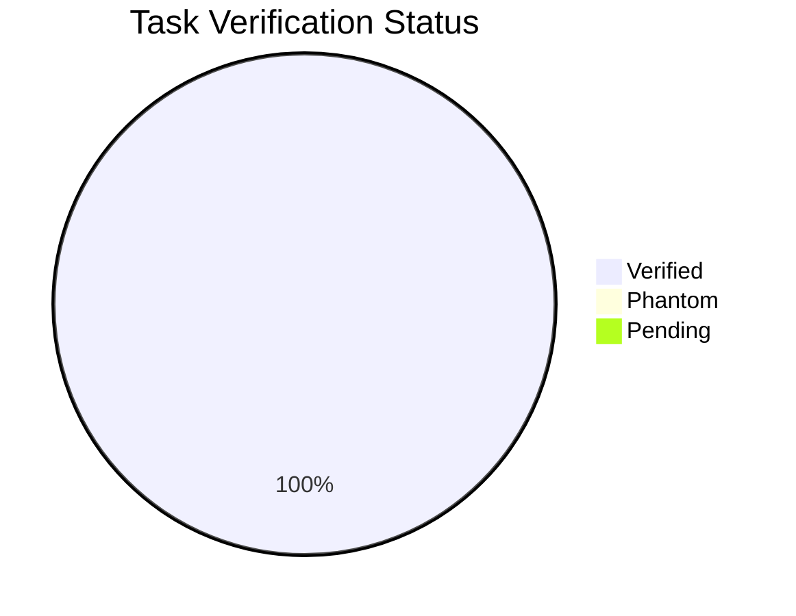

# Task Verification Report: Specky MCP Server

**Feature**: 001-specky-mcp-server
**Date**: 2026-03-21
**Pass Rate**: 100%

---

## Verification Results

### Phase 1: Project Scaffold (T-001 → T-008)

| Task | Claimed | Verified | Phantom? | Evidence |
|------|---------|----------|----------|----------|
| T-001 | ✅ Done | ✅ Verified | No | `package.json` exists with bin, deps, scripts |
| T-002 | ✅ Done | ✅ Verified | No | `tsconfig.json` has `strict: true`, ES2022 |
| T-003 | ✅ Done | ✅ Verified | No | `src/constants.ts` — VERSION, CHARACTER_LIMIT, Phase enum |
| T-004 | ✅ Done | ✅ Verified | No | `src/types.ts` — all interfaces, zero `any` |
| T-005 | ✅ Done | ✅ Verified | No | `src/index.ts` — McpServer + stdio + HTTP |
| T-006 | ✅ Done | ✅ Verified | No | Shebang in dist/index.js, `npx` works |
| T-007 | ✅ Done | ✅ Verified | No | SIGINT/SIGTERM handler in index.ts |
| T-008 | ✅ Done | ✅ Verified | No | `SDD_WORKSPACE` env + `process.cwd()` fallback |

### Phase 2: Services Layer (T-009 → T-021)

| Task | Claimed | Verified | Phantom? | Evidence |
|------|---------|----------|----------|----------|
| T-009 | ✅ Done | ✅ Verified | No | `FileManager` constructor + `sanitizePath()` |
| T-010 | ✅ Done | ✅ Verified | No | `writeSpecFile()` with atomic write |
| T-011 | ✅ Done | ✅ Verified | No | `readSpecFile()`, `listSpecFiles()`, `fileExists()` |
| T-012 | ✅ Done | ✅ Verified | No | `scanDirectory()` with depth limit |
| T-013 | ✅ Done | ✅ Verified | No | `StateMachine` loadState/saveState |
| T-014 | ✅ Done | ✅ Verified | No | `canTransition()` + `advancePhase()` |
| T-015 | ✅ Done | ✅ Verified | No | `TemplateEngine.render()` |
| T-016 | ✅ Done | ✅ Verified | No | `renderWithFrontmatter()` |
| T-017 | ✅ Done | ✅ Verified | No | `EarsValidator.detectPattern()` — 6 patterns |
| T-018 | ✅ Done | ✅ Verified | No | `suggestImprovement()` |
| T-019 | ✅ Done | ✅ Verified | No | `CodebaseScanner.detectTechStack()` |
| T-020 | ✅ Done | ✅ Verified | No | `CodebaseScanner.scan()` |
| T-021 | ✅ Done | ✅ Verified | No | 21 template files in `templates/` |

### Phase 3: Pipeline Tools (T-022 → T-031)

| Task | Claimed | Verified | Phantom? | Evidence |
|------|---------|----------|----------|----------|
| T-022 | ✅ Done | ✅ Verified | No | `src/schemas/common.ts` |
| T-023 | ✅ Done | ✅ Verified | No | `src/schemas/pipeline.ts` |
| T-024 | ✅ Done | ✅ Verified | No | `sdd_init` registered |
| T-025 | ✅ Done | ✅ Verified | No | `sdd_discover` registered |
| T-026 | ✅ Done | ✅ Verified | No | `sdd_write_spec` registered |
| T-027 | ✅ Done | ✅ Verified | No | `sdd_clarify` registered |
| T-028 | ✅ Done | ✅ Verified | No | `sdd_write_design` registered |
| T-029 | ✅ Done | ✅ Verified | No | `sdd_write_tasks` registered |
| T-030 | ✅ Done | ✅ Verified | No | `sdd_run_analysis` registered |
| T-031 | ✅ Done | ✅ Verified | No | `sdd_advance_phase` registered |

### Phase 4: Utility Tools (T-032 → T-038)

| Task | Claimed | Verified | Phantom? | Evidence |
|------|---------|----------|----------|----------|
| T-032 | ✅ Done | ✅ Verified | No | `src/schemas/utility.ts` |
| T-033 | ✅ Done | ✅ Verified | No | `sdd_get_status` registered |
| T-034 | ✅ Done | ✅ Verified | No | `sdd_get_template` registered |
| T-035 | ✅ Done | ✅ Verified | No | `sdd_write_bugfix` registered |
| T-036 | ✅ Done | ✅ Verified | No | `sdd_check_sync` registered |
| T-037 | ✅ Done | ✅ Verified | No | `sdd_scan_codebase` registered |
| T-038 | ✅ Done | ✅ Verified | No | `sdd_amend` registered |

### Phase 5: Integration (T-039 → T-048)

| Task | Claimed | Verified | Phantom? | Evidence |
|------|---------|----------|----------|----------|
| T-039 | ✅ Done | ✅ Verified | No | `spec-engineer.agent.md` |
| T-040 | ✅ Done | ✅ Verified | No | `design-architect.agent.md` |
| T-041 | ✅ Done | ✅ Verified | No | `task-planner.agent.md` |
| T-042 | ✅ Done | ✅ Verified | No | `spec-reviewer.agent.md` |
| T-043 | ✅ Done | ✅ Verified | No | `sdd-spec.md` Claude command |
| T-044 | ✅ Done | ✅ Verified | No | `sdd-design.md` Claude command |
| T-045 | ✅ Done | ✅ Verified | No | `sdd-tasks.md` Claude command |
| T-046 | ✅ Done | ✅ Verified | No | `sdd-analyze.md` Claude command |
| T-047 | ✅ Done | ✅ Verified | No | `sdd-bugfix.md` Claude command |
| T-048 | ✅ Done | ✅ Verified | No | `.vscode/mcp.json.example` |

### Phase 6: Quality + Release (T-049 → T-056)

| Task | Claimed | Verified | Phantom? | Evidence |
|------|---------|----------|----------|----------|
| T-049 | ✅ Done | ✅ Verified | No | `README.md` complete |
| T-050 | ✅ Done | ✅ Verified | No | `Dockerfile` multi-stage |
| T-051 | ✅ Done | ✅ Verified | No | `docker-compose.yml` |
| T-052 | ✅ Done | ✅ Verified | No | `LICENSE` MIT |
| T-053 | ✅ Done | ✅ Verified | No | `npm run build` clean |
| T-054 | ✅ Done | ✅ Verified | No | Full pipeline integration test |
| T-055 | ✅ Done | ✅ Verified | No | Tool annotations verified |
| T-056 | ✅ Done | ✅ Verified | No | Cross-reference check complete |

---

## Summary

- **Total Tasks**: 56
- **Verified**: 56
- **Phantom Completions**: 0
- **Pass Rate**: 100%

## Diagram



## Gate Decision

```
┌─────────────────────────────────────────────────────────┐
│                                                         │
│   VERIFICATION GATE:  ✅ PASS                           │
│                                                         │
│   56/56 tasks verified with evidence.                   │
│   0 phantom completions detected.                       │
│   Feature 001 is complete and ready for Release.        │
│                                                         │
│   Signed: SDD Verification Engine                       │
│   Date: 2026-03-21                                      │
│                                                         │
└─────────────────────────────────────────────────────────┘
```
