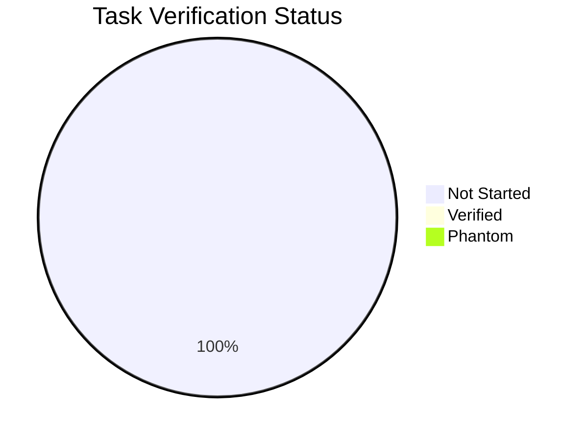

# Task Verification Report: Specky v3.0 Enterprise-Ready

**Feature**: 002-enterprise-ready
**Date**: 2026-03-21
**Pass Rate**: 0% (implementation not started)

---

## Verification Results

### Phase 1: Testing Foundation (T-001 → T-015)

| Task | Claimed | Verified | Phantom? | Evidence |
|------|---------|----------|----------|----------|
| T-001 | ⬜ Not started | — | — | — |
| T-002 | ⬜ Not started | — | — | — |
| T-003 | ⬜ Not started | — | — | — |
| T-004 | ⬜ Not started | — | — | — |
| T-005 | ⬜ Not started | — | — | — |
| T-006 | ⬜ Not started | — | — | — |
| T-007 | ⬜ Not started | — | — | — |
| T-008 | ⬜ Not started | — | — | — |
| T-009 | ⬜ Not started | — | — | — |
| T-010 | ⬜ Not started | — | — | — |
| T-011 | ⬜ Not started | — | — | — |
| T-012 | ⬜ Not started | — | — | — |
| T-013 | ⬜ Not started | — | — | — |
| T-014 | ⬜ Not started | — | — | — |
| T-015 | ⬜ Not started | — | — | — |

### Phase 2: Test Generation Pipeline (T-020 → T-030)

| Task | Claimed | Verified | Phantom? | Evidence |
|------|---------|----------|----------|----------|
| T-020 | ⬜ Not started | — | — | — |
| T-021 | ⬜ Not started | — | — | — |
| T-022 | ⬜ Not started | — | — | — |
| T-023 | ⬜ Not started | — | — | — |
| T-024 | ⬜ Not started | — | — | — |
| T-025 | ⬜ Not started | — | — | — |
| T-026 | ⬜ Not started | — | — | — |
| T-027 | ⬜ Not started | — | — | — |
| T-028 | ⬜ Not started | — | — | — |
| T-029 | ⬜ Not started | — | — | — |
| T-030 | ⬜ Not started | — | — | — |

### Phase 3: Documentation & Onboarding (T-040 → T-050)

| Task | Claimed | Verified | Phantom? | Evidence |
|------|---------|----------|----------|----------|
| T-040 | ⬜ Not started | — | — | — |
| T-041 | ⬜ Not started | — | — | — |
| T-042 | ⬜ Not started | — | — | — |
| T-043 | ⬜ Not started | — | — | — |
| T-044 | ⬜ Not started | — | — | — |
| T-045 | ⬜ Not started | — | — | — |
| T-046 | ⬜ Not started | — | — | — |
| T-047 | ⬜ Not started | — | — | — |
| T-048 | ⬜ Not started | — | — | — |
| T-049 | ⬜ Not started | — | — | — |
| T-050 | ⬜ Not started | — | — | — |

### Phase 4: Integration Polish (T-060 → T-068)

| Task | Claimed | Verified | Phantom? | Evidence |
|------|---------|----------|----------|----------|
| T-060 | ⬜ Not started | — | — | — |
| T-061 | ⬜ Not started | — | — | — |
| T-062 | ⬜ Not started | — | — | — |
| T-063 | ⬜ Not started | — | — | — |
| T-064 | ⬜ Not started | — | — | — |
| T-065 | ⬜ Not started | — | — | — |
| T-066 | ⬜ Not started | — | — | — |
| T-067 | ⬜ Not started | — | — | — |
| T-068 | ⬜ Not started | — | — | — |

### Phase 5: Enterprise Trust Signals (T-080 → T-089)

| Task | Claimed | Verified | Phantom? | Evidence |
|------|---------|----------|----------|----------|
| T-080 | ⬜ Not started | — | — | — |
| T-081 | ⬜ Not started | — | — | — |
| T-082 | ⬜ Not started | — | — | — |
| T-083 | ⬜ Not started | — | — | — |
| T-084 | ⬜ Not started | — | — | — |
| T-085 | ⬜ Not started | — | — | — |
| T-086 | ⬜ Not started | — | — | — |
| T-087 | ⬜ Not started | — | — | — |
| T-088 | ⬜ Not started | — | — | — |
| T-089 | ⬜ Not started | — | — | — |

---

## Summary

- **Total Tasks**: 56
- **Verified**: 0
- **Phantom Completions**: 0
- **Pass Rate**: 0%

## Diagram



## Gate Decision

```
┌─────────────────────────────────────────────────────────┐
│                                                         │
│   VERIFICATION GATE:  ⏳ PENDING                        │
│                                                         │
│   0/56 tasks verified.                                  │
│   Implementation has not started yet.                   │
│   Update this report as tasks are completed.            │
│                                                         │
│   Signed: SDD Verification Engine                       │
│   Date: 2026-03-21                                      │
│                                                         │
└─────────────────────────────────────────────────────────┘
```
