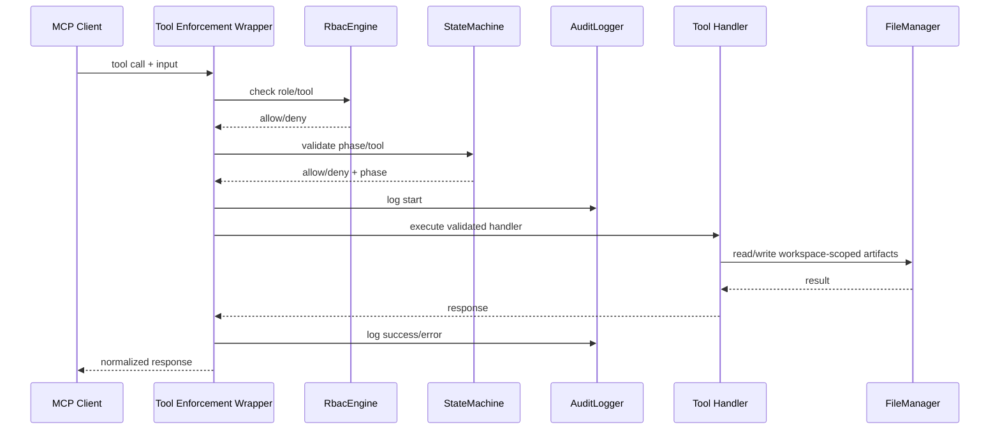

# Enterprise Controls

This document defines the enterprise control model for Specky. It separates current capabilities from target enforcement so the project can be audited honestly while hardening work progresses.

## Control Objectives

Specky should provide these enterprise guarantees:

1. Every tool call is authorized.
2. Every tool call is phase-aware.
3. Every write is auditable.
4. Every generated artifact is traceable to input, requirements, and version.
5. Every release is reproducible and evidence-backed.
6. Every compliance claim has a generated report or explicit manual assumption.

## Current Capability Matrix

| Control | Current Status | Gap |
| --- | --- | --- |
| Zod input schemas | Implemented | Keep schemas aligned with shared ID contracts. |
| State machine | Implemented | Enforce through a central wrapper for all tools. |
| RBAC engine | Implemented and globally enforced | Continue expanding role policy coverage as new tools are added. |
| Audit logger | Implemented and globally attached | Add user-facing audit chain verification command/tool. |
| Rate limiting | Implemented for HTTP mode | Add enterprise defaults and docs. |
| HMAC state signature | Implemented | Add user-facing verification command/tool. |
| Compliance checks | Implemented as keyword controls | Integrate into semantic gate. |
| Cross-analysis | Implemented | Integrate into semantic gate. |
| Test traceability | Implemented | Integrate into verification and release gates. |
| Publish preflight | Script exists | Enforce in GitHub publish workflow. |

## Target Tool Execution Flow

## RBAC Policy

| Role | Access |
| --- | --- |
| Viewer | Read-only status, routing, context, metrics, templates, checkpoints list, audit verification. |
| Contributor | Authoring and analysis tools, excluding release-gate operations. |
| Admin | All tools, including release, branch governance, and enterprise configuration. |

RBAC may remain opt-in for local use, but when enabled it must be enforced by the wrapper before any handler executes.

## Audit Policy

When `audit_enabled=true`, every tool execution should produce a hash-chained record containing:

- Timestamp
- Tool name
- Role
- Phase
- Spec directory
- Feature number when available
- Result status
- Input hash
- Output hash or error hash
- Previous hash

Sensitive file content and secrets must not be logged.

## Semantic Gate Policy

`sdd_run_analysis` should approve by evidence, not file presence alone.

Minimum evidence:

| Signal | Required For APPROVE |
| --- | --- |
| EARS compliance | Meets configured threshold |
| Requirement to design coverage | Meets configured threshold |
| Requirement to task coverage | Meets configured threshold |
| Task to test coverage | Meets configured threshold before release |
| Orphaned requirements | Zero, or accepted with documented waiver |
| Compliance controls | Required frameworks pass or have explicit waivers |
| Intent drift | Below configured threshold |
| Cognitive debt | Below configured threshold |

## Release Controls

Before publish:

1. `npm audit --audit-level=high`
2. `npm run build`
3. `npm test`
4. `npm run test:coverage`
5. `npm pack --dry-run`
6. Fresh install smoke test
7. MCP initialize handshake
8. Changelog/version check
9. Evidence pack update

## References

- [NIST Secure Software Development Framework (SSDF)](https://csrc.nist.gov/Projects/ssdf)
- [OWASP Software Component Verification Standard](https://owasp.org/www-project-software-component-verification-standard/)
- [OWASP ASVS](https://owasp.org/www-project-application-security-verification-standard/)
- [Model Context Protocol documentation](https://modelcontextprotocol.io/)
