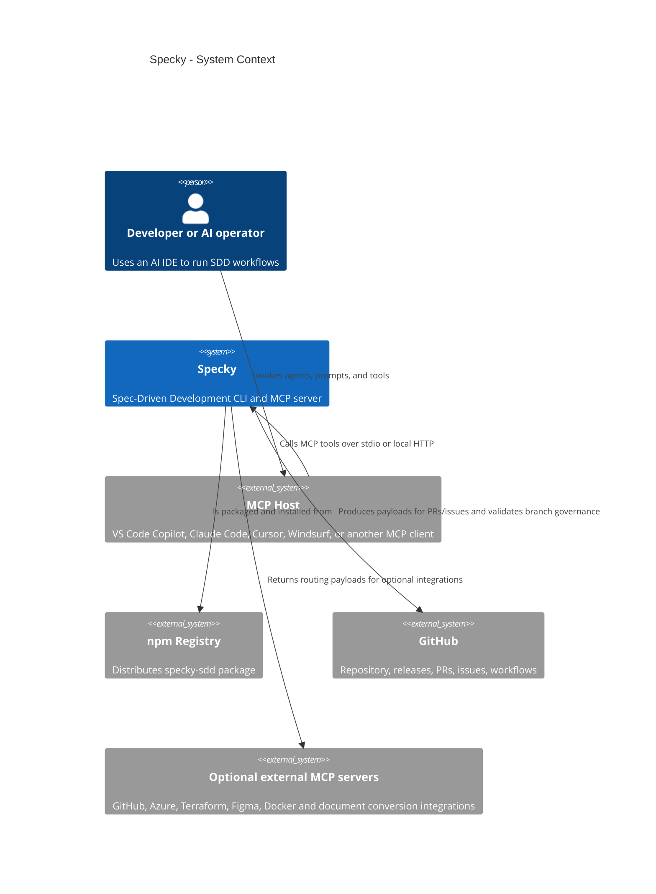
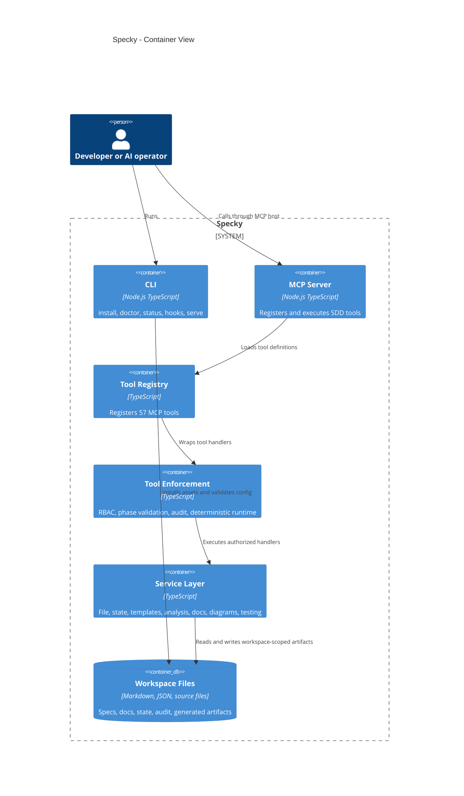
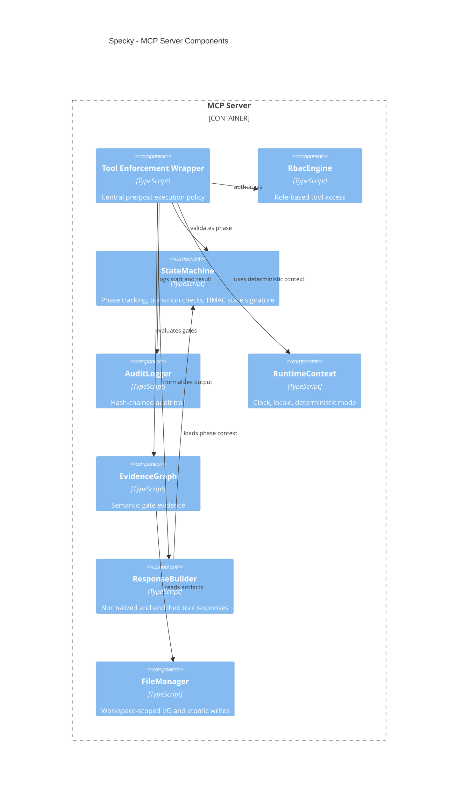
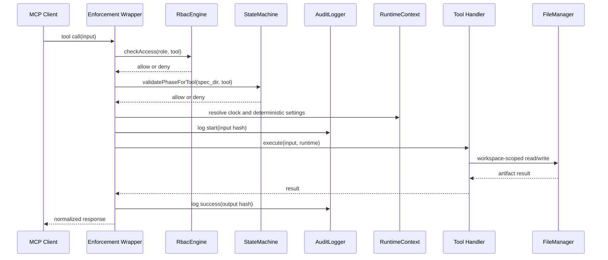
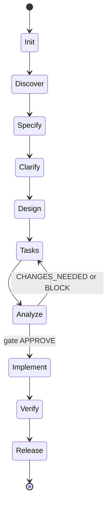
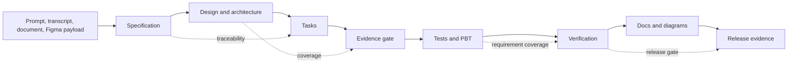
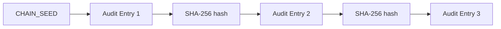

# System Design

This document describes the target architecture for Specky as an enterprise-grade, deterministic Spec-Driven Development engine.

## Design Goals

- Local-first MCP server for SDD workflows.
- Deterministic, reproducible generated artifacts.
- Centralized enforcement for RBAC, phase rules, audit logging, and output normalization.
- Evidence-based quality gates.
- Documentation and diagrams generated in parallel with implementation.

## C4 Context

## C4 Container

## C4 Component

## Tool Execution Sequence

## Pipeline State Machine

## Artifact Data Flow

## Audit Chain

Each entry stores the previous entry hash. A verification command or tool should detect missing, reordered, or modified entries.

## Security Boundary

The intended security boundary is the workspace root. File reads and writes should go through `FileManager`. Exceptions must be tracked as gaps until remediated.

The CLI can intentionally execute installed hook scripts through `specky hooks`; this is an explicit administrative command and should be documented separately from MCP tool execution.

## References

- [C4 model](https://c4model.com/)
- [Mermaid C4 syntax](https://mermaid.js.org/syntax/c4.html)
- [Model Context Protocol documentation](https://modelcontextprotocol.io/)
- [OWASP Application Security Verification Standard](https://owasp.org/www-project-application-security-verification-standard/)
