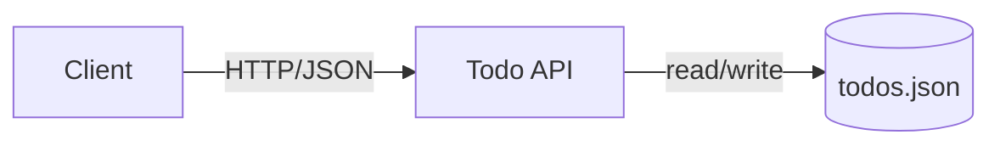
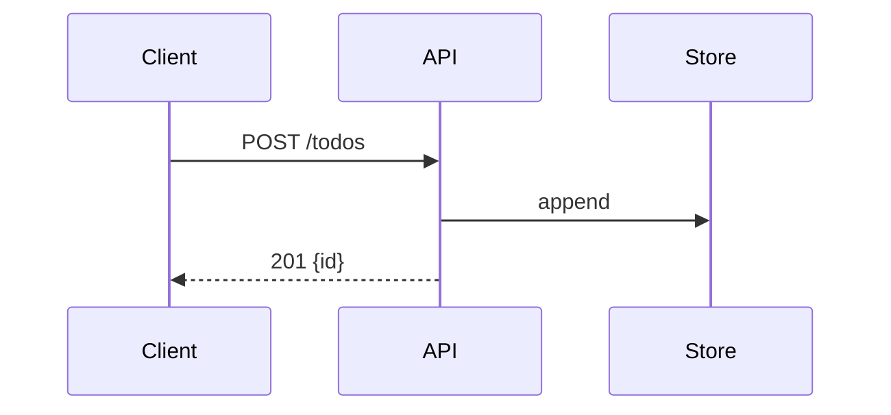

<!-- markdownlint-disable -->
# todo-api — Design

> Complete system design covering architecture, data, APIs, security, infrastructure, and decisions.

---

## 1. System Context (C4 Level 1)

> Who uses the system and what external systems does it integrate with?

A developer HTTP client calls the Todo API; the service reads/writes a local JSON file.

---

## 2. Container Architecture (C4 Level 2)

> What are the deployable units (APIs, databases, queues, frontends) and how do they communicate?

One container: Express HTTP server with an in-process TodoService and FileStore.

---

## 3. Component Design (C4 Level 3)

> What are the internal modules/services within each container and their responsibilities?

Router -> Validator -> TodoService -> FileStore. Traceability: TodoService implements REQ-TODO-001 (CRUD) and REQ-TODO-003 (toggle); FileStore implements REQ-TODO-002 (persistence); Validator implements REQ-TODO-004 (input validation).

---

## 4. Code-Level Design (C4 Level 4)

> Key classes, interfaces, patterns, and their relationships.

[TODO: code_level_design]

---

## 5. System Diagrams

### Container

---

### Create flow

---

## 6. Data Model

> Entities, relationships, storage strategy, and data flow.

Todo { id: uuid, title: string(1..200), completed: boolean, createdAt, updatedAt }.

---

## 7. API Contracts

> Endpoints, request/response schemas, authentication, and error codes.

[TODO: Add API contracts if applicable]

---

## 8. Infrastructure & Deployment

> How the system is deployed, scaled, monitored, and operated.

Single Docker container; /health endpoint.

---

## 9. Security Architecture

> Authentication, authorization, encryption, secrets management, and threat model.

Validation on every write; no auth in v1 (bind localhost); 8KB payload limit.

---

## 10. Architecture Decision Records

### ADR-001: File persistence over a database for v1

**Decision:** Use an atomic JSON file store.

**Rationale:** v1 is single-user; a DB adds ops overhead not yet justified.

**Consequences:** Not horizontally scalable; a StoragePort keeps a DB swap cheap later.

---

## 11. Error Handling Strategy

> How errors are detected, logged, propagated, and recovered from.

Validation -> 400; not found -> 404; unexpected -> 500 with correlation id.

---

## 12. Cross-Cutting Concerns

> Logging, monitoring, caching, configuration, feature flags, and observability.

[TODO: cross_cutting]

---

**Covers:** [TODO: requirement_references]
