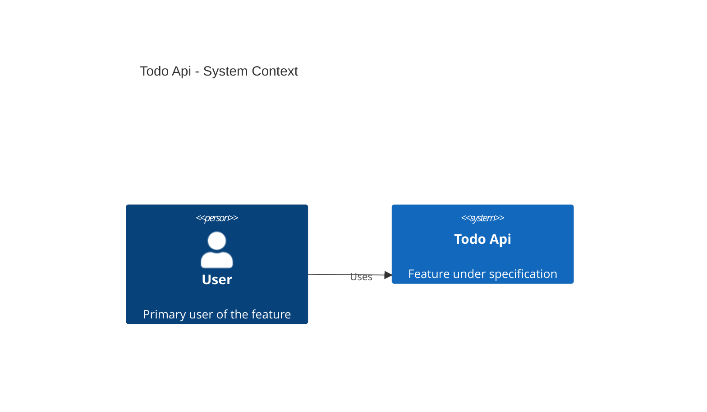
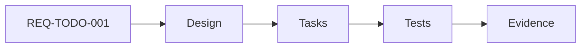

# Todo Api Diagrams

## C4 Context

## Component Flow

## Required Diagram Updates

- Add C4 Container diagram.
- Add C4 Component diagram.
- Add Sequence diagram for the critical path.
- Add Data Flow diagram.
- Add Deployment diagram when infrastructure exists.
